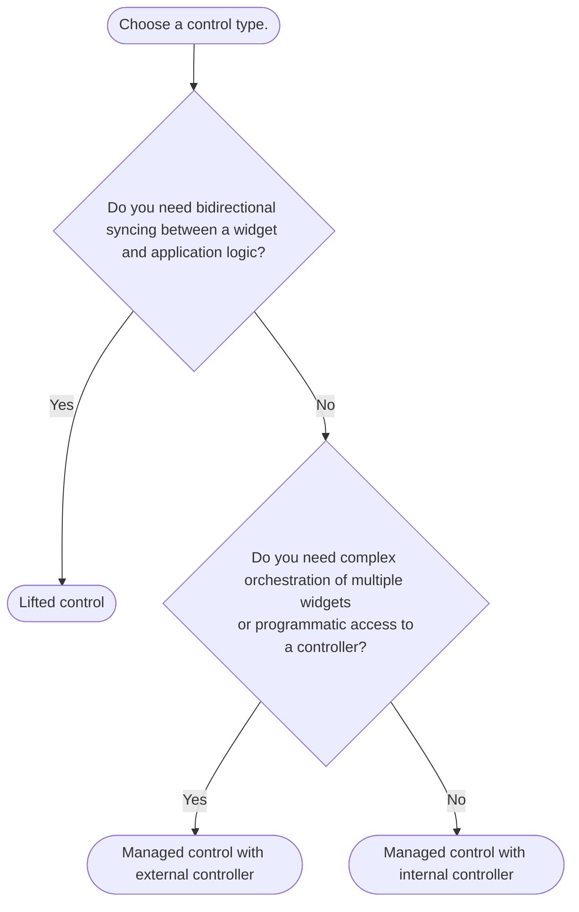
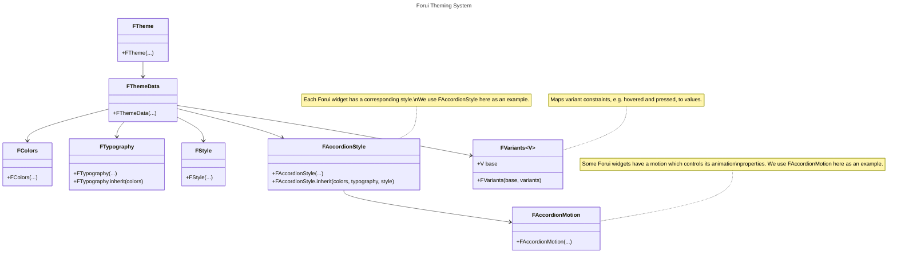

# Getting Started

Get started with Forui in your Flutter project.

This guide assumes you have a basic understanding of Flutter and have already set up your development environment.
If you're new to Flutter, you may follow the official [installation guide](https://docs.flutter.dev/get-started).

## Installation

From your Flutter project directory, run the following command to install Forui.

> **Warning:** Forui 0.18.0+ requires Flutter **3.41.0+**. Run `flutter --version` to check your Flutter version.

```bash filename="bash" copy
flutter pub add forui
```

## Upgrading

Flutter does not automatically upgrade minor versions of packages prior to `1.0.0`.

This means that that following entry in your `pubspec.yaml` file will **not** automatically upgrade to `0.20.0`:

```yaml filename="pubspec.yaml"
dependencies:
  forui: ^0.19.0 // ❌ will not upgrade to 0.20.0
```

To upgrade to the latest version of Forui, run the following command:

```bash filename="bash" copy
flutter pub upgrade forui --major-versions
```

From `0.17.0` onwards, Forui provides [data driven fixes](https://github.com/flutter/flutter/blob/master/docs/contributing/Data-driven-Fixes.md).
This means that you can automate some of the migration by running `dart fix --apply`.

### Forui Icons

> **Info:** Forui Icons is bundled with the forui package. You don't need to install it separately if you install `forui`.

If you would like to only use the icons, run the following command from your Flutter project's directory.

```bash filename="bash" copy
flutter pub add forui_assets
```

## Usage

To use Forui widgets in your Flutter app, import the Forui package and place the
[`FTheme`](https://pub.dev/documentation/forui/latest/forui.theme/FTheme-class.html) widget underneath
`CupertinoApp`, `MaterialApp`, or `WidgetsApp` at the root of the widget tree.

To generate a basic Forui app structure in your project, run:

**Basic**

```bash filename="bash" copy
dart run forui init
```

**Router**

```bash filename="bash" copy
dart run forui init --template=router
```

Or copy & paste the following code snippet:

**Basic**

````dart
import 'package:flutter/foundation.dart';
import 'package:flutter/material.dart';

import 'package:forui/forui.dart';

void main() {
  runApp(const Application());
}

class Application extends StatelessWidget {
  const Application({super.key});

  @override
  Widget build(BuildContext context) {
    /// Try changing this and hot reloading the application.
    ///
    /// To create a custom theme:
    /// ```shell
    /// dart forui theme create [theme template].
    /// ```
    final theme =
        const <TargetPlatform>{
          .android,
          .iOS,
          .fuchsia,
        }.contains(defaultTargetPlatform)
        ? FThemes.neutral.dark.touch
        : FThemes.neutral.dark.desktop;

    return MaterialApp(
      // TODO: replace with your application's supported locales.
      supportedLocales: FLocalizations.supportedLocales,
      // TODO: add your application's localizations delegates.
      localizationsDelegates: const [...FLocalizations.localizationsDelegates],
      // MaterialApp's theme is also animated by default with the same duration and curve.
      // See https://api.flutter.dev/flutter/material/MaterialApp/themeAnimationStyle.html
      // for how to configure this.
      //
      // There is a known issue with implicitly animated widgets where their transition
      // occurs AFTER the theme's. See https://github.com/duobaseio/forui/issues/670.
      theme: theme.toApproximateMaterialTheme(),
      builder: (_, child) => FTheme(
        data: theme,
        child: FToaster(child: FTooltipGroup(child: child!)),
      ),
      // You can also replace FScaffold with Material Scaffold.
      home: const FScaffold(
        // TODO: replace with your widget.
        child: Example(),
      ),
    );
  }
}

class Example extends StatefulWidget {
  const Example({super.key});

  @override
  State<Example> createState() => _ExampleState();
}

class _ExampleState extends State<Example> {
  int _count = 0;

  @override
  Widget build(BuildContext context) => Center(
    child: Column(
      mainAxisSize: .min,
      spacing: 10,
      children: [
        Text('Count: $_count'),
        FButton(
          onPress: () => setState(() => _count++),
          suffix: const Icon(FIcons.chevronsUp),
          child: const Text('Increase'),
        ),
      ],
    ),
  );
}

````

**Router**

````dart
import 'package:flutter/foundation.dart';
import 'package:flutter/material.dart';

import 'package:forui/forui.dart';

void main() {
  runApp(const Application());
}

class Application extends StatelessWidget {
  const Application({super.key});

  @override
  Widget build(BuildContext context) {
    /// Try changing this and hot reloading the application.
    ///
    /// To create a custom theme:
    /// ```shell
    /// dart forui theme create [theme template].
    /// ```
    final theme =
        const <TargetPlatform>{
          .android,
          .iOS,
          .fuchsia,
        }.contains(defaultTargetPlatform)
        ? FThemes.neutral.dark.touch
        : FThemes.neutral.dark.desktop;

    return MaterialApp.router(
      // TODO: replace with your application's supported locales.
      supportedLocales: FLocalizations.supportedLocales,
      // TODO: add your application's localizations delegates.
      localizationsDelegates: const [...FLocalizations.localizationsDelegates],
      // MaterialApp's theme is also animated by default with the same duration and curve.
      // See https://api.flutter.dev/flutter/material/MaterialApp/themeAnimationStyle.html
      // for how to configure this.
      //
      // There is a known issue with implicitly animated widgets where their transition
      // occurs AFTER the theme's. See https://github.com/duobaseio/forui/issues/670.
      theme: theme.toApproximateMaterialTheme(),
      builder: (_, child) => FTheme(
        data: theme,
        child: FToaster(child: FTooltipGroup(child: child!)),
      ),
      // TODO: Add your router configuration here.
    );
  }
}

````

It is perfectly fine to use Cupertino/Material widgets alongside Forui widgets!

```dart
import 'package:flutter/cupertino.dart';

import 'package:forui/forui.dart';


void main() {
  runApp(const Application());
}

class Application extends StatelessWidget {
  const Application({super.key});

  @override
  Widget build(BuildContext context) => CupertinoApp(
    builder: (context, child) => FTheme(
      data: FThemes.neutral.light.touch,
      child: FToaster(child: FTooltipGroup(child: child!)),
    ),
    home: const FScaffold(child: Placeholder()),
  );
}

```

### Themes

Forui provides a set of predefined themes that you can use out of the box.
In the example above, we used the `FThemes.neutral.light` theme, which is a light theme variant of the neutral color scheme.

Themes are a very powerful building block in Forui, allowing you to customize the look and feel of your app.
To learn more about themes, refer to the [Themes](/docs/concepts/themes) page.

# About Forui

Beautiful, minimalistic, and platform-agnostic UI library for Flutter.

**Forui** is a UI library for Flutter that provides a set of minimalistic widgets heavily inspired by [shadcn/ui](https://ui.shadcn.com/).

## Why Choose Forui?

- Over 40+ beautifully crafted widgets.
- Bundled [CLI](/docs/reference/cli) to generate themes & styling boilerplate.
- [Well-tested](https://app.codecov.io/gh/duobaseio/forui).
- I10n support.
- First-class [Flutter Hooks](https://pub.dev/packages/flutter_hooks) integration via [`forui_hooks`](https://pub.dev/packages/forui_hooks).

## Core Principles

Flutter shines as a powerful multi-platform development tool, but its native Material and Cupertino widgets often fall short of truly universal design.
Forui strives to be the default platform-agnostic alternative for developers seeking consistent and elegant UIs across all devices.

The library is designed with the following core principles in mind:

- **Platform Agnostic Design:** Our widgets are crafted to seamlessly adapt to various platforms, ensuring a cohesive and polished look across devices.
- **Touch-First Interaction:** We prioritize touch interactions, providing a natural and responsive feel for mobile and tablet users.
- **Minimalistic Aesthetics:** Our library embraces simplicity and clean design principles, delivering a visually appealing and uncluttered user interface.
- **Extensible and Customizable:** We encourage customization and provide flexible options to tailor components to your unique design needs.

## Quick Links

## FAQ

This section consists of frequently asked questions about Forui.
If you have any questions that are not answered here, please [open a discussion](https://github.com/duobaseio/forui/discussions).

**Can I use X with Forui?**

For the most part, *yes*.
Forui is designed to be compatible with other Flutter libraries and packages, including Material and Cupertino widgets.

**Why is Forui not a port of shadcn/ui?**

While we admire the minimalistic design of `shadcn/ui`, Forui focuses on delivering an optimal user experience on touch devices.
This means we've adapted the designs to be more intuitive for mobile and tablet devices.

# Controls

Abstractions over controllers that define where widget state lives.

Controls are abstractions over controllers, e.g. `TextEditingController`, that define where state lives.
Instead of passing controllers to Forui widgets, you pass controls (that optionally wrap controllers).

There are **2** types of controls.

## Lifted

You externally manage the state. The widget is "dumb" and just reflects the passed-in values. This is similar
to React's [controlled components](https://react.dev/learn/sharing-state-between-components#controlled-and-uncontrolled-components).

```dart
  FPopover(
    control: .lifted(
      shown: _shown,
      onChange: (shown) => setState(() => _shown = shown),
    ),
    child: const Placeholder(),
    popoverBuilder: (_, _) => const Placeholder(),
  );

```

## Managed

The widget internally manages its own state, either through an internal controller configured using the passed-in initial
values, or through a passed-in external controller. In the latter case, you are responsible for managing the controller's
lifecycle.

```dart
// FPopover manages its own state using an internal controller.
FPopover(
  control: const .managed(initial: false, onChange: print),
  child: const Placeholder(),
  popoverBuilder: (_, _) => const Placeholder(),
);

// FPopover manages its own state using an external controller.
FPopover(
  control: .managed(controller: _externalController),
  child: const Placeholder(),
  popoverBuilder: (_, _) => const Placeholder(),
);

```

## When to Use Which?

> **Info:** **TL;DR**: Start with "Managed with internal controller" for simplicity and switch as needed.



### Common scenarios

- Lifted:
  - Syncing state between your state management solution, e.g. [Riverpod](https://riverpod.dev/), and the widget.
  - Reacting to every state change and potentially modifying the state.

- Managed with external controller:
  - Using a lifecycle management solution, e.g. [Flutter Hooks](https://pub.dev/packages/flutter_hooks).
  - Programmatically triggering actions, e.g. showing a popover.

- Managed with internal controller:
  - Prototyping.
  - Simply setting an initial value.
  - Passively observing state changes.

# Localization

Enable localization for Forui widgets across 115 languages.

Forui supports all 115 languages that Flutter natively does.

To enable localization for Forui widgets, add the `FLocalizations.delegate` in your call to the constructor for `CupertinoApp`, `MaterialApp`, or `WidgetsApp`. Afterwards, add the locales supported by your application.

```dart
MaterialApp(
  localizationsDelegates: const [
    FLocalizations.delegate, // Add this line
  ],
  supportedLocales: const [
    // Add locales supported by your application here.
  ],
  builder: (context, child) =>
      FTheme(data: FThemes.neutral.light.touch, child: child!),
  home: const FScaffold(child: Placeholder()),
);

```

The `FLocalizations` class also provides auto-generated `localizationsDelegates` and `supportedLocales` lists. You can use
these instead of providing them manually if your application doesn't have any other localization messages.

```dart
MaterialApp(
  localizationsDelegates: FLocalizations.localizationsDelegates,
  supportedLocales: FLocalizations.supportedLocales,
  builder: (context, child) =>
      FTheme(data: FThemes.neutral.light.touch, child: child!),
  home: const FScaffold(child: Placeholder()),
);

```

Please see [Internationalizing Flutter apps](https://docs.flutter.dev/ui/accessibility-and-internationalization/internationalization)
for more information.

# Responsive

Platform variants and responsive breakpoints for adaptive layouts.

Forui provides platform-aware theme variants and responsive breakpoints for building adaptive layouts.

## Platform Themes

Every predefined theme includes both a **desktop** and **touch** variant. Touch variants use larger hit targets and
spacing optimized for touch input, while desktop variants are more compact.

```dart
@override
Widget build(BuildContext context) => FTheme(
  data: FThemes.neutral.light.touch, // or FThemes.neutral.light.desktop
  child: const FScaffold(child: Placeholder()),
);

```

The current platform is automatically detected and available via [`context.platformVariant`](https://pub.dev/documentation/forui/latest/forui.theme/FAdaptiveBuildContext/platformVariant.html).
Touch platforms include Android, iOS, and Fuchsia, while desktop platforms include Windows, macOS, and Linux.

The detected platform can be overridden via `FTheme`'s `platform` parameter:

```dart
@override
Widget build(BuildContext context) => FTheme(
  data: FThemes.neutral.light.desktop,
  platform: FPlatformVariant.iOS, // overrides the detected platform
  child: const FScaffold(child: Placeholder()),
);

```

## Breakpoints

Forui also contains responsive breakpoints based on [Tailwind CSS](https://tailwindcss.com/docs/responsive-design).

### Predefined Breakpoints

All breakpoints are in logical pixels. Mobile devices are typically smaller than `sm` (640), while tablet and desktop
devices are typically larger than `md` (768) and `lg` (1024) respectively.

| Breakpoint | Minimum width | Accessor                     |
| :--------- | :------------ | :--------------------------- |
| `sm`       | 640           | `FThemeData.breakpoints.sm`  |
| `md`       | 768           | `FThemeData.breakpoints.md`  |
| `lg`       | 1024          | `FThemeData.breakpoints.lg`  |
| `xl`       | 1280          | `FThemeData.breakpoints.xl`  |
| `xl2`      | 1536          | `FThemeData.breakpoints.xl2` |

### Usage

```dart
@override
Widget build(BuildContext context) {
  final breakpoints = context.theme.breakpoints;
  final width = MediaQuery.sizeOf(context).width;

  return switch (width) {
    _ when width < breakpoints.sm => const MobileWidget(),
    _ when width < breakpoints.lg => const TabletWidget(),
    _ => const DesktopWidget(),
  };
}

```

### Custom Breakpoints

Additional breakpoints can be added via an extension on `FBreakpoints`:

```dart
extension CustomBreakpoints on FBreakpoints {
  double get custom => 42;
}

```

After which, the custom breakpoint can be accessed like so:

```dart
@override
Widget build(BuildContext context) {
  final breakpoints = context.theme.breakpoints;
  final width = MediaQuery.sizeOf(context).width;

  return switch (width) {
    _ when width < breakpoints.custom => const SuperSmallWidget(),
    _ when width < breakpoints.sm => const MobileWidget(),
    _ when width < breakpoints.lg => const TabletWidget(),
    _ => const DesktopWidget(),
  };
}

```

# Themes

Define consistent visual styles across your Flutter application with Forui's theming system.

Forui themes allow you to define a consistent visual style across your application & widgets. It optionally relies on
the [CLI](/docs/reference/cli) to generate themes and styles that can be directly modified in your project.

## Getting Started

> **Info:** Forui does not manage the theme brightness (light or dark) automatically.
> You need to specify the theme explicitly in `FTheme(...)`.
>
> ```dart
> @override
> Widget build(BuildContext context) => FTheme(
>   data: FThemes.neutral.light.touch, // or FThemes.neutral.dark.touch
>   child: const FScaffold(child: Placeholder()),
> );
>
> ```

Forui includes predefined themes that can be used out of the box. They are heavily inspired by [shadcn/ui](https://ui.shadcn.com/themes).

| Theme                                     | Light Accessor          | Dark Accessor          |
|:------------------------------------------|:------------------------|:-----------------------|
|  | `FThemes.neutral.light` | `FThemes.neutral.dark` |
|     | `FThemes.zinc.light`    | `FThemes.zinc.dark`    |
|    | `FThemes.slate.light`   | `FThemes.slate.dark`   |
|     | `FThemes.blue.light`    | `FThemes.blue.dark`    |
|    | `FThemes.green.light`   | `FThemes.green.dark`   |
|   | `FThemes.orange.light`  | `FThemes.orange.dark`  |
|      | `FThemes.red.light`     | `FThemes.red.dark`     |
|     | `FThemes.rose.light`    | `FThemes.rose.dark`    |
|   | `FThemes.violet.light`  | `FThemes.violet.dark`  |
|   | `FThemes.yellow.light`  | `FThemes.yellow.dark`  |

Each light and dark accessor also contains desktop and touch variants with font sizes and padding optimized for their
respective platforms. For example, `FThemes.neutral.light.desktop` is the desktop variant of the neutral light theme,
while `FThemes.neutral.light.touch` is the touch variant.

See [Responsive](/docs/concepts/responsive) for more details.

## Theme Components



There are **7** core components in Forui's theming system.

- **[`FTheme`](https://pub.dev/documentation/forui/latest/forui.theme/FTheme-class.html)**: The root widget that provides the theme data to all widgets in the subtree.
- **[`FThemeData`](https://pub.dev/documentation/forui/latest/forui.theme/FThemeData-class.html)**: Main class that holds:
  - **[`FColors`](https://pub.dev/documentation/forui/latest/forui.theme/FColors-class.html)**: Color scheme including primary, foreground, and background colors.
  - **[`FTypography`](https://pub.dev/documentation/forui/latest/forui.theme/FTypography-class.html)**: Typography settings including font family and text styles.
  - **[`FStyle`](https://pub.dev/documentation/forui/latest/forui.theme/FStyle-class.html)**: Misc. options such as border radius and icon size.
  - **[`FVariants`](https://pub.dev/documentation/forui/latest/forui.theme/FVariants-class.html)**: Maps variant constraints, e.g. hovered and pressed, to
    values.
  - Individual widget styles.
  - Individual widget motions.

A `BuildContext` extension allows `FThemeData` can be accessed via [`context.theme`](https://pub.dev/documentation/forui/latest/forui.theme/FThemeBuildContext.html):

```dart
@override
Widget build(BuildContext context) {
  final FThemeData theme = context.theme;
  final FColors colors = context.theme.colors;
  final FTypography typography = context.theme.typography;
  final FStyle style = context.theme.style;

  return const Placeholder();
}

```

### Colors

The `FColors` class contains the theme's color scheme. Colors come in **pairs** - a main color and its corresponding
foreground color for text and icons.

For example:

- `primary` (background) + `primaryForeground` (text/icons)
- `secondary` (background) + `secondaryForeground` (text/icons)
- `destructive` (background) + `destructiveForeground` (text/icons)

```dart
@override
Widget build(BuildContext context) {
  final colors = context.theme.colors;
  return ColoredBox(
    color: colors.primary,
    child: Text(
      'Hello World!',
      style: TextStyle(color: colors.primaryForeground),
    ),
  );
}

```

#### Hovered and Disabled Colors

To create hovered and disabled color variants, use the [`FColors.hover`](https://pub.dev/documentation/forui/latest/forui.theme/FColors/hover.html)
and [`FColors.disable`](https://pub.dev/documentation/forui/latest/forui.theme/FColors/disable.html) methods.

### Typography

The `FTypography` class contains the theme's typography settings, including the default font family and various text
styles.

> **Info:** The `TextStyle`s in `FTypography` are based on [Tailwind CSS Font Size](https://tailwindcss.com/docs/font-size).
> For example, `FTypography.sm` is the equivalent of `text-sm` in Tailwind CSS.

`FTypography`'s text styles only specify `fontSize` and `height`. Use `copyWith()` to add colors and other properties:

```dart
@override
Widget build(BuildContext context) {
  final typography = context.theme.typography;

  return Text(
    'Hello World!',
    style: typography.xs.copyWith(
      color: context.theme.colors.primaryForeground,
      fontWeight: .bold,
    ),
  );
}

```

#### Custom Font Family

Use the `copyWith()` method to change the default font family. As some fonts may have different sizes, the `scale()`
method is provided to quickly scale all the font sizes.

```dart
@override
Widget build(BuildContext context) => FTheme(
  data: FThemeData(
    colors: FThemes.neutral.light.touch.colors,
    typography: FThemes.neutral.light.touch.typography
        .copyWith(xs: const TextStyle(fontSize: 12, height: 1))
        .scale(sizeScalar: 0.8),
    touch: true,
  ),
  child: const FScaffold(child: Placeholder()),
);

```

### Style

The `FStyle` class defines the theme's miscellaneous styling options such as the default border radius and icon size.

```dart
@override
Widget build(BuildContext context) {
  final colors = context.theme.colors;
  final style = context.theme.style;

  return DecoratedBox(
    decoration: BoxDecoration(
      border: .all(color: colors.border, width: style.borderWidth),
      borderRadius: style.borderRadius.md,
      color: colors.primary,
    ),
    child: const Placeholder(),
  );
}

```

### Variants

`FVariants` lets you define a base value with optional overrides for specific variant constraints.

This is useful for expressing a wide range of styling concepts:

- User interaction states, e.g. hovered, pressed.
- Semantic states, e.g. disabled, error.
- Stylistic variants, e.g. destructive and outlined buttons.
- Platform differences, e.g. touch vs desktop.

Each widget defines its own variant type, e.g. `FTappableVariant` and `FCalendarVariant`, ensuring only valid variants
can be used. Constraints are composed using `.and(...)` and `.not(...)`:

```dart
FVariants(
  // base (default if no variants match)
  const BoxDecoration(color: Colors.white),
  variants: {
    // NOT hovered
    [.not(.hovered)]: const BoxDecoration(color: Colors.red),
    // hovered OR pressed
    [.hovered, .pressed]: const BoxDecoration(color: Colors.grey),
    // disabled AND pressed
    [.disabled.and(.pressed)]: const BoxDecoration(color: Colors.black26),
  },
);

```

Variants can also be expressed as deltas (modifications) applied to a base value:

```dart
FVariants.from(
  // base (default if no variants match)
  const BoxDecoration(
    color: Colors.white,
    borderRadius: .all(.circular(8)),
  ),
  variants: {
    // NOT hovered - keeps border radius
    [.not(.hovered)]: const .delta(color: Colors.red),
    // hovered OR pressed - keeps border radius
    [.hovered, .pressed]: const .delta(color: Colors.grey),
    // disabled AND pressed - keeps border radius
    [.disabled.and(.pressed)]: const .delta(color: Colors.black26),
  },
);

```

Resolution uses a [**tiered most-specific-wins strategy**](https://github.com/duobaseio/forui/blob/main/design_docs/shipped/styling_2.0.md#proposed-solution-1)
which is deterministic and order-independent.

Each variant belongs to one of three tiers:
| Tier | Category    | Examples                          |
|:-----|:------------|:----------------------------------|
| 2    | Semantic    | `disabled`, `selected`, `error`   |
| 1    | Interaction | `hovered`, `focused`, `pressed`   |
| 0    | Platform    | `android`, `iOS`, `web`           |

Higher tiers always take precedence.

For example, given the states `{.disabled, .pressed}`, `.disabled.and(.pressed)` wins over `.pressed` because `disabled`
is a tier 2 (semantic) state which outranks tier 1 (interaction) states.

> **Info:** To learn how to customize `FVariants`, see the [customizing widget styles](/docs/guides/customizing-widget-styles#variants)
> guide.

## Material Interoperability

Forui provides **2** ways to convert [`FThemeData`](https://pub.dev/documentation/forui/latest/forui.theme/FThemeData-class.html)
to Material's [`ThemeData`](https://api.flutter.dev/flutter/material/ThemeData-class.html).

This is useful when:

- Using Material widgets within a Forui application.
- Maintaining consistent theming across both Forui and Material components.
- Gradually migrating from Material to Forui.

A Forui theme can be converted to a Material theme using
[`toApproximateMaterialTheme()`](https://pub.dev/documentation/forui/latest/forui.theme/FThemeData/toApproximateMaterialTheme.html).

> **Warning:** The mapping is done on a best-effort basis, may not capture all nuances, and can change without prior warning.

```dart
import 'package:flutter/material.dart';

import 'package:forui/forui.dart';

@override
Widget build(BuildContext context) => MaterialApp(
  theme: FThemes.neutral.light.touch.toApproximateMaterialTheme(),
  home: Scaffold(
    body: Center(
      child: FCard(
        title: const Text('Mixed Widgets'),
        subtitle: const Text('Using both Forui and Material widgets together'),
        child: ElevatedButton(
          onPressed: () {},
          child: const Text('Material Button'),
        ),
      ),
    ),
  ),
);

```

Alternatively, you can generate a copy of `toApproximateMaterialTheme()` inside your project using the CLI:

```shell copy
dart run forui snippet create material-mapping
```

This is preferred when you want to fine-tune the mapping between Forui and Material themes, as it allows you to modify
the generated mapping directly to fit your design needs.

# Accordion

A vertically stacked set of interactive headings that reveal associated content sections when clicked. Each section can be expanded or collapsed independently.

```dart
@override
Widget build(BuildContext _) => FAccordion(
  children: const [
    FAccordionItem(
      title: Text('Production Information'),
      child: Text(
        'Our flagship product combines cutting-edge technology with sleek design. '
        'Built with premium materials, it offers unparalleled performance and '
        'reliability.\n'
        'Key features include advanced processing capabilities, and an intuitive '
        'user interface designed for both beginners and experts.',
      ),
    ),
    FAccordionItem(
      initiallyExpanded: true,
      title: Text('Shipping Details'),
      child: Text(
        'We offer worldwide shipping through trusted courier partners. '
        'Standard delivery takes 3-5 business days, while express shipping '
        'ensures delivery within 1-2 business days.\n'
        'All orders are carefully packaged and fully insured. Track your'
        ' shipment in real-time through our dedicated tracking portal.',
      ),
    ),
    FAccordionItem(
      title: Text('Return Policy'),
      child: Text(
        'We stand behind our products with a comprehensive 30-day return policy. '
        "If you're not completely satisfied, simply return the item in its "
        'original condition.\n'
        'Our hassle-free return process includes free return shipping and full '
        'refunds processed within 48 hours of receiving the returned item.',
      ),
    ),
  ],
);

```

## CLI

To generate a specific style for customization:

**Accordion**

```shell copy
dart run forui style create accordion
```

## Usage

### `FAccordion(...)`

```dart
FAccordion({
  required List<Widget> children,
  FAccordionControl control = const .managed(),
  FAccordionStyleDelta style = const .context(),
  Key? key,
})

```

### `FAccordionItem(...)`

```dart
FAccordionItem({
  required Widget title,
  required Widget child,
  FAccordionStyleDelta style = const .context(),
  Widget icon = const Icon(FIcons.chevronDown),
  bool? initiallyExpanded,
  bool autofocus = false,
  FocusNode? focusNode,
  void Function(bool)? onFocusChange,
  void Function(bool)? onHoverChange,
  void Function(Set<FTappableVariant>, Set<FTappableVariant>)?
  onVariantChange,
  Key? key,
})

```

## Examples

### With Max Number of Expanded Items

```dart
@override
Widget build(BuildContext _) => FAccordion(
  control: .managed(max: 2),
  children: const [
    FAccordionItem(
      title: Text('Production Information'),
      child: Text(
        'Our flagship product combines cutting-edge technology with sleek design. '
        'Built with premium materials, it offers unparalleled performance and '
        'reliability.\n'
        'Key features include advanced processing capabilities, and an intuitive '
        'user interface designed for both beginners and experts.',
      ),
    ),
    FAccordionItem(
      initiallyExpanded: true,
      title: Text('Shipping Details'),
      child: Text(
        'We offer worldwide shipping through trusted courier partners. '
        'Standard delivery takes 3-5 business days, while express shipping '
        'ensures delivery within 1-2 business days.\n'
        'All orders are carefully packaged and fully insured. Track your'
        ' shipment in real-time through our dedicated tracking portal.',
      ),
    ),
    FAccordionItem(
      title: Text('Return Policy'),
      child: Text(
        'We stand behind our products with a comprehensive 30-day return policy. '
        "If you're not completely satisfied, simply return the item in its "
        'original condition.\n'
        'Our hassle-free return process includes free return shipping and full '
        'refunds processed within 48 hours of receiving the returned item.',
      ),
    ),
  ],
);

```

# Avatar

A circular image component that displays user profile pictures with a fallback option. The Avatar component provides a consistent way to represent users in your application, displaying profile images with fallbacks to initials or icons when images are unavailable.

```dart
@override
Widget build(BuildContext _) => Row(
  mainAxisAlignment: .center,
  spacing: 10,
  children: [
    FAvatar(image: AssetImage(path('avatar.png')), fallback: const Text('MN')),
    FAvatar(image: const AssetImage(''), fallback: const Text('MN')),
    FAvatar(image: const AssetImage('')),
  ],
);

```

## CLI

To generate a specific style for customization:

**Avatar**

```shell copy
dart run forui style create avatar
```

## Usage

### `FAvatar(...)`

```dart
FAvatar({
  required ImageProvider<Object> image,
  FAvatarStyleDelta style = const .context(),
  double size = 40.0,
  String? semanticsLabel,
  Widget? fallback,
  Key? key,
})

```

### `FAvatar.raw(...)`

```dart
FAvatar.raw({
  Widget? child,
  FAvatarStyleDelta style = const .context(),
  double size = 40.0,
  Key? key,
})

```

## Examples

### Raw

```dart
@override
Widget build(BuildContext context) => Row(
  mainAxisAlignment: .center,
  spacing: 10,
  children: [
    FAvatar.raw(),
    FAvatar.raw(
      child: Icon(FIcons.baby, color: context.theme.colors.mutedForeground),
    ),
    FAvatar.raw(child: const Text('MN')),
  ],
);

```

### Fallback

```dart
@override
Widget build(BuildContext _) => Row(
  mainAxisAlignment: .center,
  spacing: 10,
  children: [
    FAvatar(image: const AssetImage(''), fallback: const Text('MN')),
    FAvatar(image: const AssetImage('')),
  ],
);

```

# Badge

A badge draws attention to specific information, such as labels and counts. Use badges to display status, notifications, or small pieces of information that need to stand out.

```dart
@override
Widget build(BuildContext _) => FBadge(child: const Text('Badge'));

```

## CLI

To generate a specific style for customization:

**Badges**

```shell copy
dart run forui style create badges
```

## Usage

### `FBadge(...)`

```dart
FBadge({
  required Widget child,
  FBadgeVariant variant = .primary,
  FBadgeStyleDelta style = const .context(),
  Key? key,
})

```

### `FBadge.raw(...)`

```dart
FBadge.raw({
  required Widget Function(BuildContext, FBadgeStyle) builder,
  FBadgeVariant variant = .primary,
  FBadgeStyleDelta style = const .context(),
  Key? key,
})

```

## Examples

### Primary

```dart
@override
Widget build(BuildContext _) => FBadge(child: const Text('Badge'));

```

### Secondary

```dart
@override
Widget build(BuildContext _) => FBadge(
  variant: .secondary,
  child: const Text('Badge'),
);

```

### Outline

```dart
@override
Widget build(BuildContext _) => FBadge(
  variant: .outline,
  child: const Text('Badge'),
);

```

### Destructive

```dart
@override
Widget build(BuildContext _) => FBadge(
  variant: .destructive,
  child: const Text('Badge'),
);

```

# Calendar

A calendar component for selecting and editing dates.

The calendar supports swipe gestures on mobile platforms, allowing users to navigate between pages by swiping left or right.

A [`FCalendarController`](https://pub.dev/documentation/forui/latest/forui.widgets.calendar/FCalendarController-class.html)
controls the date selection behavior, including single date, multiple dates, and date range selection.

> **Info:** `FCalendar` and all `FCalendarController`s return `DateTime`s in UTC timezone, truncated to the nearest day.

> **Info:** Hold `Shift` while scrolling to navigate through dates on desktop and web.

```dart
@override
Widget build(BuildContext _) => FCalendar(
  control: .managedDate(),
  start: DateTime(2000),
  end: DateTime(2040),
);

```

## CLI

To generate a specific style for customization:

**Calendar**

```shell copy
dart run forui style create calendar
```

**Calendar Header**

```shell copy
dart run forui style create calendar-header
```

**Calendar Day Picker**

```shell copy
dart run forui style create calendar-day-picker
```

## Usage

### `FCalendar(...)`

```dart
FCalendar({
  required FCalendarControl<Object?> control,
  FCalendarStyleDelta style = const .context(),
  Widget Function(
        BuildContext,
        ({
          bool current,
          DateTime date,
          bool selectable,
          bool selected,
          FCalendarDayPickerStyle style,
          bool today,
        }),
        Widget?,
      )
      dayBuilder =
      defaultDayBuilder,
  void Function(DateTime)? onMonthChange,
  void Function(DateTime)? onPress,
  void Function(DateTime)? onLongPress,
  FCalendarPickerType initialType = .day,
  DateTime? start,
  DateTime? end,
  DateTime? today,
  DateTime? initialMonth,
  Key? key,
})

```

## Examples

### Single Date

```dart
@override
Widget build(BuildContext _) => FCalendar(
  control: .managedDate(),
  start: DateTime(2000),
  end: DateTime(2040),
);

```

### Multiple Dates with Initial Selections

```dart
@override
Widget build(BuildContext _) => FCalendar(
  control: .managedDates(
    initial: {DateTime(2024, 7, 17), DateTime(2024, 7, 20)},
  ),
  start: DateTime(2000),
  today: DateTime(2024, 7, 15),
  end: DateTime(2030),
);

```

### Unselectable Dates

```dart
@override
Widget build(BuildContext _) => FCalendar(
  control: .managedDates(
    initial: {DateTime(2024, 7, 17), DateTime(2024, 7, 20)},
    selectable: (date) =>
        !{DateTime.utc(2024, 7, 18), DateTime.utc(2024, 7, 19)}.contains(date),
  ),
  start: DateTime(2000),
  today: DateTime(2024, 7, 15),
  end: DateTime(2030),
);

```

### Range Selection with Initial Range

```dart
@override
Widget build(BuildContext _) => FCalendar(
  control: .managedRange(
    initial: (DateTime(2024, 7, 17), DateTime(2024, 7, 20)),
  ),
  start: DateTime(2000),
  today: DateTime(2024, 7, 15),
  end: DateTime(2030),
);

```

# Card

A flexible container component that displays content with an optional title, subtitle, and child widget. Cards are commonly used to group related information and actions.

```dart
@override
Widget build(BuildContext _) => FCard(
  image: Container(
    decoration: BoxDecoration(
      image: DecorationImage(
        image: AssetImage(path('avatar.png')),
        fit: .cover,
      ),
    ),
    height: 200,
  ),
  title: const Text('Gratitude'),
  subtitle: const Text(
    'The quality of being thankful; readiness to show appreciation for and to return kindness.',
  ),
);

```

## CLI

To generate a specific style for customization:

**Card**

```shell copy
dart run forui style create card
```

## Usage

### `FCard(...)`

```dart
FCard({
  Widget? image,
  Widget? title,
  Widget? subtitle,
  Widget? child,
  MainAxisSize mainAxisSize = .min,
  FCardStyleDelta style = const .context(),
  Key? key,
})

```

### `FCard.raw(...)`

```dart
FCard.raw({
  required Widget child,
  FCardStyleDelta style = const .context(),
  Key? key,
})

```

# Item Group

An item group that typically groups related information together.

> **Info:** This widget is typically used to create more complex widgets rather than being used directly.

```dart
@override
Widget build(BuildContext _) => FItemGroup(
  children: [
    FItem(
      prefix: const Icon(FIcons.user),
      title: const Text('Personalization'),
      suffix: const Icon(FIcons.chevronRight),
      onPress: () {},
    ),
    FItem(
      prefix: const Icon(FIcons.wifi),
      title: const Text('WiFi'),
      details: const Text('Duobase (5G)'),
      suffix: const Icon(FIcons.chevronRight),
      onPress: () {},
    ),
  ],
);

```

## CLI

To generate a specific style for customization:

**Item Group**

```shell copy
dart run forui style create item-group
```

**Items**

```shell copy
dart run forui style create items
```

**Item**

```shell copy
dart run forui style create item
```

**Item Content**

```shell copy
dart run forui style create item-content
```

## Usage

### `FItemGroup(...)`

```dart
FItemGroup({
  required List<FItemMixin> children,
  FItemGroupStyleDelta style = const .context(),
  ScrollController? scrollController,
  double? cacheExtent,
  double maxHeight = .infinity,
  DragStartBehavior dragStartBehavior = .start,
  ScrollPhysics physics = const ClampingScrollPhysics(),
  bool? enabled,
  bool? intrinsicWidth,
  FItemDivider divider = .none,
  String? semanticsLabel,
  Key? key,
})

```

### `FItemGroup.builder(...)`

```dart
FItemGroup.builder({
  required Widget? Function(BuildContext, int) itemBuilder,
  int? count,
  FItemGroupStyleDelta style = const .context(),
  ScrollController? scrollController,
  double? cacheExtent,
  double maxHeight = .infinity,
  DragStartBehavior dragStartBehavior = .start,
  ScrollPhysics physics = const ClampingScrollPhysics(),
  bool? enabled,
  FItemDivider divider = .none,
  String? semanticsLabel,
  Key? key,
})

```

### `FItemGroup.merge(...)`

```dart
FItemGroup.merge({
  required List<FItemGroupMixin> children,
  FItemGroupStyleDelta style = const .context(),
  ScrollController? scrollController,
  double? cacheExtent,
  double maxHeight = .infinity,
  DragStartBehavior dragStartBehavior = .start,
  ScrollPhysics physics = const ClampingScrollPhysics(),
  bool? enabled,
  bool? intrinsicWidth,
  FItemDivider divider = .full,
  String? semanticsLabel,
  Key? key,
})

```

## Examples

### Behavior

#### Scrollable

```dart
@override
Widget build(BuildContext _) => FItemGroup(
  maxHeight: 150,
  children: [
    .item(
      prefix: const Icon(FIcons.user),
      title: const Text('Personalization'),
      suffix: const Icon(FIcons.chevronRight),
      onPress: () {},
    ),
    .item(
      prefix: const Icon(FIcons.mail),
      title: const Text('Mail'),
      suffix: const Icon(FIcons.chevronRight),
      onPress: () {},
    ),
    .item(
      prefix: const Icon(FIcons.wifi),
      title: const Text('WiFi'),
      details: const Text('Duobase (5G)'),
      suffix: const Icon(FIcons.chevronRight),
      onPress: () {},
    ),
    .item(
      prefix: const Icon(FIcons.alarmClock),
      title: const Text('Alarm Clock'),
      suffix: const Icon(FIcons.chevronRight),
      onPress: () {},
    ),
    .item(
      prefix: const Icon(FIcons.qrCode),
      title: const Text('QR code'),
      suffix: const Icon(FIcons.chevronRight),
      onPress: () {},
    ),
  ],
);

```

#### Lazy Scrollable

```dart
@override
Widget build(BuildContext _) => FItemGroup.builder(
  maxHeight: 200,
  count: 200,
  itemBuilder: (context, index) => FItem(
    title: Text('Item $index'),
    suffix: const Icon(FIcons.chevronRight),
    onPress: () {},
  ),
);

```

#### Merge Multiple Groups

This function merges multiple `FItemGroupMixin`s into a single group. It is useful for representing a group with
several sections.

```dart
@override
Widget build(BuildContext _) => FItemGroup.merge(
  children: [
    .group(
      children: [
        .item(
          prefix: const Icon(FIcons.user),
          title: const Text('Personalization'),
          suffix: const Icon(FIcons.chevronRight),
          onPress: () {},
        ),
        .item(
          prefix: const Icon(FIcons.wifi),
          title: const Text('WiFi'),
          details: const Text('Duobase (5G)'),
          suffix: const Icon(FIcons.chevronRight),
          onPress: () {},
        ),
      ],
    ),
    .group(
      children: [
        .item(
          prefix: const Icon(FIcons.list),
          title: const Text('List View'),
          suffix: const Icon(FIcons.chevronRight),
          onPress: () {},
        ),
        .item(
          prefix: const Icon(FIcons.grid2x2),
          title: const Text('Grid View'),
          suffix: const Icon(FIcons.chevronRight),
          onPress: () {},
        ),
      ],
    ),
  ],
);

```

### Appearance

#### Full Divider

```dart
@override
Widget build(BuildContext _) => FItemGroup(
  divider: .full,
  children: [
    FItem(
      prefix: const Icon(FIcons.user),
      title: const Text('Personalization'),
      suffix: const Icon(FIcons.chevronRight),
      onPress: () {},
    ),
    FItem(
      prefix: const Icon(FIcons.wifi),
      title: const Text('WiFi'),
      details: const Text('Duobase (5G)'),
      suffix: const Icon(FIcons.chevronRight),
      onPress: () {},
    ),
  ],
);

```

#### Indented Divider

```dart
@override
Widget build(BuildContext _) => FItemGroup(
  divider: .indented,
  children: [
    FItem(
      prefix: const Icon(FIcons.user),
      title: const Text('Personalization'),
      suffix: const Icon(FIcons.chevronRight),
      onPress: () {},
    ),
    FItem(
      prefix: const Icon(FIcons.wifi),
      title: const Text('WiFi'),
      details: const Text('Duobase (5G)'),
      suffix: const Icon(FIcons.chevronRight),
      onPress: () {},
    ),
  ],
);

```

# Item

An item is typically used to group related information together.

> **Info:** This widget is typically used to create more complex widgets rather than being used directly.

```dart
@override
Widget build(BuildContext _) => FItem(
  prefix: const Icon(FIcons.user),
  title: const Text('Personalization'),
  suffix: const Icon(FIcons.chevronRight),
  onPress: () {},
);

```

## CLI

To generate a specific style for customization:

**Items**

```shell copy
dart run forui style create items
```

**Item**

```shell copy
dart run forui style create item
```

**Item Content**

```shell copy
dart run forui style create item-content
```

## Usage

### `FItem(...)`

```dart
FItem({
  required Widget title,
  FItemVariant variant = .primary,
  FItemStyleDelta style = const .context(),
  bool? enabled,
  bool selected = false,
  String? semanticsLabel,
  bool autofocus = false,
  FocusNode? focusNode,
  void Function(bool)? onFocusChange,
  void Function(bool)? onHoverChange,
  void Function(Set<FTappableVariant>, Set<FTappableVariant>)?
  onVariantChange,
  void Function()? onPress,
  void Function()? onLongPress,
  void Function()? onDoubleTap,
  void Function()? onSecondaryPress,
  void Function()? onSecondaryLongPress,
  Map<ShortcutActivator, Intent>? shortcuts,
  Map<Type, Action<Intent>>? actions,
  Widget? prefix,
  Widget? subtitle,
  Widget? details,
  Widget? suffix,
  Key? key,
})

```

### `FItem.raw(...)`

```dart
FItem.raw({
  required Widget child,
  FItemVariant variant = .primary,
  FItemStyleDelta style = const .context(),
  bool? enabled,
  bool selected = false,
  String? semanticsLabel,
  bool autofocus = false,
  FocusNode? focusNode,
  void Function(bool)? onFocusChange,
  void Function(bool)? onHoverChange,
  void Function(Set<FTappableVariant>, Set<FTappableVariant>)?
  onVariantChange,
  void Function()? onPress,
  void Function()? onLongPress,
  void Function()? onDoubleTap,
  void Function()? onSecondaryPress,
  void Function()? onSecondaryLongPress,
  Map<ShortcutActivator, Intent>? shortcuts,
  Map<Type, Action<Intent>>? actions,
  Widget? prefix,
  Key? key,
})

```

## Examples

### Destructive

```dart
@override
Widget build(BuildContext _) => FItem(
  variant: .destructive,
  prefix: const Icon(FIcons.trash),
  title: const Text('Delete Account'),
  suffix: const Icon(FIcons.chevronRight),
  onPress: () {},
);

```

### Untappable

```dart
@override
Widget build(BuildContext _) => FItem(
  prefix: const Icon(FIcons.user),
  title: const Text('Personalization'),
  suffix: const Icon(FIcons.chevronRight),
);

```

### Disabled

```dart
@override
Widget build(BuildContext _) => FItem(
  enabled: false,
  prefix: const Icon(FIcons.user),
  title: const Text('Personalization'),
  suffix: const Icon(FIcons.chevronRight),
  onPress: () {},
);

```

### With Subtitle

```dart
@override
Widget build(BuildContext _) => FItem(
  prefix: const Icon(FIcons.bell),
  title: const Text('Notifications'),
  subtitle: const Text('Banners, Sounds, Badges'),
  suffix: const Icon(FIcons.chevronRight),
  onPress: () {},
);

```

### With Details

```dart
@override
Widget build(BuildContext _) => FItem(
  prefix: const Icon(FIcons.wifi),
  title: const Text('WiFi'),
  details: const Text('Duobase (5G)'),
  suffix: const Icon(FIcons.chevronRight),
  onPress: () {},
);

```

# Line Calendar

A compact calendar component that displays dates in a horizontally scrollable line, ideal for date selection in limited space.

> **Info:** Hold `Shift` while scrolling to navigate through dates on desktop and web.

```dart
@override
Widget build(BuildContext _) => FLineCalendar(
  control: .managed(initial: .now().subtract(const Duration(days: 1))),
);

```

## CLI

To generate a specific style for customization:

**Line Calendar**

```shell copy
dart run forui style create line-calendar
```

## Usage

### `FLineCalendar(...)`

```dart
FLineCalendar({
  FLineCalendarControl control = const .managed(),
  FLineCalendarStyleDelta style = const .context(),
  AlignmentDirectional initialScrollAlignment = .center,
  ScrollPhysics? physics,
  double? cacheExtent,
  ScrollViewKeyboardDismissBehavior keyboardDismissBehavior = .manual,
  Widget Function(
        BuildContext,
        ({
          DateTime date,
          FLineCalendarStyle style,
          bool today,
          Set<FTappableVariant> variants,
        }),
        Widget?,
      )
      builder =
      defaultBuilder,
  DateTime? start,
  DateTime? end,
  DateTime? initialScroll,
  DateTime? today,
  Key? key,
})

```

# Alert

Displays a callout for user attention.

```dart
@override
Widget build(BuildContext _) => const FAlert(
  variant: .primary,
  title: Text('Heads Up!'),
  subtitle: Text('You can add components to your app using the cli.'),
);

```

## CLI

To generate a specific style for customization:

**Alerts**

```shell copy
dart run forui style create alerts
```

## Usage

### `FAlert(...)`

```dart
FAlert({
  required Widget title,
  Widget icon = const Icon(FIcons.circleAlert),
  Widget? subtitle,
  FAlertVariant variant = .primary,
  FAlertStyleDelta style = const .context(),
  Key? key,
})

```

## Examples

### Primary

```dart
@override
Widget build(BuildContext _) => const FAlert(
  variant: .primary,
  title: Text('Heads Up!'),
  subtitle: Text('You can add components to your app using the cli.'),
);

```

### Destructive

```dart
@override
Widget build(BuildContext _) => const FAlert(
  variant: .destructive,
  title: Text('Heads Up!'),
  subtitle: Text('You can add components to your app using the cli.'),
);

```

# Circular Progress

Displays an indeterminate circular indicator showing the completion progress of a task.

```dart
@override
Widget build(BuildContext _) => const Row(
  mainAxisAlignment: .center,
  spacing: 25,
  children: [
    FCircularProgress(),
    FCircularProgress.loader(),
    FCircularProgress.pinwheel(),
  ],
);

```

## CLI

To generate a specific style for customization:

**Circular Progress Sizes**

```shell copy
dart run forui style create circular-progress-sizes
```

**Circular Progress**

```shell copy
dart run forui style create circular-progress
```

## Usage

### `FCircularProgress(...)`

```dart
FCircularProgress({
  FCircularProgressSizeVariant size = .md,
  FCircularProgressStyleDelta style = const .context(),
  String? semanticsLabel,
  IconData icon = FIcons.loaderCircle,
  Key? key,
})

```

### `FCircularProgress.loader(...)`

```dart
FCircularProgress.loader({
  FCircularProgressSizeVariant size = .md,
  FCircularProgressStyleDelta style = const .context(),
  String? semanticsLabel,
  Key? key,
})

```

### `FCircularProgress.pinwheel(...)`

```dart
FCircularProgress.pinwheel({
  FCircularProgressSizeVariant size = .md,
  FCircularProgressStyleDelta style = const .context(),
  String? semanticsLabel,
  Key? key,
})

```

# Determinate Progress

Displays a determinate linear indicator showing the completion progress of a task.

```dart
class DeterminateProgressExample extends StatefulWidget {
  @override
  State<DeterminateProgressExample> createState() =>
      _DeterminateProgressExampleState();
}

class _DeterminateProgressExampleState
    extends State<DeterminateProgressExample> {
  late Timer _timer = Timer(
    const Duration(seconds: 1),
    () => setState(() => _value = 0.7),
  );
  double _value = 0.2;

  @override
  void dispose() {
    _timer.cancel();
    super.dispose();
  }

  @override
  Widget build(BuildContext _) => Column(
    mainAxisAlignment: .center,
    spacing: 20,
    children: [
      FDeterminateProgress(value: _value),
      Row(
        mainAxisAlignment: .end,
        children: [
          FButton(
            variant: .outline,
            size: .sm,
            mainAxisSize: .min,
            child: const Text('Reset'),
            onPress: () => setState(() {
              _value = 0.2;
              _timer.cancel();
              _timer = Timer(
                const Duration(seconds: 1),
                () => setState(() => _value = 0.7),
              );
            }),
          ),
        ],
      ),
    ],
  );
}

```

## CLI

To generate a specific style for customization:

**Determinate Progress**

```shell copy
dart run forui style create determinate-progress
```

## Usage

### `FDeterminateProgress(...)`

```dart
FDeterminateProgress({
  required double value,
  FDeterminateProgressStyleDelta style = const .context(),
  String? semanticsLabel,
  Key? key,
})

```

# Progress

Displays an indeterminate linear indicator showing the completion progress of a task.

```dart
@override
Widget build(BuildContext _) => const FProgress();

```

## CLI

To generate a specific style for customization:

**Progress**

```shell copy
dart run forui style create progress
```

## Usage

### `FProgress(...)`

```dart
FProgress({
  FProgressStyleDelta style = const .context(),
  String? semanticsLabel,
  Key? key,
})

```

# Collapsible

A collapsible widget that animates between visible and hidden states.

```dart
class CollapsibleExample extends StatefulWidget {
  @override
  State<CollapsibleExample> createState() => _CollapsibleExampleState();
}

class _CollapsibleExampleState extends State<CollapsibleExample>
    with SingleTickerProviderStateMixin {
  late final _controller = AnimationController(
    duration: const Duration(milliseconds: 300),
    vsync: this,
  );
  late final _animation = CurvedAnimation(
    parent: _controller,
    curve: Curves.easeInOut,
  );
  bool _expanded = false;

  @override
  void dispose() {
    _animation.dispose();
    _controller.dispose();
    super.dispose();
  }

  @override
  Widget build(BuildContext _) => Column(
    mainAxisSize: .min,
    spacing: 16,
    children: [
      FButton(
        variant: .outline,
        size: .sm,
        mainAxisSize: .min,
        onPress: () {
          setState(() => _expanded = !_expanded);
          _controller.toggle();
        },
        child: Text(_expanded ? 'Collapse' : 'Expand'),
      ),
      AnimatedBuilder(
        animation: _animation,
        builder: (context, child) => FCollapsible(
          value: _animation.value,
          child: FCard(
            title: const Text('Lorem ipsum'),
            child: const Text(
              'Sed ut perspiciatis unde omnis iste natus error sit voluptatem '
              'accusantium doloremque laudantium, totam rem aperiam, eaque ipsa '
              'quae ab illo inventore veritatis et quasi architecto beatae vitae '
              'dicta sunt explicabo.',
            ),
          ),
        ),
      ),
    ],
  );
}

```

## Usage

### `FCollapsible(...)`

```dart
FCollapsible({required double value, required Widget child, Key? key})

```

# Focused Outline

An outline around a focused widget that does not affect its layout.

```dart
@override
Widget build(BuildContext context) => FFocusedOutline(
  focused: true,
  child: Container(
    decoration: BoxDecoration(
      color: context.theme.colors.primary,
      borderRadius: .circular(8),
    ),
    padding: const .symmetric(vertical: 8.0, horizontal: 12),
    child: Text(
      'Focused',
      style: context.theme.typography.md.copyWith(
        color: context.theme.colors.primaryForeground,
      ),
    ),
  ),
);

```

## Usage

### `FFocusedOutline(...)`

```dart
FFocusedOutline({
  required bool focused,
  required Widget? child,
  FFocusedOutlineStyleDelta style = const .context(),
  Key? key,
})

```

# Portal

A portal renders a portal widget that "floats" on top of a child widget.

> **Info:** This widget is typically used to create other high-level widgets, e.g., [popover](../overlay/popover) or
> [tooltip](../overlay/tooltip). You should prefer those high-level widgets unless you're creating a custom widget.

```dart
@override
Widget build(BuildContext _) => FPortal(
  spacing: const .spacing(8),
  padding: const .all(5),
  portalBuilder: (context, _) => Container(
    decoration: BoxDecoration(
      color: context.theme.colors.background,
      border: .all(color: context.theme.colors.border),
      borderRadius: .circular(4),
    ),
    padding: const .only(left: 20, top: 14, right: 20, bottom: 10),
    child: SizedBox(
      width: 288,
      child: Column(
        mainAxisSize: .min,
        crossAxisAlignment: .start,
        children: [
          Text('Dimensions', style: context.theme.typography.md),
          const SizedBox(height: 7),
          Text(
            'Set the dimensions for the layer.',
            style: context.theme.typography.sm.copyWith(
              color: context.theme.colors.mutedForeground,
              fontWeight: FontWeight.w300,
            ),
          ),
          const SizedBox(height: 15),
          for (final (label, value) in [
            ('Width', '100%'),
            ('Max. Width', '300px'),
          ]) ...[
            Row(
              children: [
                Expanded(
                  child: Text(label, style: context.theme.typography.sm),
                ),
                Expanded(
                  flex: 2,
                  child: FTextField(
                    control: .managed(initial: TextEditingValue(text: value)),
                  ),
                ),
              ],
            ),
            const SizedBox(height: 7),
          ],
        ],
      ),
    ),
  ),
  builder: (context, controller, _) => FButton(
    variant: .outline,
    size: .sm,
    mainAxisSize: .min,
    onPress: controller.toggle,
    child: const Text('Portal'),
  ),
);

```

## Usage

### `FPortal(...)`

```dart
FPortal({
  required Widget Function(BuildContext, OverlayPortalController)
  portalBuilder,
  OverlayPortalController? controller,
  FPortalConstraints constraints = const FPortalConstraints(),
  AlignmentGeometry portalAnchor = .topCenter,
  AlignmentGeometry childAnchor = .bottomCenter,
  FPortalSpacing spacing = .zero,
  FPortalOverflow overflow = .flip,
  Offset offset = .zero,
  bool useViewPadding = true,
  bool useViewInsets = true,
  EdgeInsetsGeometry padding = .zero,
  Widget Function(RenderBox?)? barrier,
  Widget Function(BuildContext, OverlayPortalController, Widget?) builder =
      defaultBuilder,
  Widget? child,
  Key? key,
})

```

## Visualization

# Tappable

An area that responds to touch.

> **Info:** This widget is typically used to create other high-level widgets, e.g., [button](../form/button). You should prefer
> those high-level widgets unless you're creating a custom widget.

```dart
@override
Widget build(BuildContext context) => FTappable(
  builder: (context, states, child) => Container(
    decoration: BoxDecoration(
      color:
          (states.contains(FTappableVariant.hovered) ||
              states.contains(FTappableVariant.pressed))
          ? context.theme.colors.secondary
          : context.theme.colors.background,
      borderRadius: .circular(8),
      border: .all(color: context.theme.colors.border),
    ),
    padding: const .symmetric(vertical: 8.0, horizontal: 12),
    child: child!,
  ),
  child: const Text('Tappable'),
  onPress: () {},
);

```

## Usage

### `FTappable(...)`

```dart
FTappable({
  FTappableStyleDelta style,
  FFocusedOutlineStyleDelta? focusedOutlineStyle,
  String? semanticsLabel,
  bool excludeSemantics,
  bool autofocus,
  FocusNode? focusNode,
  void Function(bool)? onFocusChange,
  void Function(bool)? onHoverChange,
  void Function(Set<FTappableVariant>, Set<FTappableVariant>)?
  onVariantChange,
  bool selected,
  HitTestBehavior behavior,
  void Function()? onPress,
  void Function()? onLongPress,
  void Function()? onDoubleTap,
  void Function()? onSecondaryPress,
  void Function()? onSecondaryLongPress,
  Map<ShortcutActivator, Intent>? shortcuts,
  Map<Type, Action<Intent>>? actions,
  Widget Function(BuildContext, Set<FTappableVariant>, Widget?) builder,
  Widget? child,
  Key? key,
})

```

### `FTappable.static(...)`

A variant of `FTappable` without any animation. This is similar to using `FTappableMotion.none`.

```dart
FTappable.static({
  FTappableStyleDelta style = const .context(),
  FFocusedOutlineStyleDelta? focusedOutlineStyle,
  String? semanticsLabel,
  bool excludeSemantics = false,
  bool autofocus = false,
  FocusNode? focusNode,
  void Function(bool)? onFocusChange,
  void Function(bool)? onHoverChange,
  void Function(Set<FTappableVariant>, Set<FTappableVariant>)?
  onVariantChange,
  bool selected = false,
  HitTestBehavior behavior = .translucent,
  void Function()? onPress,
  void Function()? onLongPress,
  void Function()? onDoubleTap,
  void Function()? onSecondaryPress,
  void Function()? onSecondaryLongPress,
  Map<Type, Action<Intent>>? actions,
  Widget Function(BuildContext, Set<FTappableVariant>, Widget?) builder =
      defaultBuilder,
  Widget? child,
  Map<ShortcutActivator, Intent>? shortcuts,
  Key? key,
})

```

## Custom Bounce Animation

You can customize a tappable's bounce animation by passing a `FTappableMotion`.

```dart
const _motions = {
  'Default': FTappableMotion(),
  'Heavy': FTappableMotion(bounceTween: FImmutableTween(begin: 1.0, end: 0.9)),
  'None': FTappableMotion.none,
};

class TappableBounceExample extends StatelessWidget {
  @override
  Widget build(BuildContext context) => Row(
    mainAxisSize: .min,
    spacing: 10,
    children: [
      for (final MapEntry(:key, :value) in _motions.entries)
        FTappable(
          style: .delta(motion: value),
          onPress: () {},
          builder: (context, states, child) => Container(
            decoration: BoxDecoration(
              color: states.contains(FTappableVariant.pressed)
                  ? context.theme.colors.secondary
                  : context.theme.colors.background,
              borderRadius: context.theme.style.borderRadius.md,
              border: .all(color: context.theme.colors.border),
            ),
            padding: const .symmetric(vertical: 8.0, horizontal: 12),
            child: child!,
          ),
          child: Text(key, style: context.theme.typography.sm),
        ),
    ],
  );
}

```

## Slide-across Interaction

Several tappables can be placed in a `FTappableGroup` to enable slide-across interaction. When you press one tappable
and slide across to another, the pressed state transfers to the new tappable.

```dart
@override
Widget build(BuildContext context) => FTappableGroup(
  child: Row(
    mainAxisSize: .min,
    spacing: 10,
    children: [
      for (final label in ['Copy', 'Cut', 'Paste'])
        FTappable(
          onPress: () {},
          builder: (context, states, child) => Container(
            decoration: BoxDecoration(
              color: states.contains(FTappableVariant.pressed)
                  ? context.theme.colors.secondary
                  : context.theme.colors.background,
              borderRadius: context.theme.style.borderRadius.md,
              border: .all(color: context.theme.colors.border),
            ),
            padding: const .symmetric(vertical: 8.0, horizontal: 12),
            child: child!,
          ),
          child: Text(label, style: context.theme.typography.sm),
        ),
    ],
  ),
);

```

# Autocomplete

An autocomplete provides a list of suggestions based on the user's input and shows typeahead text for the first match. It is a form-field and can therefore be used in a form.

> **Info:** An autocomplete is not a searchable select. it is a text-field with suggestions. Values are not limited to one of
> suggestions, users can type anything. If you need a searchable select, use
> [a searchable select](/docs/form/select#searchable)
> or [a searchable multi select](/docs/form/multi-select#searchable)

```dart
@override
Widget build(BuildContext _) => FAutocomplete(
  label: const Text('Autocomplete'),
  hint: 'What can it do?',
  items: features,
);

```

## CLI

To generate a specific style for customization:

**Autocomplete**

```shell copy
dart run forui style create autocomplete
```

**Autocomplete Field Sizes**

```shell copy
dart run forui style create autocomplete-field-sizes
```

**Autocomplete Field**

```shell copy
dart run forui style create autocomplete-field
```

**Autocomplete Content**

```shell copy
dart run forui style create autocomplete-content
```

**Autocomplete Section**

```shell copy
dart run forui style create autocomplete-section
```

## Usage

### `FAutocomplete(...)`

```dart
FAutocomplete({
  required List<String> items,
  FAutocompleteControl control = const .managed(),
  FPopoverControl popoverControl = const .managed(),
  FTextFieldSizeVariant size = .md,
  FAutocompleteStyleDelta style = const .context(),
  Widget? label,
  String? hint,
  Widget? description,
  TextMagnifierConfiguration? magnifierConfiguration,
  Object groupId = EditableText,
  FocusNode? focusNode,
  TextInputType? keyboardType,
  TextInputAction? textInputAction,
  TextCapitalization textCapitalization = .none,
  TextAlign textAlign = .start,
  TextAlignVertical? textAlignVertical,
  TextDirection? textDirection,
  void Function()? contentOnTapHide,
  bool autofocus = false,
  String obscuringCharacter = '•',
  bool obscureText = false,
  bool autocorrect = true,
  SmartDashesType? smartDashesType,
  SmartQuotesType? smartQuotesType,
  bool enableSuggestions = true,
  int? minLines,
  int? maxLines = 1,
  bool expands = false,
  bool readOnly = false,
  bool? showCursor,
  int? maxLength,
  MaxLengthEnforcement? maxLengthEnforcement,
  bool onTapAlwaysCalled = false,
  void Function()? onEditingComplete,
  void Function(String)? onSubmit,
  void Function(String, Map<String, dynamic>)? onAppPrivateCommand,
  List<TextInputFormatter>? inputFormatters,
  bool enabled = true,
  bool? ignorePointers,
  bool enableInteractiveSelection = true,
  TextSelectionControls? selectionControls,
  DragStartBehavior dragStartBehavior = .start,
  MouseCursor? mouseCursor,
  Widget? Function(BuildContext, int, int?, bool)? counterBuilder,
  ScrollPhysics? scrollPhysics,
  ScrollController? scrollController,
  Iterable<String>? autofillHints,
  String? restorationId,
  bool stylusHandwritingEnabled = true,
  bool enableIMEPersonalizedLearning = true,
  ContentInsertionConfiguration? contentInsertionConfiguration,
  Widget Function(BuildContext, EditableTextState)? contextMenuBuilder,
  bool canRequestFocus = true,
  UndoHistoryController? undoController,
  SpellCheckConfiguration? spellCheckConfiguration,
  Widget Function(BuildContext, FAutocompleteStyle, Set<FTextFieldVariant>)?
  prefixBuilder,
  Widget Function(BuildContext, FAutocompleteStyle, Set<FTextFieldVariant>)?
  suffixBuilder,
  bool Function(TextEditingValue) clearable = FTextField.defaultClearable,
  Widget Function(
        BuildContext,
        FAutocompleteController,
        FPopoverController,
        Widget,
      )
      popoverBuilder =
      FPopover.defaultPopoverBuilder,
  void Function(String?)? onSaved,
  void Function()? onReset,
  String? Function(String?)? validator,
  AutovalidateMode autovalidateMode = .disabled,
  String? forceErrorText,
  Widget Function(BuildContext, String) errorBuilder =
      FFormFieldProperties.defaultErrorBuilder,
  AlignmentGeometry contentAnchor = .topStart,
  AlignmentGeometry fieldAnchor = .bottomStart,
  FPortalConstraints contentConstraints = const FAutoWidthPortalConstraints(
    maxHeight: 300,
  ),
  FPortalSpacing contentSpacing = const .spacing(4),
  FPortalOverflow contentOverflow = .flip,
  Offset contentOffset = .zero,
  bool contentUseViewPadding = true,
  bool contentUseViewInsets = true,
  FPopoverHideRegion contentHideRegion = .excludeChild,
  Object? contentGroupId,
  bool contentCutout = true,
  void Function(Path, Rect) contentCutoutBuilder =
      FModalBarrier.defaultCutoutBuilder,
  bool autoHide = true,
  bool? retainFocus,
  Widget Function(
        BuildContext,
        FAutocompleteStyle,
        Set<FTextFieldVariant>,
        Widget,
      )
      builder =
      FTextField.defaultBuilder,
  bool rightArrowToComplete = false,
  FutureOr<Iterable<String>> Function(String)? filter,
  List<FAutocompleteItemMixin> Function(
    BuildContext,
    String,
    Iterable<String>,
  )?
  contentBuilder,
  ScrollController? contentScrollController,
  ScrollPhysics contentPhysics = const ClampingScrollPhysics(),
  FItemDivider contentDivider = .none,
  Widget Function(BuildContext, FAutocompleteContentStyle)
      contentEmptyBuilder =
      defaultContentEmptyBuilder,
  Widget Function(BuildContext, FAutocompleteContentStyle)
      contentLoadingBuilder =
      defaultContentLoadingBuilder,
  Widget Function(BuildContext, Object?, StackTrace)? contentErrorBuilder,
  Key? key,
})

```

### `FAutocomplete.builder(...)`

```dart
FAutocomplete.builder({
  required FutureOr<Iterable<String>> Function(String) filter,
  required List<FAutocompleteItemMixin> Function(
    BuildContext,
    String,
    Iterable<String>,
  )
  contentBuilder,
  FAutocompleteControl control = const .managed(),
  FPopoverControl popoverControl = const .managed(),
  FTextFieldSizeVariant size = .md,
  FAutocompleteStyleDelta style = const .context(),
  Widget? label,
  String? hint,
  Widget? description,
  TextMagnifierConfiguration? magnifierConfiguration,
  Object groupId = EditableText,
  FocusNode? focusNode,
  TextInputType? keyboardType,
  TextInputAction? textInputAction,
  TextCapitalization textCapitalization = .none,
  TextAlign textAlign = .start,
  TextAlignVertical? textAlignVertical,
  TextDirection? textDirection,
  void Function()? contentOnTapHide,
  bool autofocus = false,
  String obscuringCharacter = '•',
  bool obscureText = false,
  bool autocorrect = true,
  SmartDashesType? smartDashesType,
  SmartQuotesType? smartQuotesType,
  bool enableSuggestions = true,
  int? minLines,
  int? maxLines = 1,
  bool expands = false,
  bool readOnly = false,
  bool? showCursor,
  int? maxLength,
  MaxLengthEnforcement? maxLengthEnforcement,
  bool onTapAlwaysCalled = false,
  void Function()? onEditingComplete,
  void Function(String)? onSubmit,
  void Function(String, Map<String, dynamic>)? onAppPrivateCommand,
  List<TextInputFormatter>? inputFormatters,
  bool enabled = true,
  bool? ignorePointers,
  bool enableInteractiveSelection = true,
  TextSelectionControls? selectionControls,
  DragStartBehavior dragStartBehavior = .start,
  MouseCursor? mouseCursor,
  Widget? Function(BuildContext, int, int?, bool)? counterBuilder,
  ScrollPhysics? scrollPhysics,
  ScrollController? scrollController,
  Iterable<String>? autofillHints,
  String? restorationId,
  bool stylusHandwritingEnabled = true,
  bool enableIMEPersonalizedLearning = true,
  ContentInsertionConfiguration? contentInsertionConfiguration,
  Widget Function(BuildContext, EditableTextState)? contextMenuBuilder,
  bool canRequestFocus = true,
  UndoHistoryController? undoController,
  SpellCheckConfiguration? spellCheckConfiguration,
  Widget Function(BuildContext, FAutocompleteStyle, Set<FTextFieldVariant>)?
  prefixBuilder,
  Widget Function(BuildContext, FAutocompleteStyle, Set<FTextFieldVariant>)?
  suffixBuilder,
  bool Function(TextEditingValue) clearable = FTextField.defaultClearable,
  Widget Function(
        BuildContext,
        FAutocompleteController,
        FPopoverController,
        Widget,
      )
      popoverBuilder =
      FPopover.defaultPopoverBuilder,
  void Function(String?)? onSaved,
  void Function()? onReset,
  String? Function(String?)? validator,
  AutovalidateMode autovalidateMode = .disabled,
  String? forceErrorText,
  Widget Function(BuildContext, String) errorBuilder =
      FFormFieldProperties.defaultErrorBuilder,
  AlignmentGeometry contentAnchor = .topStart,
  AlignmentGeometry fieldAnchor = .bottomStart,
  FPortalConstraints contentConstraints = const FAutoWidthPortalConstraints(
    maxHeight: 300,
  ),
  FPortalSpacing contentSpacing = const .spacing(4),
  FPortalOverflow contentOverflow = .flip,
  Offset contentOffset = .zero,
  bool contentUseViewPadding = true,
  bool contentUseViewInsets = true,
  FPopoverHideRegion contentHideRegion = .excludeChild,
  Object? contentGroupId,
  bool contentCutout = true,
  void Function(Path, Rect) contentCutoutBuilder =
      FModalBarrier.defaultCutoutBuilder,
  bool autoHide = true,
  bool? retainFocus,
  Widget Function(
        BuildContext,
        FAutocompleteStyle,
        Set<FTextFieldVariant>,
        Widget,
      )
      builder =
      FTextField.defaultBuilder,
  bool rightArrowToComplete = false,
  ScrollController? contentScrollController,
  ScrollPhysics contentPhysics = const ClampingScrollPhysics(),
  FItemDivider contentDivider = .none,
  Widget Function(BuildContext, FAutocompleteContentStyle)
      contentEmptyBuilder =
      defaultContentEmptyBuilder,
  Widget Function(BuildContext, FAutocompleteContentStyle)
      contentLoadingBuilder =
      defaultContentLoadingBuilder,
  Widget Function(BuildContext, Object?, StackTrace)? contentErrorBuilder,
  Key? key,
})

```

## Examples

### Detailed

```dart
@override
Widget build(BuildContext _) => FAutocomplete.builder(
  hint: 'Type to search',
  filter: (query) => const [
    'Bug',
    'Feature',
    'Question',
  ].where((i) => i.toLowerCase().contains(query.toLowerCase())),
  contentBuilder: (context, query, suggestions) => [
    for (final suggestion in suggestions)
      switch (suggestion) {
        'Bug' => .item(
          value: 'Bug',
          prefix: const Icon(FIcons.bug),
          title: const Text('Bug'),
          subtitle: const Text('An unexpected problem or behavior'),
        ),
        'Feature' => .item(
          value: 'Feature',
          prefix: const Icon(FIcons.filePlusCorner),
          title: const Text('Feature'),
          subtitle: const Text('A new feature or enhancement'),
        ),
        'Question' => .item(
          value: 'Question',
          prefix: const Icon(FIcons.messageCircleQuestionMark),
          title: const Text('Question'),
          subtitle: const Text('A question or clarification'),
        ),
        _ => .item(value: suggestion),
      },
  ],
);

```

### Sections

```dart
const timezones = {
  'North America': [
    'Eastern Standard Time (EST)',
    'Central Standard Time (CST)',
    'Mountain Standard Time (MST)',
    'Pacific Standard Time (PST)',
    'Alaska Standard Time (AKST)',
    'Hawaii Standard Time (HST)',
  ],
  'South America': [
    'Argentina Time (ART)',
    'Bolivia Time (BOT)',
    'Brasilia Time (BRT)',
    'Chile Standard Time (CLT)',
  ],
  'Europe & Africa': [
    'Greenwich Mean Time (GMT)',
    'Central European Time (CET)',
    'Eastern European Time (EET)',
    'Western European Summer Time (WEST)',
    'Central Africa Time (CAT)',
    'Eastern Africa Time (EAT)',
  ],
  'Asia': [
    'Moscow Time (MSK)',
    'India Standard Time (IST)',
    'China Standard Time (CST)',
    'Japan Standard Time (JST)',
    'Korea Standard Time (KST)',
    'Indonesia Standard Time (IST)',
  ],
  'Australia & Pacific': [
    'Australian Western Standard Time (AWST)',
    'Australian Central Standard Time (ACST)',
    'Australian Eastern Standard Time (AEST)',
    'New Zealand Standard Time (NZST)',
    'Fiji Time (FJT)',
  ],
};

class SectionAutocompleteExample extends StatelessWidget {
  @override
  Widget build(BuildContext _) => FAutocomplete.builder(
    hint: 'Type to search timezones',
    filter: (query) => timezones.values
        .expand((list) => list)
        .where(
          (timezone) => timezone.toLowerCase().contains(query.toLowerCase()),
        ),
    contentBuilder: (context, query, suggestions) => [
      for (final MapEntry(key: label, value: zones) in timezones.entries)
        if (zones.where(suggestions.contains).toList() case final zones
            when zones.isNotEmpty)
          .section(label: Text(label), items: zones),
    ],
  );
}

```

### Dividers

```dart
@override
Widget build(BuildContext _) => FAutocomplete.builder(
  hint: 'Type to search levels',
  filter: (query) => const [
    '1A',
    '1B',
    '2A',
    '2B',
    '3',
    '4',
  ].where((i) => i.toLowerCase().contains(query.toLowerCase())),
  contentBuilder: (context, query, suggestions) =>
      <FAutocompleteItemMixin>[
            .richSection(
              label: const Text('Level 1'),
              divider: .indented,
              children: [
                if (suggestions.contains('1A')) .item(value: '1A'),
                if (suggestions.contains('1B')) .item(value: '1B'),
              ],
            ),
            .section(
              label: const Text('Level 2'),
              items: ['2A', '2B'].where(suggestions.contains).toList(),
            ),
            if (suggestions.contains('3')) .item(value: '3'),
            if (suggestions.contains('4')) .item(value: '4'),
          ]
          .where(
            (item) => item is! FAutocompleteSection || item.children.isNotEmpty,
          )
          .toList(),
);

```

### Behavior

#### Async

```dart
const fruits = [
  'Apple',
  'Banana',
  'Orange',
  'Grape',
  'Strawberry',
  'Pineapple',
];

class AsyncAutocompleteExample extends StatelessWidget {
  @override
  Widget build(BuildContext _) => FAutocomplete.builder(
    hint: 'Type to search fruits',
    filter: (query) async {
      await Future.delayed(const Duration(seconds: 3));
      return query.isEmpty
          ? fruits
          : fruits.where(
              (fruit) => fruit.toLowerCase().startsWith(query.toLowerCase()),
            );
    },
    contentBuilder: (context, query, values) => [
      for (final fruit in values) .item(value: fruit),
    ],
  );
}

```

#### Async with Custom Loading

```dart
const fruits = [
  'Apple',
  'Banana',
  'Orange',
  'Grape',
  'Strawberry',
  'Pineapple',
];

class AsyncLoadingAutocompleteExample extends StatelessWidget {
  @override
  Widget build(BuildContext _) => FAutocomplete.builder(
    hint: 'Type to search fruits',
    filter: (query) async {
      await Future.delayed(const Duration(seconds: 3));
      return query.isEmpty
          ? fruits
          : fruits.where(
              (fruit) => fruit.toLowerCase().startsWith(query.toLowerCase()),
            );
    },
    contentLoadingBuilder: (context, style) => Padding(
      padding: const .all(14.0),
      child: Text('Here be dragons...', style: style.emptyTextStyle),
    ),
    contentBuilder: (context, query, suggestions) => [
      for (final suggestion in suggestions) .item(value: suggestion),
    ],
  );
}

```

#### Async with Custom Error Handling

```dart
const fruits = [
  'Apple',
  'Banana',
  'Orange',
  'Grape',
  'Strawberry',
  'Pineapple',
];

class AsyncErrorAutocompleteExample extends StatelessWidget {
  @override
  Widget build(BuildContext _) => FAutocomplete.builder(
    hint: 'Type to search fruits',
    filter: (query) async {
      await Future.delayed(const Duration(seconds: 3));
      throw StateError('Error loading data');
    },
    contentBuilder: (context, query, values) => [
      for (final fruit in values) .item(value: fruit),
    ],
    contentErrorBuilder: (context, error, trace) => Padding(
      padding: const .all(14.0),
      child: Icon(
        FIcons.circleX,
        size: 15,
        color: context.theme.colors.primary,
      ),
    ),
  );
}

```

#### Clearable

```dart
const fruits = [
  'Apple',
  'Banana',
  'Orange',
  'Grape',
  'Strawberry',
  'Pineapple',
];

class ClearableAutocompleteExample extends StatelessWidget {
  @override
  Widget build(BuildContext _) => FAutocomplete(
    hint: 'Type to search fruits',
    clearable: (value) => value.text.isNotEmpty,
    items: fruits,
  );
}

```

#### Popover Builder

```dart
const fruits = [
  'Apple',
  'Banana',
  'Orange',
  'Grape',
  'Strawberry',
  'Pineapple',
];

class PopoverBuilderAutocompleteExample extends StatelessWidget {
  @override
  Widget build(BuildContext _) => FAutocomplete(
    hint: 'Type to search fruits',
    items: fruits,
    popoverBuilder: (context, controller, popoverController, content) =>
        SingleChildScrollView(
          child: Column(
            mainAxisSize: .min,
            children: [
              content,
              const FDivider(style: .delta(padding: .value(.zero))),
              FButton(
                variant: .ghost,
                prefix: const Icon(FIcons.list),
                child: const Text('Browse All'),
                onPress: () {},
              ),
            ],
          ),
        ),
  );
}

```

### Form

```dart
class FormAutocompleteExample extends StatefulWidget {
  @override
  State<FormAutocompleteExample> createState() =>
      _FormAutocompleteExampleState();
}

class _FormAutocompleteExampleState extends State<FormAutocompleteExample> {
  final _key = GlobalKey<FormState>();

  @override
  Widget build(BuildContext _) => Form(
    key: _key,
    child: Column(
      crossAxisAlignment: .start,
      spacing: 16,
      children: [
        FAutocomplete(
          label: const Text('Department'),
          description: const Text('Type to search your dream department'),
          hint: 'Search departments',
          validator: (department) => department == null || department.isEmpty
              ? 'Please select a department'
              : null,
          items: const [
            'Engineering',
            'Marketing',
            'Sales',
            'Human Resources',
            'Finance',
          ],
        ),
        Row(
          mainAxisAlignment: .end,
          children: [
            FButton(
              size: .sm,
              mainAxisSize: .min,
              child: const Text('Submit'),
              onPress: () {
                if (_key.currentState!.validate()) {
                  // Form is valid, do something with department.
                }
              },
            ),
          ],
        ),
      ],
    ),
  );
}

```

# Button

A button.

```dart
@override
Widget build(BuildContext _) =>
    FButton(mainAxisSize: .min, onPress: () {}, child: const Text('Button'));

```

## CLI

To generate a specific style for customization:

**Buttons**

```shell copy
dart run forui style create buttons
```

**Button Sizes**

```shell copy
dart run forui style create button-sizes
```

**Button**

```shell copy
dart run forui style create button
```

## Usage

### `FButton(...)`

```dart
FButton({
  required void Function()? onPress,
  required Widget child,
  FButtonVariant variant = .primary,
  FButtonSizeVariant size = .md,
  FButtonStyleDelta style = const .context(),
  void Function()? onLongPress,
  void Function()? onDoubleTap,
  void Function()? onSecondaryPress,
  void Function()? onSecondaryLongPress,
  bool autofocus = false,
  FocusNode? focusNode,
  void Function(bool)? onFocusChange,
  void Function(bool)? onHoverChange,
  void Function(Set<FTappableVariant>, Set<FTappableVariant>)?
  onVariantChange,
  bool selected = false,
  Map<ShortcutActivator, Intent>? shortcuts,
  Map<Type, Action<Intent>>? actions,
  MainAxisSize mainAxisSize = .max,
  MainAxisAlignment mainAxisAlignment = .center,
  CrossAxisAlignment crossAxisAlignment = .center,
  TextBaseline? textBaseline,
  Widget? prefix,
  Widget? suffix,
  Key? key,
})

```

### `FButton.icon(...)`

```dart
FButton.icon({
  required void Function()? onPress,
  required Widget child,
  FButtonVariant variant = .outline,
  FButtonSizeVariant size = .md,
  FButtonStyleDelta style = const .context(),
  void Function()? onLongPress,
  void Function()? onDoubleTap,
  void Function()? onSecondaryPress,
  void Function()? onSecondaryLongPress,
  bool autofocus = false,
  FocusNode? focusNode,
  void Function(bool)? onFocusChange,
  void Function(bool)? onHoverChange,
  void Function(Set<FTappableVariant>, Set<FTappableVariant>)?
  onVariantChange,
  bool selected = false,
  Map<ShortcutActivator, Intent>? shortcuts,
  Map<Type, Action<Intent>>? actions,
  Key? key,
})

```

### `FButton.raw(...)`

```dart
FButton.raw({
  required void Function()? onPress,
  required Widget child,
  FButtonVariant variant = .primary,
  FButtonSizeVariant size = .md,
  FButtonStyleDelta style = const .context(),
  void Function()? onLongPress,
  void Function()? onDoubleTap,
  void Function()? onSecondaryPress,
  void Function()? onSecondaryLongPress,
  bool autofocus = false,
  FocusNode? focusNode,
  void Function(bool)? onFocusChange,
  void Function(bool)? onHoverChange,
  void Function(Set<FTappableVariant>, Set<FTappableVariant>)?
  onVariantChange,
  bool selected = false,
  Map<ShortcutActivator, Intent>? shortcuts,
  Map<Type, Action<Intent>>? actions,
  Key? key,
})

```

## Examples

### Appearance

#### Primary

```dart
@override
Widget build(BuildContext _) =>
    FButton(mainAxisSize: .min, onPress: () {}, child: const Text('Button'));

```

#### Secondary

```dart
@override
Widget build(BuildContext _) => FButton(
  variant: .secondary,
  mainAxisSize: .min,
  onPress: () {},
  child: const Text('Button'),
);

```

#### Destructive

```dart
@override
Widget build(BuildContext _) => FButton(
  variant: .destructive,
  mainAxisSize: .min,
  onPress: () {},
  child: const Text('Button'),
);

```

#### Outline

```dart
@override
Widget build(BuildContext _) => FButton(
  variant: .outline,
  mainAxisSize: .min,
  onPress: () {},
  child: const Text('Button'),
);

```

#### Ghost

```dart
@override
Widget build(BuildContext _) => FButton(
  variant: .ghost,
  mainAxisSize: .min,
  onPress: () {},
  child: const Text('Button'),
);

```

#### Sizes

```dart
@override
Widget build(BuildContext _) => Column(
  mainAxisSize: .min,
  spacing: 20,
  children: [
    Row(
      mainAxisSize: .min,
      spacing: 10,
      children: [
        FButton(
          variant: .outline,
          size: .xs,
          mainAxisSize: .min,
          onPress: () {},
          child: const Text('xs'),
        ),
        FButton(
          variant: .outline,
          size: .sm,
          mainAxisSize: .min,
          onPress: () {},
          child: const Text('sm'),
        ),
        FButton(
          variant: .outline,
          mainAxisSize: .min,
          onPress: () {},
          child: const Text('base'),
        ),
        FButton(
          variant: .outline,
          size: .lg,
          mainAxisSize: .min,
          onPress: () {},
          child: const Text('lg'),
        ),
      ],
    ),
    Row(
      mainAxisSize: .min,
      spacing: 10,
      children: [
        FButton.icon(
          size: .xs,
          onPress: () {},
          child: const Icon(FIcons.chevronRight),
        ),
        FButton.icon(
          size: .sm,
          onPress: () {},
          child: const Icon(FIcons.chevronRight),
        ),
        FButton.icon(onPress: () {}, child: const Icon(FIcons.chevronRight)),
        FButton.icon(
          size: .lg,
          onPress: () {},
          child: const Icon(FIcons.chevronRight),
        ),
      ],
    ),
  ],
);

```

### Toggleable

```dart
class ButtonToggleExample extends StatefulWidget {
  @override
  State<ButtonToggleExample> createState() => _ButtonToggleExampleState();
}

class _ButtonToggleExampleState extends State<ButtonToggleExample> {
  bool _italic = false;

  @override
  Widget build(BuildContext _) => FButton(
    variant: .outline,
    size: .sm,
    mainAxisSize: .min,
    selected: _italic,
    onPress: () => setState(() => _italic = !_italic),
    prefix: const Icon(FIcons.italic),
    child: Text(
      'Italic',
      style: TextStyle(decoration: _italic ? .underline : null),
    ),
  );
}

```

### Content

#### With Text and Icon

```dart
@override
Widget build(BuildContext _) => FButton(
  mainAxisSize: .min,
  prefix: const Icon(FIcons.mail),
  onPress: () {},
  child: const Text('Login with Email'),
);

```

#### With Only Icon

```dart
@override
Widget build(BuildContext _) =>
    FButton.icon(child: const Icon(FIcons.chevronRight), onPress: () {});

```

#### With Circular Progress

```dart
@override
Widget build(BuildContext _) => FButton(
  mainAxisSize: .min,
  prefix: const FCircularProgress(),
  onPress: null,
  child: const Text('Please wait'),
);

```

# Checkbox

A control that allows the user to toggle between checked and not checked.

> **Info:** For touch devices, a [switch](/docs/form/switch) is generally recommended over this.

> **Info:** We recommend using a [select group](/docs/form/select-group#checkbox-form) to create a group of checkboxes.

```dart
class CheckboxExample extends StatefulWidget {
  @override
  State<CheckboxExample> createState() => _CheckboxExampleState();
}

class _CheckboxExampleState extends State<CheckboxExample> {
  bool _state = false;

  @override
  Widget build(BuildContext _) => FCheckbox(
    label: const Text('Accept terms and conditions'),
    description: const Text('You agree to our terms and conditions.'),
    semanticsLabel: 'Accept terms and conditions',
    value: _state,
    onChange: (value) => setState(() => _state = value),
  );
}

```

## CLI

To generate a specific style for customization:

**Checkbox**

```shell copy
dart run forui style create checkbox
```

## Usage

### `FCheckbox(...)`

```dart
FCheckbox({
  FCheckboxStyleDelta style = const .context(),
  Widget? label,
  Widget? description,
  Widget? error,
  String? semanticsLabel,
  bool value = false,
  void Function(bool)? onChange,
  bool enabled = true,
  bool autofocus = false,
  FocusNode? focusNode,
  void Function(bool)? onFocusChange,
  Key? key,
})

```

## Examples

### Disabled

```dart
class DisabledCheckboxExample extends StatefulWidget {
  @override
  State<DisabledCheckboxExample> createState() =>
      _DisabledCheckboxExampleState();
}

class _DisabledCheckboxExampleState extends State<DisabledCheckboxExample> {
  bool _state = true;

  @override
  Widget build(BuildContext _) => FCheckbox(
    label: const Text('Accept terms and conditions'),
    description: const Text('You agree to our terms and conditions.'),
    semanticsLabel: 'Accept terms and conditions',
    value: _state,
    onChange: (value) => setState(() => _state = value),
    enabled: false,
  );
}

```

### Error

```dart
class ErrorCheckboxExample extends StatefulWidget {
  @override
  State<ErrorCheckboxExample> createState() => _ErrorCheckboxExampleState();
}

class _ErrorCheckboxExampleState extends State<ErrorCheckboxExample> {
  bool _state = false;

  @override
  Widget build(BuildContext _) => FCheckbox(
    label: const Text('Accept terms and conditions'),
    description: const Text('You agree to our terms and conditions.'),
    error: const Text('Please accept the terms and conditions.'),
    semanticsLabel: 'Accept terms and conditions',
    value: _state,
    onChange: (value) => setState(() => _state = value),
  );
}

```

### Without Label

```dart
class RawCheckboxExample extends StatefulWidget {
  @override
  State<RawCheckboxExample> createState() => _RawCheckboxExampleState();
}

class _RawCheckboxExampleState extends State<RawCheckboxExample> {
  bool _state = false;

  @override
  Widget build(BuildContext _) => FCheckbox(
    value: _state,
    onChange: (value) => setState(() => _state = value),
  );
}

```

### Form

```dart
class FormCheckboxExample extends StatefulWidget {
  @override
  State<FormCheckboxExample> createState() => _FormCheckboxExampleState();
}

class _FormCheckboxExampleState extends State<FormCheckboxExample> {
  final _key = GlobalKey<FormState>();

  @override
  Widget build(BuildContext _) => Form(
    key: _key,
    child: Column(
      mainAxisAlignment: .center,
      crossAxisAlignment: .start,
      spacing: 16,
      children: [
        FTextFormField.email(
          hint: 'janedoe@foruslabs.com',
          validator: (value) => (value?.contains('@') ?? false)
              ? null
              : 'Please enter a valid email.',
        ),
        const SizedBox(height: 12),
        FTextFormField.password(
          validator: (value) => 8 <= (value?.length ?? 0)
              ? null
              : 'Password must be at least 8 characters long.',
        ),
        const SizedBox(height: 15),
        FormField(
          initialValue: false,
          onSaved: (value) {
            // Save values somewhere.
          },
          validator: (value) => (value ?? false)
              ? null
              : 'Please accept the terms and conditions.',
          builder: (state) => FCheckbox(
            label: const Text('Accept terms and conditions'),
            description: const Text('You agree to our terms and conditions.'),
            error: state.errorText == null ? null : Text(state.errorText!),
            value: state.value ?? false,
            onChange: (value) => state.didChange(value),
          ),
        ),
        Row(
          mainAxisAlignment: .end,
          children: [
            FButton(
              size: .sm,
              mainAxisSize: .min,
              child: const Text('Register'),
              onPress: () {
                if (_key.currentState!.validate()) {
                  // Form is valid, do something.
                }
              },
            ),
          ],
        ),
      ],
    ),
  );
}

```

# Date Field

A date field allows a date to be selected from a calendar or input field.

> **Info:** It is recommended to use [FDateField.calendar](#fdatefieldcalendar) on touch devices and
> [FDateField.new](#fdatefield)/[FDateField.input](#fdatefieldinput) on non-primarily touch devices.

The input field supports both arrow key navigation:

- Up/Down arrows: Increment/decrement values
- Left/Right arrows: Move between date segments

The input field does not support the following locales that use non-western numerals, it will default to English:

- Arabic
- Assamese
- Bengali
- Persian/Farsi
- Marathi
- Burmese
- Nepali
- Pashto
- Tamil

```dart
@override
Widget build(BuildContext _) => const FDateField(
  label: Text('Appointment Date'),
  description: Text('Select a date for your appointment'),
);

```

## CLI

To generate a specific style for customization:

**Date Field**

```shell copy
dart run forui style create date-field
```

## Usage

### `FDateField(...)`

```dart
FDateField({
  FDateFieldControl control,
  FPopoverControl popoverControl,
  FTextFieldSizeVariant size,
  FDateFieldStyleDelta style,
  FocusNode? focusNode,
  TextInputAction? textInputAction,
  TextAlign textAlign,
  TextAlignVertical? textAlignVertical,
  TextDirection? textDirection,
  bool autofocus,
  bool expands,
  void Function()? onEditingComplete,
  void Function(DateTime)? onSubmit,
  MouseCursor? mouseCursor,
  bool canRequestFocus,
  bool clearable,
  Widget Function(
    BuildContext,
    FDateFieldController,
    FPopoverController,
    Widget,
  )
  popoverBuilder,
  int baselineInputYear,
  Widget Function(
    BuildContext,
    FDateFieldStyle,
    Set<FTextFieldVariant>,
    Widget,
  )
  builder,
  Widget Function(BuildContext, FTextFieldStyle, Set<FTextFieldVariant>)?
  prefixBuilder,
  Widget Function(BuildContext, FTextFieldStyle, Set<FTextFieldVariant>)?
  suffixBuilder,
  FDateFieldCalendarProperties calendar,
  Widget? label,
  Widget? description,
  bool enabled,
  void Function(DateTime?)? onSaved,
  void Function()? onReset,
  AutovalidateMode autovalidateMode,
  String? forceErrorText,
  Widget Function(BuildContext, String) errorBuilder,
  Key? formFieldKey,
  Key? key,
})

```

### `FDateField.calendar(...)`

```dart
FDateField.calendar({
  FDateFieldControl control,
  FPopoverControl popoverControl,
  FTextFieldSizeVariant size,
  FDateFieldStyleDelta style,
  DateFormat? format,
  TextAlign textAlign,
  TextAlignVertical? textAlignVertical,
  TextDirection? textDirection,
  bool expands,
  MouseCursor mouseCursor,
  bool canRequestFocus,
  bool clearable,
  String? hint,
  bool autofocus,
  FocusNode? focusNode,
  Alignment anchor,
  Alignment fieldAnchor,
  FPortalSpacing spacing,
  FPortalOverflow overflow,
  Offset offset,
  bool useViewPadding,
  bool useViewInsets,
  FPopoverHideRegion hideRegion,
  Object? groupId,
  void Function()? onTapHide,
  bool cutout,
  void Function(Path, Rect) cutoutBuilder,
  Widget Function(
    BuildContext,
    FDateFieldController,
    FPopoverController,
    Widget,
  )
  popoverBuilder,
  Widget Function(
    BuildContext,
    ({
      bool current,
      DateTime date,
      bool selectable,
      bool selected,
      FCalendarDayPickerStyle style,
      bool today,
    }),
    Widget?,
  )
  dayBuilder,
  DateTime? start,
  DateTime? end,
  DateTime? today,
  FCalendarPickerType initialType,
  bool autoHide,
  Widget Function(
    BuildContext,
    FDateFieldStyle,
    Set<FTextFieldVariant>,
    Widget,
  )
  builder,
  Widget Function(BuildContext, FTextFieldStyle, Set<FTextFieldVariant>)?
  prefixBuilder,
  Widget Function(BuildContext, FTextFieldStyle, Set<FTextFieldVariant>)?
  suffixBuilder,
  Widget? label,
  Widget? description,
  bool enabled,
  void Function(DateTime?)? onSaved,
  void Function()? onReset,
  AutovalidateMode autovalidateMode,
  String? forceErrorText,
  Widget Function(BuildContext, String) errorBuilder,
  Key? formFieldKey,
  Key? key,
})

```

### `FDateField.input(...)`

```dart
FDateField.input({
  FDateFieldControl control,
  FTextFieldSizeVariant size,
  FDateFieldStyleDelta style,
  bool autofocus,
  FocusNode? focusNode,
  Widget Function(
    BuildContext,
    FDateFieldStyle,
    Set<FTextFieldVariant>,
    Widget,
  )
  builder,
  Widget Function(BuildContext, FTextFieldStyle, Set<FTextFieldVariant>)?
  prefixBuilder,
  Widget Function(BuildContext, FTextFieldStyle, Set<FTextFieldVariant>)?
  suffixBuilder,
  TextInputAction? textInputAction,
  TextAlign textAlign,
  TextAlignVertical? textAlignVertical,
  TextDirection? textDirection,
  bool expands,
  void Function()? onEditingComplete,
  void Function(DateTime)? onSubmit,
  MouseCursor? mouseCursor,
  bool canRequestFocus,
  bool clearable,
  int baselineInputYear,
  Widget? label,
  Widget? description,
  bool enabled,
  void Function(DateTime?)? onSaved,
  void Function()? onReset,
  AutovalidateMode autovalidateMode,
  String? forceErrorText,
  Widget Function(BuildContext, String) errorBuilder,
  Key? formFieldKey,
  Key? key,
})

```

## Examples

### Calendar Only

```dart
@override
Widget build(BuildContext _) => const FDateField.calendar(
  label: Text('Appointment Date'),
  description: Text('Select a date for your appointment'),
);

```

### Input Only

```dart
@override
Widget build(BuildContext _) => const FDateField.input(
  label: Text('Appointment Date'),
  description: Text('Select a date for your appointment'),
);

```

### Clearable

```dart
@override
Widget build(BuildContext _) => FDateField(
  control: .managed(initial: .now()),
  label: const Text('Appointment Date'),
  description: const Text('Select a date for your appointment'),
  clearable: true,
);

```

### Popover Builder

```dart
@override
Widget build(BuildContext _) => FDateField.calendar(
  style: .delta(
    calendarStyle: .delta(
      decoration: .boxDelta(border: .fromLTRB()),
      padding: const .value(.only(left: 11, top: 11, right: 11)),
    ),
  ),
  label: const Text('Appointment Date'),
  description: const Text('Select a date for your appointment'),
  popoverBuilder: (context, controller, popoverController, content) => Padding(
    padding: const .all(1.0),
    child: Column(
      mainAxisSize: .min,
      children: [
        content,
        Padding(
          padding: const .all(8.0),
          child: Row(
            mainAxisSize: .min,
            spacing: 6,
            children: [
              for (final label in ['Today', 'Tomorrow', 'In a week'])
                FButton(
                  variant: .outline,
                  size: .sm,
                  child: Text(label),
                  onPress: () {},
                ),
            ],
          ),
        ),
      ],
    ),
  ),
);

```

### Custom Validation

```dart
@override
Widget build(BuildContext _) => FDateField(
  control: .managed(
    validator: (date) => date?.weekday == 6 || date?.weekday == 7
        ? 'Date cannot be a weekend.'
        : null,
  ),
  label: const Text('Appointment Date'),
  description: const Text('Select a date for your appointment'),
);

```

### Form

```dart
class FormDateFieldExample extends StatefulWidget {
  @override
  State<FormDateFieldExample> createState() => _FormDateFieldExampleState();
}

class _FormDateFieldExampleState extends State<FormDateFieldExample> {
  final _key = GlobalKey<FormState>();
  late final _startController = FDateFieldController(
    validator: (date) => switch (date) {
      null => 'Please select a start date',
      final date when date.isBefore(.now()) =>
        'Start date must be in the future',
      _ => null,
    },
  );

  @override
  void dispose() {
    _startController.dispose();
    super.dispose();
  }

  @override
  Widget build(BuildContext _) => Form(
    key: _key,
    child: Column(
      spacing: 16,
      children: [
        FDateField(
          control: .managed(controller: _startController),
          label: const Text('Start Date'),
          description: const Text('Select a start date'),
          autovalidateMode: .disabled,
        ),
        const SizedBox(height: 20),
        FDateField(
          control: .managed(
            validator: (date) => switch (date) {
              null => 'Please select an end date',
              final date
                  when _startController.value != null &&
                      date.isBefore(_startController.value!) =>
                'Start date must be in the future',
              _ => null,
            },
          ),
          label: const Text('End Date'),
          description: const Text('Select an end date'),
          autovalidateMode: .disabled,
        ),
        Row(
          mainAxisAlignment: .end,
          children: [
            FButton(
              size: .sm,
              mainAxisSize: .min,
              child: const Text('Submit'),
              onPress: () {
                if (_key.currentState!.validate()) {
                  // Form is valid, do something.
                }
              },
            ),
          ],
        ),
      ],
    ),
  );
}

```

# Label

Describes a form field with a label, description, and error message (if any). This widget is usually used for custom form fields. All form fields in Forui come with this widget wrapped.

```dart
@override
Widget build(BuildContext _) => const FLabel(
  axis: .horizontal,
  label: Text('Accept terms and conditions'),
  description: Text('You agree to our terms and conditions.'),
  error: Text('Please accept the terms.'),
  child: DecoratedBox(
    decoration: BoxDecoration(
      borderRadius: .all(.circular(5)),
      color: Colors.grey,
    ),
    child: SizedBox.square(dimension: 16),
  ),
);

```

## CLI

To generate a specific style for customization:

**Labels**

```shell copy
dart run forui style create labels
```

**Label**

```shell copy
dart run forui style create label
```

## Usage

### `FLabel(...)`

```dart
FLabel({
  required Axis axis,
  required Widget child,
  FLabelStyleDelta style = const .context(),
  Widget? label,
  Widget? description,
  Widget? error,
  bool expands = false,
  Set<FFormFieldVariant> variants = const {},
  Key? key,
})

```

## Examples

### Vertical

```dart
@override
Widget build(BuildContext _) => const FLabel(
  axis: .vertical,
  label: Text('Email'),
  description: Text('Enter your email address.'),
  error: Text('Please enter a valid email address.'),
  child: DecoratedBox(
    decoration: BoxDecoration(
      borderRadius: .all(.circular(5)),
      color: Colors.grey,
    ),
    child: SizedBox(width: 250, height: 30),
  ),
);

```

### Disabled

```dart
@override
Widget build(BuildContext _) => FLabel(
  axis: .horizontal,
  label: const Text('Accept terms and conditions'),
  description: const Text('You agree to our terms and conditions.'),
  error: const Text('Please accept the terms.'),
  variants: {.disabled},
  child: const DecoratedBox(
    decoration: BoxDecoration(
      borderRadius: .all(.circular(5)),
      color: Colors.grey,
    ),
    child: SizedBox.square(dimension: 16),
  ),
);

```

### Error

```dart
@override
Widget build(BuildContext _) => FLabel(
  axis: .horizontal,
  label: const Text('Accept terms and conditions'),
  description: const Text('You agree to our terms and conditions.'),
  error: const Text('Please accept the terms.'),
  variants: {.error},
  child: const DecoratedBox(
    decoration: BoxDecoration(
      borderRadius: .all(.circular(5)),
      color: Colors.grey,
    ),
    child: SizedBox.square(dimension: 16),
  ),
);

```

# Multi Select

A multi select displays a list of drop-down options for the user to pick from. It is a form-field and can therefore be used in a form.

> **Info:** For single selections, consider using a [select](/docs/form/select).
>
> For touch devices, a [select tile group](/docs/tile/select-tile-group) or
> [select menu tile](/docs/tile/select-menu-tile) is generally recommended over this.

```dart
const fruits = [
  'Apple',
  'Banana',
  'Blueberry',
  'Grapes',
  'Lemon',
  'Mango',
  'Kiwi',
  'Orange',
  'Peach',
  'Pear',
  'Pineapple',
  'Plum',
  'Raspberry',
  'Strawberry',
  'Watermelon',
];

class MultiSelectExample extends StatelessWidget {
  @override
  Widget build(BuildContext _) => FMultiSelect<String>.rich(
    hint: const Text('Select a fruit'),
    format: Text.new,
    children: [
      for (final fruit in fruits) .item(title: Text(fruit), value: fruit),
    ],
  );
}

```

## CLI

To generate a specific style for customization:

**Multi Select**

```shell copy
dart run forui style create multi-select
```

**Multi Select Field Sizes**

```shell copy
dart run forui style create multi-select-field-sizes
```

**Multi Select Field**

```shell copy
dart run forui style create multi-select-field
```

**Multi Select Tag**

```shell copy
dart run forui style create multi-select-tag
```

## Usage

### `FMultiSelect(...)`

```dart
FMultiSelect({
  required Map<String, String> items,
  FMultiValueControl<String>? control,
  FPopoverControl popoverControl = const .managed(),
  FTextFieldSizeVariant size = .md,
  FMultiSelectStyleDelta style = const .context(),
  bool autofocus = false,
  FocusNode? focusNode,
  Widget Function(
    BuildContext,
    FMultiSelectFieldStyle,
    Set<FTextFieldVariant>,
  )?
  prefixBuilder,
  Widget Function(
        BuildContext,
        FMultiSelectFieldStyle,
        Set<FTextFieldVariant>,
      )?
      suffixBuilder =
      defaultIconBuilder,
  Widget? label,
  Widget? description,
  bool enabled = true,
  void Function(Set<String>)? onSaved,
  void Function()? onReset,
  AutovalidateMode autovalidateMode = .onUnfocus,
  String? forceErrorText,
  String? Function(Set<String>) validator =
      FFormFieldProperties.defaultValidator,
  Widget Function(BuildContext, String) errorBuilder =
      FFormFieldProperties.defaultErrorBuilder,
  Widget? hint,
  bool keepHint = true,
  int Function(String, String)? sort,
  Widget Function(
    BuildContext,
    bool,
    FMultiValueNotifier<String>,
    FMultiSelectFieldStyle,
    String,
    Widget,
  )?
  tagBuilder,
  TextAlign textAlign = .start,
  TextDirection? textDirection,
  bool clearable = false,
  Widget Function(
        BuildContext,
        FMultiValueNotifier<String>,
        FPopoverController,
        Widget,
      )
      popoverBuilder =
      FPopover.defaultPopoverBuilder,
  AlignmentGeometry contentAnchor = .topStart,
  AlignmentGeometry fieldAnchor = .bottomStart,
  FPortalConstraints contentConstraints = const FAutoWidthPortalConstraints(
    maxHeight: 300,
  ),
  FPortalSpacing contentSpacing = const .spacing(4),
  FPortalOverflow contentOverflow = .flip,
  bool contentUseViewPadding = true,
  bool contentUseViewInsets = true,
  Offset contentOffset = .zero,
  FPopoverHideRegion contentHideRegion = .excludeChild,
  Object? contentGroupId,
  bool contentCutout = true,
  void Function(Path, Rect) contentCutoutBuilder =
      FModalBarrier.defaultCutoutBuilder,
  Widget Function(BuildContext, FMultiSelectStyle) contentEmptyBuilder =
      FMultiSelect.defaultContentEmptyBuilder,
  ScrollController? contentScrollController,
  bool contentScrollHandles = false,
  ScrollPhysics contentPhysics = const ClampingScrollPhysics(),
  FItemDivider contentDivider = .none,
  Key? formFieldKey,
  Key? key,
})

```

### `FMultiSelect.rich(...)`

```dart
FMultiSelect.rich({
  required Widget Function(String) format,
  required List<FSelectItemMixin> children,
  FMultiValueControl<String>? control,
  FPopoverControl popoverControl,
  FTextFieldSizeVariant size,
  FMultiSelectStyleDelta style,
  bool autofocus,
  FocusNode? focusNode,
  Widget Function(
    BuildContext,
    FMultiSelectFieldStyle,
    Set<FTextFieldVariant>,
  )?
  prefixBuilder,
  Widget Function(
    BuildContext,
    FMultiSelectFieldStyle,
    Set<FTextFieldVariant>,
  )?
  suffixBuilder,
  Widget? label,
  Widget? description,
  bool enabled,
  void Function(Set<String>)? onSaved,
  void Function()? onReset,
  AutovalidateMode autovalidateMode,
  String? forceErrorText,
  String? Function(Set<String>) validator,
  Widget Function(BuildContext, String) errorBuilder,
  Widget? hint,
  bool keepHint,
  int Function(String, String)? sort,
  Widget Function(
    BuildContext,
    bool,
    FMultiValueNotifier<String>,
    FMultiSelectFieldStyle,
    String,
    Widget,
  )?
  tagBuilder,
  TextAlign textAlign,
  TextDirection? textDirection,
  bool clearable,
  Widget Function(
    BuildContext,
    FMultiValueNotifier<String>,
    FPopoverController,
    Widget,
  )
  popoverBuilder,
  AlignmentGeometry contentAnchor,
  AlignmentGeometry fieldAnchor,
  FPortalConstraints contentConstraints,
  FPortalSpacing contentSpacing,
  FPortalOverflow contentOverflow,
  bool contentUseViewPadding,
  bool contentUseViewInsets,
  Offset contentOffset,
  FPopoverHideRegion contentHideRegion,
  Object? contentGroupId,
  bool contentCutout,
  void Function(Path, Rect) contentCutoutBuilder,
  Widget Function(BuildContext, FMultiSelectStyle) contentEmptyBuilder,
  ScrollController? contentScrollController,
  bool contentScrollHandles,
  ScrollPhysics contentPhysics,
  FItemDivider contentDivider,
  Key? formFieldKey,
  Key? key,
})

```

### `FMultiSelect.search(...)`

```dart
FMultiSelect.search(
  Map<String, String> items, {
  FutureOr<Iterable<String>> Function(String)? filter,
  FSelectSearchFieldProperties searchFieldProperties =
      const FSelectSearchFieldProperties(),
  Widget Function(BuildContext, FSelectSearchStyle) contentLoadingBuilder =
      FMultiSelect.defaultContentLoadingBuilder,
  Widget Function(BuildContext, Object?, StackTrace)? contentErrorBuilder,
  FMultiValueControl<String>? control,
  FPopoverControl popoverControl = const .managed(),
  FTextFieldSizeVariant size = .md,
  FMultiSelectStyleDelta style = const .context(),
  bool autofocus = false,
  FocusNode? focusNode,
  Widget Function(
    BuildContext,
    FMultiSelectFieldStyle,
    Set<FTextFieldVariant>,
  )?
  prefixBuilder,
  Widget Function(
        BuildContext,
        FMultiSelectFieldStyle,
        Set<FTextFieldVariant>,
      )?
      suffixBuilder =
      defaultIconBuilder,
  Widget? label,
  Widget? description,
  bool enabled = true,
  void Function(Set<String>)? onSaved,
  void Function()? onReset,
  AutovalidateMode autovalidateMode = .onUnfocus,
  String? forceErrorText,
  String? Function(Set<String>) validator =
      FFormFieldProperties.defaultValidator,
  Widget Function(BuildContext, String) errorBuilder =
      FFormFieldProperties.defaultErrorBuilder,
  Widget? hint,
  bool keepHint = true,
  int Function(String, String)? sort,
  Widget Function(
    BuildContext,
    bool,
    FMultiValueNotifier<String>,
    FMultiSelectFieldStyle,
    String,
    Widget,
  )?
  tagBuilder,
  TextAlign textAlign = .start,
  TextDirection? textDirection,
  bool clearable = false,
  Widget Function(
        BuildContext,
        FMultiValueNotifier<String>,
        FPopoverController,
        Widget,
      )
      popoverBuilder =
      FPopover.defaultPopoverBuilder,
  AlignmentGeometry contentAnchor = .topStart,
  AlignmentGeometry fieldAnchor = .bottomStart,
  FPortalConstraints contentConstraints = const FAutoWidthPortalConstraints(
    maxHeight: 300,
  ),
  FPortalSpacing contentSpacing = const .spacing(4),
  FPortalOverflow contentOverflow = .flip,
  bool contentUseViewPadding = true,
  bool contentUseViewInsets = true,
  Offset contentOffset = .zero,
  FPopoverHideRegion contentHideRegion = .excludeChild,
  Object? contentGroupId,
  bool contentCutout = true,
  void Function(Path, Rect) contentCutoutBuilder =
      FModalBarrier.defaultCutoutBuilder,
  Widget Function(BuildContext, FMultiSelectStyle) contentEmptyBuilder =
      defaultContentEmptyBuilder,
  ScrollController? contentScrollController,
  bool contentScrollHandles = false,
  ScrollPhysics contentPhysics = const ClampingScrollPhysics(),
  FItemDivider contentDivider = .none,
  Key? formFieldKey,
  Key? key,
})

```

### `FMultiSelect.searchBuilder(...)`

```dart
FMultiSelect.searchBuilder({
  required Widget Function(String) format,
  required FutureOr<Iterable<String>> Function(String) filter,
  required List<FSelectItemMixin> Function(
    BuildContext,
    String,
    Iterable<String>,
  )
  contentBuilder,
  FSelectSearchFieldProperties searchFieldProperties,
  Widget Function(BuildContext, FSelectSearchStyle) contentLoadingBuilder,
  Widget Function(BuildContext, Object?, StackTrace)? contentErrorBuilder,
  FMultiValueControl<String>? control,
  FPopoverControl popoverControl,
  FTextFieldSizeVariant size,
  FMultiSelectStyleDelta style,
  bool autofocus,
  FocusNode? focusNode,
  Widget Function(
    BuildContext,
    FMultiSelectFieldStyle,
    Set<FTextFieldVariant>,
  )?
  prefixBuilder,
  Widget Function(
    BuildContext,
    FMultiSelectFieldStyle,
    Set<FTextFieldVariant>,
  )?
  suffixBuilder,
  Widget? label,
  Widget? description,
  bool enabled,
  void Function(Set<String>)? onSaved,
  void Function()? onReset,
  AutovalidateMode autovalidateMode,
  String? forceErrorText,
  String? Function(Set<String>) validator,
  Widget Function(BuildContext, String) errorBuilder,
  Widget? hint,
  bool keepHint,
  int Function(String, String)? sort,
  Widget Function(
    BuildContext,
    bool,
    FMultiValueNotifier<String>,
    FMultiSelectFieldStyle,
    String,
    Widget,
  )?
  tagBuilder,
  TextAlign textAlign,
  TextDirection? textDirection,
  bool clearable,
  Widget Function(
    BuildContext,
    FMultiValueNotifier<String>,
    FPopoverController,
    Widget,
  )
  popoverBuilder,
  AlignmentGeometry contentAnchor,
  AlignmentGeometry fieldAnchor,
  FPortalConstraints contentConstraints,
  FPortalSpacing contentSpacing,
  FPortalOverflow contentOverflow,
  bool contentUseViewPadding,
  bool contentUseViewInsets,
  Offset contentOffset,
  FPopoverHideRegion contentHideRegion,
  Object? contentGroupId,
  bool contentCutout,
  void Function(Path, Rect) contentCutoutBuilder,
  Widget Function(BuildContext, FMultiSelectStyle) contentEmptyBuilder,
  ScrollController? contentScrollController,
  bool contentScrollHandles,
  ScrollPhysics contentPhysics,
  FItemDivider contentDivider,
  Key? formFieldKey,
  Key? key,
})

```

## Examples

### Detailed

```dart
@override
Widget build(BuildContext _) => FMultiSelect<String>.rich(
  hint: const Text('Type'),
  format: Text.new,
  children: [
    .item(
      prefix: const Icon(FIcons.bug),
      title: const Text('Bug'),
      subtitle: const Text('An unexpected problem or behavior'),
      value: 'Bug',
    ),
    .item(
      prefix: const Icon(FIcons.filePlusCorner),
      title: const Text('Feature'),
      subtitle: const Text('A new feature or enhancement'),
      value: 'Feature',
    ),
    .item(
      prefix: const Icon(FIcons.messageCircleQuestionMark),
      title: const Text('Question'),
      subtitle: const Text('A question or clarification'),
      value: 'Question',
    ),
  ],
);

```

### Sections

```dart
@override
Widget build(BuildContext _) => FMultiSelect<String>.rich(
  hint: const Text('Select a timezone'),
  format: Text.new,
  children: [
    .section(
      label: const Text('North America'),
      items: {
        for (final item in [
          'Eastern Standard Time (EST)',
          'Central Standard Time (CST)',
          'Mountain Standard Time (MST)',
          'Pacific Standard Time (PST)',
          'Alaska Standard Time (AKST)',
          'Hawaii Standard Time (HST)',
        ])
          item: item,
      },
    ),
    .section(
      label: const Text('South America'),
      items: {
        for (final item in [
          'Argentina Time (ART)',
          'Bolivia Time (BOT)',
          'Brasilia Time (BRT)',
          'Chile Standard Time (CLT)',
        ])
          item: item,
      },
    ),
    .section(
      label: const Text('Europe & Africa'),
      items: {
        for (final item in [
          'Greenwich Mean Time (GMT)',
          'Central European Time (CET)',
          'Eastern European Time (EET)',
          'Western European Summer Time (WEST)',
          'Central Africa Time (CAT)',
          'Eastern Africa Time (EAT)',
        ])
          item: item,
      },
    ),
    .section(
      label: const Text('Asia'),
      items: {
        for (final item in [
          'Moscow Time (MSK)',
          'India Standard Time (IST)',
          'China Standard Time (CST)',
          'Japan Standard Time (JST)',
          'Korea Standard Time (KST)',
          'Indonesia Standard Time (IST)',
        ])
          item: item,
      },
    ),
    .section(
      label: const Text('Australia & Pacific'),
      items: {
        for (final item in [
          'Australian Western Standard Time (AWST)',
          'Australian Central Standard Time (ACST)',
          'Australian Eastern Standard Time (AEST)',
          'New Zealand Standard Time (NZST)',
          'Fiji Time (FJT)',
        ])
          item: item,
      },
    ),
  ],
);

```

### Dividers

```dart
@override
Widget build(BuildContext _) => FMultiSelect<String>.rich(
  hint: const Text('Select a level'),
  contentDivider: .full,
  format: Text.new,
  children: [
    .section(
      label: const Text('Level 1'),
      divider: .indented,
      items: {
        for (final item in ['A', 'B']) item: '1$item',
      },
    ),
    .section(
      label: const Text('Level 2'),
      items: {
        for (final item in ['A', 'B']) item: '2$item',
      },
    ),
    .item(title: const Text('Level 3'), value: '3'),
    .item(title: const Text('Level 4'), value: '4'),
  ],
);

```

### Searchable

#### Sync

```dart
const fruits = [
  'Apple',
  'Banana',
  'Blueberry',
  'Grapes',
  'Lemon',
  'Mango',
  'Kiwi',
  'Orange',
  'Peach',
  'Pear',
  'Pineapple',
  'Plum',
  'Raspberry',
  'Strawberry',
  'Watermelon',
];

class SyncMultiSelectExample extends StatelessWidget {
  @override
  Widget build(BuildContext _) => FMultiSelect<String>.searchBuilder(
    hint: const Text('Select a fruit'),
    format: Text.new,
    filter: (query) => query.isEmpty
        ? fruits
        : fruits.where((f) => f.toLowerCase().startsWith(query.toLowerCase())),
    contentBuilder: (context, _, fruits) => [
      for (final fruit in fruits) .item(title: Text(fruit), value: fruit),
    ],
  );
}

```

#### Async

```dart
const fruits = [
  'Apple',
  'Banana',
  'Blueberry',
  'Grapes',
  'Lemon',
  'Mango',
  'Kiwi',
  'Orange',
  'Peach',
  'Pear',
  'Pineapple',
  'Plum',
  'Raspberry',
  'Strawberry',
  'Watermelon',
];

class AsyncMultiSelectExample extends StatelessWidget {
  @override
  Widget build(BuildContext _) => FMultiSelect<String>.searchBuilder(
    hint: const Text('Select a fruit'),
    format: Text.new,
    filter: (query) async {
      await Future.delayed(const Duration(seconds: 1));
      return query.isEmpty
          ? fruits
          : fruits.where(
              (fruit) => fruit.toLowerCase().startsWith(query.toLowerCase()),
            );
    },
    contentBuilder: (context, _, fruits) => [
      for (final fruit in fruits) .item(title: Text(fruit), value: fruit),
    ],
  );
}

```

#### Async with Custom Loading

```dart
const fruits = [
  'Apple',
  'Banana',
  'Blueberry',
  'Grapes',
  'Lemon',
  'Mango',
  'Kiwi',
  'Orange',
  'Peach',
  'Pear',
  'Pineapple',
  'Plum',
  'Raspberry',
  'Strawberry',
  'Watermelon',
];

class AsyncLoadingMultiSelectExample extends StatelessWidget {
  @override
  Widget build(BuildContext _) => FMultiSelect<String>.searchBuilder(
    hint: const Text('Select a fruit'),
    format: Text.new,
    filter: (query) async {
      await Future.delayed(const Duration(seconds: 1));
      return query.isEmpty
          ? fruits
          : fruits.where(
              (fruit) => fruit.toLowerCase().startsWith(query.toLowerCase()),
            );
    },
    contentLoadingBuilder: (context, style) => Padding(
      padding: const .all(8.0),
      child: Text(
        'Here be dragons...',
        style: style.fieldStyles.md.contentTextStyle.base,
      ),
    ),
    contentBuilder: (context, _, fruits) => [
      for (final fruit in fruits) .item(title: Text(fruit), value: fruit),
    ],
  );
}

```

#### Async with Custom Error Handling

```dart
const fruits = [
  'Apple',
  'Banana',
  'Blueberry',
  'Grapes',
  'Lemon',
  'Mango',
  'Kiwi',
  'Orange',
  'Peach',
  'Pear',
  'Pineapple',
  'Plum',
  'Raspberry',
  'Strawberry',
  'Watermelon',
];

class AsyncErrorMultiSelectExample extends StatelessWidget {
  @override
  Widget build(BuildContext _) => FMultiSelect<String>.searchBuilder(
    hint: const Text('Select a fruit'),
    format: Text.new,
    filter: (query) async {
      await Future.delayed(const Duration(seconds: 1));
      throw StateError('Error loading data');
    },
    contentBuilder: (context, _, fruits) => [
      for (final fruit in fruits) .item(title: Text(fruit), value: fruit),
    ],
    contentErrorBuilder: (context, error, trace) {
      final style = context.theme.selectStyle.fieldStyles.md.iconStyle.base;
      return Padding(
        padding: const .all(8.0),
        child: Icon(
          FIcons.messageCircleX,
          size: style.size,
          color: style.color,
        ),
      );
    },
  );
}

```

### Behavior

#### Clearable

```dart
const fruits = [
  'Apple',
  'Banana',
  'Blueberry',
  'Grapes',
  'Lemon',
  'Mango',
  'Kiwi',
  'Orange',
  'Peach',
  'Pear',
  'Pineapple',
  'Plum',
  'Raspberry',
  'Strawberry',
  'Watermelon',
];

class ClearableMultiSelectExample extends StatelessWidget {
  @override
  Widget build(BuildContext _) => FMultiSelect<String>.rich(
    hint: const Text('Select a fruit'),
    format: Text.new,
    clearable: true,
    children: [
      for (final fruit in fruits) .item(title: Text(fruit), value: fruit),
    ],
  );
}

```

#### Custom Formatting

```dart
@override
Widget build(BuildContext _) =>
    FMultiSelect<({String firstName, String lastName})>.rich(
      hint: const Text('Select a user'),
      format: (user) => Text('${user.firstName} ${user.lastName}'),
      children: [
        for (final user in users)
          .item(title: Text(user.firstName), value: user),
      ],
    );

```

#### Min & Max

```dart
const fruits = [
  'Apple',
  'Banana',
  'Blueberry',
  'Grapes',
  'Lemon',
  'Mango',
  'Kiwi',
  'Orange',
  'Peach',
  'Pear',
  'Pineapple',
  'Plum',
  'Raspberry',
  'Strawberry',
  'Watermelon',
];

class MinMaxMultiSelectExample extends StatelessWidget {
  @override
  Widget build(BuildContext context) => FMultiSelect<String>.rich(
    control: const .managed(min: 1, max: 3),
    hint: const Text('Select favorite fruits'),
    format: Text.new,
    children: [
      for (final fruit in fruits) .item(title: Text(fruit), value: fruit),
    ],
  );
}

```

#### Sorted

```dart
const fruits = [
  'Apple',
  'Banana',
  'Blueberry',
  'Grapes',
  'Lemon',
  'Mango',
  'Kiwi',
  'Orange',
  'Peach',
  'Pear',
  'Pineapple',
  'Plum',
  'Raspberry',
  'Strawberry',
  'Watermelon',
];

class SortedMultiSelectExample extends StatelessWidget {
  @override
  Widget build(BuildContext _) => FMultiSelect<String>.rich(
    hint: const Text('Select favorite fruits'),
    format: Text.new,
    sort: (a, b) => a.compareTo(b),
    children: [
      for (final fruit in fruits) .item(title: Text(fruit), value: fruit),
    ],
  );
}

```

#### Popover Builder

```dart
const fruits = [
  'Apple',
  'Banana',
  'Blueberry',
  'Grapes',
  'Lemon',
  'Mango',
  'Kiwi',
  'Orange',
  'Peach',
  'Pear',
  'Pineapple',
  'Plum',
  'Raspberry',
  'Strawberry',
  'Watermelon',
];

class PopoverBuilderMultiSelectExample extends StatelessWidget {
  @override
  Widget build(BuildContext _) => FMultiSelect<String>.rich(
    hint: const Text('Select a fruit'),
    format: Text.new,
    popoverBuilder: (context, controller, popoverController, content) =>
        SingleChildScrollView(
          child: Column(
            mainAxisSize: .min,
            children: [
              content,
              const FDivider(style: .delta(padding: .value(.zero))),
              FButton(
                variant: .ghost,
                prefix: const Icon(FIcons.plus),
                child: const Text('Create New'),
                onPress: () {},
              ),
            ],
          ),
        ),
    children: [
      for (final fruit in fruits) .item(title: Text(fruit), value: fruit),
    ],
  );
}

```

### Form

```dart
class FormMultiSelectExample extends StatefulWidget {
  @override
  State<FormMultiSelectExample> createState() => _FormMultiSelectExampleState();
}

class _FormMultiSelectExampleState extends State<FormMultiSelectExample> {
  final _key = GlobalKey<FormState>();

  @override
  Widget build(BuildContext context) => Form(
    key: _key,
    child: Column(
      crossAxisAlignment: .start,
      spacing: 16,
      children: [
        FMultiSelect<String>.rich(
          label: const Text('Department'),
          description: const Text('Choose your dream department(s)'),
          hint: const Text('Select departments'),
          format: Text.new,
          validator: (departments) =>
              departments.isEmpty ? 'Please select departments' : null,
          children: [
            for (final department in const [
              'Engineering',
              'Marketing',
              'Sales',
              'Human Resources',
              'Finance',
            ])
              .item(title: Text(department), value: department),
          ],
        ),
        Row(
          mainAxisAlignment: .end,
          children: [
            FButton(
              size: .sm,
              mainAxisSize: .min,
              child: const Text('Submit'),
              onPress: () {
                if (_key.currentState!.validate()) {
                  // Form is valid, do something with department.
                }
              },
            ),
          ],
        ),
      ],
    ),
  );
}

```

# Picker

A generic picker that allows an item to be selected. It is composed of one or more wheels, optionally with separators between those wheels. The picker supports arrow key navigation. Recommended for touch devices.

The picker supports arrow key navigation:

- Up/Down arrows: Increment/decrement selected value
- Left/Right arrows: Move between wheels

Recommended for touch devices.

```dart
@override
Widget build(BuildContext context) => const FPicker(
  children: [
    FPickerWheel(
      children: [
        Text('January'),
        Text('February'),
        Text('March'),
        Text('April'),
        Text('May'),
        Text('June'),
        Text('July'),
        Text('August'),
        Text('September'),
        Text('October'),
        Text('November'),
        Text('December'),
      ],
    ),
  ],
);

```

## CLI

To generate a specific style for customization:

**Picker**

```shell copy
dart run forui style create picker
```

## Usage

### `FPicker(...)`

```dart
FPicker({
  required List<Widget> children,
  FPickerControl control = const .managed(),
  FPickerStyleDelta style = const .context(),
  String debugLabel = 'FPicker',
  Key? key,
})

```

### `FPickerWheel(...)`

```dart
FPickerWheel({
  required List<Widget> children,
  bool loop,
  int flex,
  double? itemExtent,
  bool autofocus,
  FocusNode? focusNode,
  void Function(bool)? onFocusChange,
  Key? key,
})

```

### `FPickerWheel.builder(...)`

```dart
FPickerWheel.builder({
  required Widget Function(BuildContext, int) builder,
  int flex,
  double? itemExtent,
  bool autofocus,
  FocusNode? focusNode,
  void Function(bool)? onFocusChange,
  Key? key,
})

```

## Examples

### Loop

```dart
@override
Widget build(BuildContext context) => const FPicker(
  children: [
    FPickerWheel(
      loop: true,
      children: [
        Text('January'),
        Text('February'),
        Text('March'),
        Text('April'),
        Text('May'),
        Text('June'),
        Text('July'),
        Text('August'),
        Text('September'),
        Text('October'),
        Text('November'),
        Text('December'),
      ],
    ),
  ],
);

```

### Lazy

```dart
@override
Widget build(BuildContext context) => FPicker(
  children: [FPickerWheel.builder(builder: (context, index) => Text('$index'))],
);

```

### Multiple Wheels

```dart
@override
Widget build(BuildContext context) => FPicker(
  children: [
    const FPickerWheel(
      flex: 3,
      loop: true,
      children: [
        Text('January'),
        Text('February'),
        Text('March'),
        Text('April'),
        Text('May'),
        Text('June'),
        Text('July'),
        Text('August'),
        Text('September'),
        Text('October'),
        Text('November'),
        Text('December'),
      ],
    ),
    FPickerWheel.builder(
      flex: 2,
      builder: (context, index) => Text('${(index % 31) + 1}'),
    ),
  ],
);

```

### With Separators

```dart
@override
Widget build(BuildContext context) => SizedBox(
  width: 200,
  child: FPicker(
    children: [
      FPickerWheel.builder(
        builder: (context, index) =>
            Text((index % 12).toString().padLeft(2, '0')),
      ),
      const Text(':'),
      FPickerWheel.builder(
        builder: (context, index) =>
            Text((index % 60).toString().padLeft(2, '0')),
      ),
      const FPickerWheel(children: [Text('AM'), Text('PM')]),
    ],
  ),
);

```

# Radio

A radio button that typically allows the user to choose only one of a predefined set of options.

> **Info:** We recommend using a [select group](/docs/form/select-group#radio-form) to create a group of radio buttons instead of using `FRadio` directly.

```dart
class RadioExample extends StatefulWidget {
  @override
  State<RadioExample> createState() => _RadioExampleState();
}

class _RadioExampleState extends State<RadioExample> {
  bool _value = true;

  @override
  Widget build(BuildContext _) => FRadio(
    label: const Text('Default'),
    description: const Text('The description of the default option.'),
    value: _value,
    onChange: (value) => setState(() => _value = value),
  );
}

```

## CLI

To generate a specific style for customization:

**Radio**

```shell copy
dart run forui style create radio
```

## Usage

### `FRadio(...)`

```dart
FRadio({
  FRadioStyleDelta style = const .context(),
  Widget? label,
  Widget? description,
  Widget? error,
  String? semanticsLabel,
  bool value = false,
  void Function(bool)? onChange,
  bool enabled = true,
  bool autofocus = false,
  FocusNode? focusNode,
  void Function(bool)? onFocusChange,
  Key? key,
})

```

# Select Group

A group of items that allow users to make a selection from a set of options.

> **Info:** For touch devices, a [select tile group](/docs/tile/select-tile-group) or
> [select menu tile](/docs/tile/select-menu-tile) is generally recommended over this.

```dart
enum Sidebar { recents, home, applications }

class SelectGroupExample extends StatelessWidget {
  @override
  Widget build(BuildContext context) => Column(
    mainAxisAlignment: .center,
    children: [
      FSelectGroup<Sidebar>(
        control: const .managed(initial: {.recents}),
        label: const Text('Sidebar'),
        description: const Text('These will be shown in the sidebar.'),
        children: [
          .checkbox(value: .recents, label: const Text('Recents')),
          .checkbox(value: .home, label: const Text('Home')),
          .checkbox(value: .applications, label: const Text('Applications')),
        ],
      ),
    ],
  );
}

```

## CLI

To generate a specific style for customization:

**Select Group**

```shell copy
dart run forui style create select-group
```

## Usage

### `FSelectGroup(...)`

```dart
FSelectGroup({
  required List<FSelectGroupItemMixin<String>> children,
  FMultiValueControl<String>? control,
  FSelectGroupStyleDelta style = const .context(),
  Widget? label,
  Widget? description,
  Widget Function(BuildContext, String) errorBuilder =
      FFormFieldProperties.defaultErrorBuilder,
  void Function(Set<String>?)? onSaved,
  void Function()? onReset,
  String? Function(Set<String>?)? validator,
  String? forceErrorText,
  bool enabled = true,
  AutovalidateMode autovalidateMode = .disabled,
  Key? formFieldKey,
  Key? key,
})

```

### `FSelectGroupItemMixin.checkbox(...)`

```dart
FSelectGroupItemMixin<T> checkbox<T>({
  required T value,
  FCheckboxStyle? style,
  Widget? label,
  Widget? description,
  Widget? error,
  String? semanticsLabel,
  bool? enabled,
  bool autofocus = false,
  FocusNode? focusNode,
  void Function(bool)? onFocusChange,
})
```

### `FSelectGroupItemMixin.radio(...)`

```dart
FSelectGroupItemMixin<T> radio<T>({
  required T value,
  Widget? label,
  Widget? description,
  Widget? error,
  String? semanticsLabel,
  FRadioStyle? style,
  bool? enabled,
  bool autofocus = false,
  FocusNode? focusNode,
  void Function(bool)? onFocusChange,
})
```

## Examples

### Checkbox Form

```dart
enum Language { dart, java, rust, python }

class SelectGroupCheckboxFormExample extends StatefulWidget {
  @override
  State<SelectGroupCheckboxFormExample> createState() =>
      _SelectGroupCheckboxFormExampleState();
}

class _SelectGroupCheckboxFormExampleState
    extends State<SelectGroupCheckboxFormExample> {
  final _key = GlobalKey<FormState>();

  @override
  Widget build(BuildContext context) => Form(
    key: _key,
    child: Column(
      mainAxisAlignment: .center,
      crossAxisAlignment: .start,
      spacing: 20,
      children: [
        FSelectGroup<Language>(
          label: const Text('Favorite Languages'),
          description: const Text('Your favorite language.'),
          validator: (values) => values?.isEmpty ?? true
              ? 'Please select at least one language.'
              : null,
          children: [
            .checkbox(value: .dart, label: const Text('Dart')),
            .checkbox(value: .java, label: const Text('Java')),
            .checkbox(value: .rust, label: const Text('Rust')),
            .checkbox(value: .python, label: const Text('Python')),
          ],
        ),
        Row(
          mainAxisAlignment: .end,
          children: [
            FButton(
              size: .sm,
              mainAxisSize: .min,
              child: const Text('Submit'),
              onPress: () {
                if (_key.currentState!.validate()) {
                  // Form is valid, do something.
                }
              },
            ),
          ],
        ),
      ],
    ),
  );
}

```

### Radio Form

```dart
enum Notification { all, direct, nothing }

class SelectGroupRadioFormExample extends StatefulWidget {
  @override
  State<SelectGroupRadioFormExample> createState() =>
      _SelectGroupRadioFormExampleState();
}

class _SelectGroupRadioFormExampleState
    extends State<SelectGroupRadioFormExample> {
  final _key = GlobalKey<FormState>();

  @override
  Widget build(BuildContext context) => Form(
    key: _key,
    child: Column(
      mainAxisAlignment: .center,
      crossAxisAlignment: .start,
      spacing: 16,
      children: [
        FSelectGroup<Notification>(
          control: const .managedRadio(),
          label: const Text('Notifications'),
          description: const Text('Select the notifications.'),
          validator: (values) =>
              values?.isEmpty ?? true ? 'Please select a value.' : null,
          children: [
            .radio(value: .all, label: const Text('All new messages')),
            .radio(
              value: .direct,
              label: const Text('Direct messages and mentions'),
            ),
            .radio(value: .nothing, label: const Text('Nothing')),
          ],
        ),
        Row(
          mainAxisAlignment: .end,
          children: [
            FButton(
              size: .sm,
              mainAxisSize: .min,
              child: const Text('Save'),
              onPress: () {
                if (_key.currentState!.validate()) {
                  // Form is valid, do something.
                }
              },
            ),
          ],
        ),
      ],
    ),
  );
}

```

# Select

A select displays a list of drop-down options for the user to pick from. It is a form-field and can therefore be used in a form.

> **Info:** For multi selections, consider using a [multi select](/docs/form/multi-select).
>
> For touch devices, a [select tile group](/docs/tile/select-tile-group) or
> [select menu tile](/docs/tile/select-menu-tile) is generally recommended over this.

```dart
const fruits = [
  'Apple',
  'Banana',
  'Blueberry',
  'Grapes',
  'Lemon',
  'Mango',
  'Kiwi',
  'Orange',
  'Peach',
  'Pear',
  'Pineapple',
  'Plum',
  'Raspberry',
  'Strawberry',
  'Watermelon',
];

class SelectExample extends StatelessWidget {
  @override
  Widget build(BuildContext context) => FSelect<String>.rich(
    hint: 'Select a fruit',
    format: (s) => s,
    children: [
      for (final fruit in fruits) .item(title: Text(fruit), value: fruit),
    ],
  );
}

```

## CLI

To generate a specific style for customization:

**Select**

```shell copy
dart run forui style create select
```

**Select Search**

```shell copy
dart run forui style create select-search
```

**Select Content**

```shell copy
dart run forui style create select-content
```

**Select Section**

```shell copy
dart run forui style create select-section
```

**Select Scroll Handle**

```shell copy
dart run forui style create select-scroll-handle
```

## Usage

### `FSelect(...)`

```dart
FSelect({
  required Map<String, String> items,
  FSelectControl<String>? control,
  FPopoverControl popoverControl = const .managed(),
  FTextFieldSizeVariant size = .md,
  FSelectStyleDelta style = const .context(),
  bool autofocus = false,
  FocusNode? focusNode,
  Widget Function(BuildContext, FSelectStyle, Set<FTextFieldVariant>, Widget)
      builder =
      FTextField.defaultBuilder,
  Widget Function(BuildContext, FTextFieldStyle, Set<FTextFieldVariant>)?
  prefixBuilder,
  Widget Function(BuildContext, FTextFieldStyle, Set<FTextFieldVariant>)?
      suffixBuilder =
      defaultIconBuilder,
  Widget? label,
  Widget? description,
  bool enabled = true,
  void Function(String?)? onSaved,
  void Function()? onReset,
  AutovalidateMode autovalidateMode = .onUnfocus,
  String? forceErrorText,
  String? Function(String?) validator = FFormFieldProperties.defaultValidator,
  Widget Function(BuildContext, String) errorBuilder =
      FFormFieldProperties.defaultErrorBuilder,
  String? hint,
  TextAlign textAlign = .start,
  TextAlignVertical? textAlignVertical,
  TextDirection? textDirection,
  bool expands = false,
  MouseCursor mouseCursor = .defer,
  bool canRequestFocus = true,
  bool clearable = false,
  Widget Function(
        BuildContext,
        FSelectController<String>,
        FPopoverController,
        Widget,
      )
      popoverBuilder =
      FPopover.defaultPopoverBuilder,
  AlignmentGeometry contentAnchor = .topStart,
  AlignmentGeometry fieldAnchor = .bottomStart,
  FPortalConstraints contentConstraints = const FAutoWidthPortalConstraints(
    maxHeight: 300,
  ),
  FPortalSpacing contentSpacing = const .spacing(4),
  FPortalOverflow contentOverflow = .flip,
  bool contentUseViewPadding = true,
  bool contentUseViewInsets = true,
  Offset contentOffset = .zero,
  FPopoverHideRegion contentHideRegion = .excludeChild,
  Object? contentGroupId,
  bool contentCutout = true,
  void Function(Path, Rect) contentCutoutBuilder =
      FModalBarrier.defaultCutoutBuilder,
  bool autoHide = true,
  Widget Function(BuildContext, FSelectStyle) contentEmptyBuilder =
      defaultContentEmptyBuilder,
  ScrollController? contentScrollController,
  bool contentScrollHandles = false,
  ScrollPhysics contentPhysics = const ClampingScrollPhysics(),
  FItemDivider contentDivider = .none,
  Key? formFieldKey,
  Key? key,
})

```

### `FSelect.rich(...)`

```dart
FSelect.rich({
  required String Function(String) format,
  required List<FSelectItemMixin> children,
  FSelectControl<String>? control,
  FPopoverControl popoverControl,
  FTextFieldSizeVariant size,
  FSelectStyleDelta style,
  bool autofocus,
  FocusNode? focusNode,
  Widget Function(BuildContext, FSelectStyle, Set<FTextFieldVariant>, Widget)
  builder,
  Widget Function(BuildContext, FTextFieldStyle, Set<FTextFieldVariant>)?
  prefixBuilder,
  Widget Function(BuildContext, FTextFieldStyle, Set<FTextFieldVariant>)?
  suffixBuilder,
  Widget? label,
  Widget? description,
  bool enabled,
  void Function(String?)? onSaved,
  void Function()? onReset,
  AutovalidateMode autovalidateMode,
  String? forceErrorText,
  String? Function(String?) validator,
  Widget Function(BuildContext, String) errorBuilder,
  String? hint,
  TextAlign textAlign,
  TextAlignVertical? textAlignVertical,
  TextDirection? textDirection,
  bool expands,
  MouseCursor mouseCursor,
  bool canRequestFocus,
  bool clearable,
  Widget Function(
    BuildContext,
    FSelectController<String>,
    FPopoverController,
    Widget,
  )
  popoverBuilder,
  AlignmentGeometry contentAnchor,
  AlignmentGeometry fieldAnchor,
  FPortalConstraints contentConstraints,
  FPortalSpacing contentSpacing,
  FPortalOverflow contentOverflow,
  bool contentUseViewPadding,
  bool contentUseViewInsets,
  Offset contentOffset,
  FPopoverHideRegion contentHideRegion,
  Object? contentGroupId,
  bool contentCutout,
  void Function(Path, Rect) contentCutoutBuilder,
  bool autoHide,
  Widget Function(BuildContext, FSelectStyle) contentEmptyBuilder,
  ScrollController? contentScrollController,
  bool contentScrollHandles,
  ScrollPhysics contentPhysics,
  FItemDivider contentDivider,
  Key? formFieldKey,
  Key? key,
})

```

### `FSelect.search(...)`

```dart
FSelect.search({
  required Map<String, String> items,
  FutureOr<Iterable<String>> Function(String)? filter,
  FSelectSearchFieldProperties searchFieldProperties =
      const FSelectSearchFieldProperties(),
  Widget Function(BuildContext, FSelectSearchStyle) contentLoadingBuilder =
      FSelect.defaultContentLoadingBuilder,
  Widget Function(BuildContext, Object?, StackTrace)? contentErrorBuilder,
  FSelectControl<String>? control,
  FPopoverControl popoverControl = const .managed(),
  FTextFieldSizeVariant size = .md,
  FSelectStyleDelta style = const .context(),
  bool autofocus = false,
  FocusNode? focusNode,
  Widget Function(BuildContext, FSelectStyle, Set<FTextFieldVariant>, Widget)
      builder =
      FTextField.defaultBuilder,
  Widget Function(BuildContext, FTextFieldStyle, Set<FTextFieldVariant>)?
  prefixBuilder,
  Widget Function(BuildContext, FTextFieldStyle, Set<FTextFieldVariant>)?
      suffixBuilder =
      defaultIconBuilder,
  Widget? label,
  Widget? description,
  bool enabled = true,
  void Function(String?)? onSaved,
  void Function()? onReset,
  AutovalidateMode autovalidateMode = .onUnfocus,
  String? forceErrorText,
  String? Function(String?) validator = FFormFieldProperties.defaultValidator,
  Widget Function(BuildContext, String) errorBuilder =
      FFormFieldProperties.defaultErrorBuilder,
  String? hint,
  TextAlign textAlign = .start,
  TextAlignVertical? textAlignVertical,
  TextDirection? textDirection,
  bool expands = false,
  MouseCursor mouseCursor = .defer,
  bool canRequestFocus = true,
  bool clearable = false,
  Widget Function(
        BuildContext,
        FSelectController<String>,
        FPopoverController,
        Widget,
      )
      popoverBuilder =
      FPopover.defaultPopoverBuilder,
  AlignmentGeometry contentAnchor = .topStart,
  AlignmentGeometry fieldAnchor = .bottomStart,
  FPortalConstraints contentConstraints = const FAutoWidthPortalConstraints(
    maxHeight: 300,
  ),
  FPortalSpacing contentSpacing = const .spacing(4),
  FPortalOverflow contentOverflow = .flip,
  bool contentUseViewPadding = true,
  bool contentUseViewInsets = true,
  Offset contentOffset = .zero,
  FPopoverHideRegion contentHideRegion = .excludeChild,
  Object? contentGroupId,
  bool contentCutout = true,
  void Function(Path, Rect) contentCutoutBuilder =
      FModalBarrier.defaultCutoutBuilder,
  bool autoHide = true,
  Widget Function(BuildContext, FSelectStyle) contentEmptyBuilder =
      defaultContentEmptyBuilder,
  ScrollController? contentScrollController,
  bool contentScrollHandles = false,
  ScrollPhysics contentPhysics = const ClampingScrollPhysics(),
  FItemDivider contentDivider = .none,
  Key? formFieldKey,
  Key? key,
})

```

### `FSelect.searchBuilder(...)`

```dart
FSelect.searchBuilder({
  required String Function(String) format,
  required FutureOr<Iterable<String>> Function(String) filter,
  required List<FSelectItemMixin> Function(
    BuildContext,
    String,
    Iterable<String>,
  )
  contentBuilder,
  FSelectSearchFieldProperties searchFieldProperties,
  Widget Function(BuildContext, FSelectSearchStyle) contentLoadingBuilder,
  Widget Function(BuildContext, Object?, StackTrace)? contentErrorBuilder,
  FSelectControl<String>? control,
  FPopoverControl popoverControl,
  FTextFieldSizeVariant size,
  FSelectStyleDelta style,
  bool autofocus,
  FocusNode? focusNode,
  Widget Function(BuildContext, FSelectStyle, Set<FTextFieldVariant>, Widget)
  builder,
  Widget Function(BuildContext, FTextFieldStyle, Set<FTextFieldVariant>)?
  prefixBuilder,
  Widget Function(BuildContext, FTextFieldStyle, Set<FTextFieldVariant>)?
  suffixBuilder,
  Widget? label,
  Widget? description,
  bool enabled,
  void Function(String?)? onSaved,
  void Function()? onReset,
  AutovalidateMode autovalidateMode,
  String? forceErrorText,
  String? Function(String?) validator,
  Widget Function(BuildContext, String) errorBuilder,
  String? hint,
  TextAlign textAlign,
  TextAlignVertical? textAlignVertical,
  TextDirection? textDirection,
  bool expands,
  MouseCursor mouseCursor,
  bool canRequestFocus,
  bool clearable,
  Widget Function(
    BuildContext,
    FSelectController<String>,
    FPopoverController,
    Widget,
  )
  popoverBuilder,
  AlignmentGeometry contentAnchor,
  AlignmentGeometry fieldAnchor,
  FPortalConstraints contentConstraints,
  FPortalSpacing contentSpacing,
  FPortalOverflow contentOverflow,
  bool contentUseViewPadding,
  bool contentUseViewInsets,
  Offset contentOffset,
  FPopoverHideRegion contentHideRegion,
  Object? contentGroupId,
  bool contentCutout,
  void Function(Path, Rect) contentCutoutBuilder,
  bool autoHide,
  Widget Function(BuildContext, FSelectStyle) contentEmptyBuilder,
  ScrollController? contentScrollController,
  bool contentScrollHandles,
  ScrollPhysics contentPhysics,
  FItemDivider contentDivider,
  Key? formFieldKey,
  Key? key,
})

```

## Examples

### Detailed

```dart
@override
Widget build(BuildContext context) => FSelect<String>.rich(
  hint: 'Type',
  format: (s) => s,
  children: [
    .item(
      prefix: const Icon(FIcons.bug),
      title: const Text('Bug'),
      subtitle: const Text('An unexpected problem or behavior'),
      value: 'Bug',
    ),
    .item(
      prefix: const Icon(FIcons.filePlusCorner),
      title: const Text('Feature'),
      subtitle: const Text('A new feature or enhancement'),
      value: 'Feature',
    ),
    .item(
      prefix: const Icon(FIcons.messageCircleQuestionMark),
      title: const Text('Question'),
      subtitle: const Text('A question or clarification'),
      value: 'Question',
    ),
  ],
);

```

### Sections

```dart
@override
Widget build(BuildContext context) => FSelect<String>.rich(
  hint: 'Select a timezone',
  format: (s) => s,
  children: [
    .section(
      label: const Text('North America'),
      items: {
        for (final item in [
          'Eastern Standard Time (EST)',
          'Central Standard Time (CST)',
          'Mountain Standard Time (MST)',
          'Pacific Standard Time (PST)',
          'Alaska Standard Time (AKST)',
          'Hawaii Standard Time (HST)',
        ])
          item: item,
      },
    ),
    .section(
      label: const Text('South America'),
      items: {
        for (final item in [
          'Argentina Time (ART)',
          'Bolivia Time (BOT)',
          'Brasilia Time (BRT)',
          'Chile Standard Time (CLT)',
        ])
          item: item,
      },
    ),
    .section(
      label: const Text('Europe & Africa'),
      items: {
        for (final item in [
          'Greenwich Mean Time (GMT)',
          'Central European Time (CET)',
          'Eastern European Time (EET)',
          'Western European Summer Time (WEST)',
          'Central Africa Time (CAT)',
          'Eastern Africa Time (EAT)',
        ])
          item: item,
      },
    ),
    .section(
      label: const Text('Asia'),
      items: {
        for (final item in [
          'Moscow Time (MSK)',
          'India Standard Time (IST)',
          'China Standard Time (CST)',
          'Japan Standard Time (JST)',
          'Korea Standard Time (KST)',
          'Indonesia Standard Time (IST)',
        ])
          item: item,
      },
    ),
    .section(
      label: const Text('Australia & Pacific'),
      items: {
        for (final item in [
          'Australian Western Standard Time (AWST)',
          'Australian Central Standard Time (ACST)',
          'Australian Eastern Standard Time (AEST)',
          'New Zealand Standard Time (NZST)',
          'Fiji Time (FJT)',
        ])
          item: item,
      },
    ),
  ],
);

```

### Dividers

```dart
@override
Widget build(BuildContext context) => FSelect<String>.rich(
  hint: 'Select a level',
  contentDivider: .full,
  format: (s) => s,
  children: [
    .section(
      label: const Text('Level 1'),
      divider: .indented,
      items: {
        for (final item in ['A', 'B']) item: '1$item',
      },
    ),
    .section(
      label: const Text('Level 2'),
      items: {
        for (final item in ['A', 'B']) item: '2$item',
      },
    ),
    .item(title: const Text('Level 3'), value: '3'),
    .item(title: const Text('Level 4'), value: '4'),
  ],
);

```

### Searchable

#### Sync

```dart
const fruits = [
  'Apple',
  'Banana',
  'Blueberry',
  'Grapes',
  'Lemon',
  'Mango',
  'Kiwi',
  'Orange',
  'Peach',
  'Pear',
  'Pineapple',
  'Plum',
  'Raspberry',
  'Strawberry',
  'Watermelon',
];

class SyncSelectExample extends StatelessWidget {
  @override
  Widget build(BuildContext context) => FSelect<String>.searchBuilder(
    hint: 'Select a fruit',
    format: (s) => s,
    filter: (query) => query.isEmpty
        ? fruits
        : fruits.where((f) => f.toLowerCase().startsWith(query.toLowerCase())),
    contentBuilder: (context, _, fruits) => [
      for (final fruit in fruits) .item(title: Text(fruit), value: fruit),
    ],
  );
}

```

#### Async

```dart
const fruits = [
  'Apple',
  'Banana',
  'Blueberry',
  'Grapes',
  'Lemon',
  'Mango',
  'Kiwi',
  'Orange',
  'Peach',
  'Pear',
  'Pineapple',
  'Plum',
  'Raspberry',
  'Strawberry',
  'Watermelon',
];

class AsyncSelectExample extends StatelessWidget {
  @override
  Widget build(BuildContext context) => FSelect<String>.searchBuilder(
    hint: 'Select a fruit',
    format: (s) => s,
    filter: (query) async {
      await Future.delayed(const Duration(seconds: 1));
      return query.isEmpty
          ? fruits
          : fruits.where(
              (fruit) => fruit.toLowerCase().startsWith(query.toLowerCase()),
            );
    },
    contentBuilder: (context, _, fruits) => [
      for (final fruit in fruits) .item(title: Text(fruit), value: fruit),
    ],
  );
}

```

#### Async with Custom Loading

```dart
const fruits = [
  'Apple',
  'Banana',
  'Blueberry',
  'Grapes',
  'Lemon',
  'Mango',
  'Kiwi',
  'Orange',
  'Peach',
  'Pear',
  'Pineapple',
  'Plum',
  'Raspberry',
  'Strawberry',
  'Watermelon',
];

class AsyncLoadingSelectExample extends StatelessWidget {
  @override
  Widget build(BuildContext context) => FSelect<String>.searchBuilder(
    hint: 'Select a fruit',
    format: (s) => s,
    filter: (query) async {
      await Future.delayed(const Duration(seconds: 1));
      return query.isEmpty
          ? fruits
          : fruits.where(
              (fruit) => fruit.toLowerCase().startsWith(query.toLowerCase()),
            );
    },
    contentLoadingBuilder: (context, style) => Padding(
      padding: const .all(8.0),
      child: Text(
        'Here be dragons...',
        style: style.fieldStyles.md.contentTextStyle.base,
      ),
    ),
    contentBuilder: (context, _, fruits) => [
      for (final fruit in fruits) .item(title: Text(fruit), value: fruit),
    ],
  );
}

```

#### Async with Custom Error Handling

```dart
const fruits = [
  'Apple',
  'Banana',
  'Blueberry',
  'Grapes',
  'Lemon',
  'Mango',
  'Kiwi',
  'Orange',
  'Peach',
  'Pear',
  'Pineapple',
  'Plum',
  'Raspberry',
  'Strawberry',
  'Watermelon',
];

class AsyncErrorSelectExample extends StatelessWidget {
  @override
  Widget build(BuildContext context) => FSelect<String>.searchBuilder(
    hint: 'Select a fruit',
    format: (s) => s,
    filter: (query) async {
      await Future.delayed(const Duration(seconds: 1));
      throw StateError('Error loading data');
    },
    contentBuilder: (context, _, fruits) => [
      for (final fruit in fruits) .item(title: Text(fruit), value: fruit),
    ],
    contentErrorBuilder: (context, error, trace) {
      final style = context.theme.selectStyle.fieldStyles.md.iconStyle.base;
      return Padding(
        padding: const .all(8.0),
        child: Icon(
          FIcons.messageCircleX,
          size: style.size,
          color: style.color,
        ),
      );
    },
  );
}

```

### Behavior

#### Toggleable Items

```dart
const fruits = [
  'Apple',
  'Banana',
  'Blueberry',
  'Grapes',
  'Lemon',
  'Mango',
  'Kiwi',
  'Orange',
  'Peach',
  'Pear',
  'Pineapple',
  'Plum',
  'Raspberry',
  'Strawberry',
  'Watermelon',
];

class ToggleableSelectExample extends StatelessWidget {
  @override
  Widget build(BuildContext context) => FSelect<String>.rich(
    control: const .managed(initial: 'Apple', toggleable: true),
    hint: 'Select a fruit',
    format: (s) => s,
    children: [
      for (final fruit in fruits) .item(title: Text(fruit), value: fruit),
    ],
  );
}

```

#### Clearable

```dart
const fruits = [
  'Apple',
  'Banana',
  'Blueberry',
  'Grapes',
  'Lemon',
  'Mango',
  'Kiwi',
  'Orange',
  'Peach',
  'Pear',
  'Pineapple',
  'Plum',
  'Raspberry',
  'Strawberry',
  'Watermelon',
];

class ClearableSelectExample extends StatelessWidget {
  @override
  Widget build(BuildContext context) => FSelect<String>.rich(
    hint: 'Select a fruit',
    format: (s) => s,
    clearable: true,
    children: [
      for (final fruit in fruits) .item(title: Text(fruit), value: fruit),
    ],
  );
}

```

#### Popover Builder

```dart
const fruits = [
  'Apple',
  'Banana',
  'Blueberry',
  'Grapes',
  'Lemon',
  'Mango',
  'Kiwi',
  'Orange',
  'Peach',
  'Pear',
  'Pineapple',
  'Plum',
  'Raspberry',
  'Strawberry',
  'Watermelon',
];

class PopoverBuilderSelectExample extends StatelessWidget {
  @override
  Widget build(BuildContext context) => FSelect<String>.rich(
    hint: 'Select a fruit',
    format: (s) => s,
    popoverBuilder: (context, controller, popoverController, content) =>
        SingleChildScrollView(
          child: Column(
            mainAxisSize: .min,
            children: [
              content,
              const FDivider(style: .delta(padding: .value(.zero))),
              FButton(
                variant: .ghost,
                prefix: const Icon(FIcons.plus),
                child: const Text('Create New'),
                onPress: () {},
              ),
            ],
          ),
        ),
    children: [
      for (final fruit in fruits) .item(title: Text(fruit), value: fruit),
    ],
  );
}

```

#### Custom Formatting

```dart
@override
Widget build(BuildContext context) =>
    FSelect<({String firstName, String lastName})>.rich(
      hint: 'Select a user',
      format: (user) => '${user.firstName} ${user.lastName}',
      children: [
        for (final user in users)
          .item(title: Text(user.firstName), value: user),
      ],
    );

```

### Form

```dart
class FormSelectExample extends StatefulWidget {
  @override
  State<FormSelectExample> createState() => _FormSelectExampleState();
}

class _FormSelectExampleState extends State<FormSelectExample>
    with SingleTickerProviderStateMixin {
  final _key = GlobalKey<FormState>();

  @override
  Widget build(BuildContext context) => Form(
    key: _key,
    child: Column(
      crossAxisAlignment: .start,
      spacing: 16,
      children: [
        FSelect<String>.rich(
          label: const Text('Department'),
          description: const Text('Choose your dream department'),
          hint: 'Select a department',
          format: (s) => s,
          validator: (department) =>
              department == null ? 'Please select a department' : null,
          children: [
            for (final department in const [
              'Engineering',
              'Marketing',
              'Sales',
              'Human Resources',
              'Finance',
            ])
              .item(title: Text(department), value: department),
          ],
        ),
        Row(
          mainAxisAlignment: .end,
          children: [
            FButton(
              size: .sm,
              mainAxisSize: .min,
              child: const Text('Submit'),
              onPress: () {
                if (_key.currentState!.validate()) {
                  // Form is valid, do something with department.
                }
              },
            ),
          ],
        ),
      ],
    ),
  );
}

```

# Slider

A sliding input component that allows users to select a value within a specified range by dragging a handle or tapping on the track.

```dart
@override
Widget build(BuildContext context) =>
    FSlider(control: .managedContinuous(initial: FSliderValue(max: 0.6)));

```

## CLI

To generate a specific style for customization:

**Sliders**

```shell copy
dart run forui style create sliders
```

**Slider**

```shell copy
dart run forui style create slider
```

## Usage

### `FSlider(...)`

```dart
FSlider({
  FSliderControl control = const .managedContinuous(),
  FSliderStyleDelta style = const .context(),
  FLayout? layout,
  Widget? label,
  Widget? description,
  Widget Function(BuildContext, String) errorBuilder =
      FFormFieldProperties.defaultErrorBuilder,
  List<FSliderMark> marks = const [],
  double? trackMainAxisExtent,
  double? trackHitRegionCrossExtent,
  FSliderTooltipControls tooltipControls = const .new(),
  Widget Function(FTooltipController, double) tooltipBuilder =
      defaultTooltipBuilder,
  String Function(double) semanticValueFormatterCallback =
      defaultSemanticValueFormatter,
  String Function(FSliderValue)? semanticFormatterCallback,
  void Function(FSliderValue)? onEnd,
  void Function(FSliderValue?)? onSaved,
  void Function()? onReset,
  String? Function(FSliderValue?)? validator,
  String? forceErrorText,
  bool enabled = true,
  AutovalidateMode autovalidateMode = .disabled,
  Key? formFieldKey,
  Key? key,
})

```

### `FSliderMark(...)`

```dart
FSliderMark({
  required double value,
  FSliderMarkStyle? style,
  bool tick = true,
  Widget? label,
})

```

## Examples

### Appearance

#### Labelled

```dart
@override
Widget build(BuildContext context) => FSlider(
  control: .managedContinuous(initial: FSliderValue(max: 0.6)),
  label: const Text('Volume'),
  description: const Text('Adjust the volume by dragging the slider.'),
);

```

#### Disabled

```dart
@override
Widget build(BuildContext context) => FSlider(
  control: .managedContinuous(initial: FSliderValue(max: 0.6)),
  label: const Text('Volume'),
  description: const Text('Adjust the volume by dragging the slider.'),
  enabled: false,
);

```

#### Error

```dart
@override
Widget build(BuildContext context) => FSlider(
  control: .managedContinuous(initial: FSliderValue(max: 0.6)),
  label: const Text('Volume'),
  description: const Text('Adjust the volume by dragging the slider.'),
  forceErrorText: 'Volume is too high.',
);

```

#### Tooltip

```dart
@override
Widget build(BuildContext context) => FSlider(
  control: .managedContinuous(initial: FSliderValue(max: 0.6)),
  tooltipBuilder: (style, value) {
    final hex = (value * 100).round().toRadixString(16).padLeft(2, '0');
    return Text('0x$hex');
  },
);

```

#### Marks

Marks provide visual reference points on the slider track. Each mark consists of:

- A tick: A visual indicator showing the mark's position
- A label: Text describing the mark's value (optional)

```dart
@override
Widget build(BuildContext context) => FSlider(
  control: .managedContinuous(initial: FSliderValue(max: 0.35)),
  marks: const [
    .mark(value: 0, label: Text('0%')),
    .mark(value: 0.25, tick: false),
    .mark(value: 0.5),
    .mark(value: 0.75, tick: false),
    .mark(value: 1, label: Text('100%')),
  ],
);

```

### Layouts and Selections

#### Discrete Values

```dart
@override
Widget build(BuildContext context) => FSlider(
  control: .managedDiscrete(initial: FSliderValue(max: 0.25)),
  marks: const [
    .mark(value: 0, label: Text('0%')),
    .mark(value: 0.25, tick: false),
    .mark(value: 0.5),
    .mark(value: 0.75, tick: false),
    .mark(value: 1, label: Text('100%')),
  ],
);

```

#### Range Selection

```dart
@override
Widget build(BuildContext context) => FSlider(
  control: .managedContinuousRange(
    initial: FSliderValue(min: 0.25, max: 0.75),
  ),
);

```

#### Selection Boundaries

```dart
@override
Widget build(BuildContext context) => FSlider(
  control: .managedContinuous(
    initial: FSliderValue(
      max: 0.6,
      constraints: (min: 0.25, max: 0.75),
    ),
  ),
);

```

#### Vertical Orientation

```dart
@override
Widget build(BuildContext context) => FSlider(
  control: .managedContinuous(initial: FSliderValue(max: 0.35)),
  label: const Text('Volume'),
  description: const Text('Adjust the volume by dragging the slider.'),
  layout: .btt,
  trackMainAxisExtent: 350,
  marks: const [
    .mark(value: 0, label: Text('0%')),
    .mark(value: 0.25, tick: false),
    .mark(value: 0.5, label: Text('50%')),
    .mark(value: 0.75, tick: false),
    .mark(value: 1, label: Text('100%')),
  ],
);

```

### Interactions

#### Slide Track

Slide anywhere on the track or thumb to select a value.

```dart
@override
Widget build(BuildContext context) => FSlider(
  control: .managedContinuous(
    initial: FSliderValue(max: 0.6),
    interaction: .slide,
  ),
);

```

#### Slide Thumb

Slide the thumb to select a value.

```dart
@override
Widget build(BuildContext context) => FSlider(
  control: .managedContinuous(
    initial: FSliderValue(max: 0.6),
    interaction: .slideThumb,
  ),
);

```

#### Tap

Tap anywhere on the track to select a value.

```dart
@override
Widget build(BuildContext context) => FSlider(
  control: .managedContinuous(
    initial: FSliderValue(max: 0.6),
    interaction: .tap,
  ),
);

```

#### Tap and Slide Thumb

Tap anywhere or slide the thumb to select a value.

```dart
@override
Widget build(BuildContext context) => FSlider(
  control: .managedContinuous(
    initial: FSliderValue(max: 0.6),
    interaction: .tapAndSlideThumb,
  ),
);

```

### Form

```dart
class SliderFormExample extends StatefulWidget {
  @override
  State<SliderFormExample> createState() => _SliderFormExampleState();
}

class _SliderFormExampleState extends State<SliderFormExample> {
  final _key = GlobalKey<FormState>();

  @override
  Widget build(BuildContext context) => Form(
    key: _key,
    child: Column(
      mainAxisAlignment: .center,
      crossAxisAlignment: .start,
      spacing: 16,
      children: [
        FSlider(
          control: .managedContinuous(initial: FSliderValue(max: 0.35)),
          label: const Text('Brightness'),
          description: const Text('Adjust the brightness level.'),
          validator: (value) =>
              value!.max > 0.8 ? 'Brightness is too high.' : null,
          marks: const [
            .mark(value: 0, label: Text('0%')),
            .mark(value: 0.25, tick: false),
            .mark(value: 0.5, label: Text('50%')),
            .mark(value: 0.75, tick: false),
            .mark(value: 1, label: Text('100%')),
          ],
        ),
        Row(
          mainAxisAlignment: .end,
          children: [
            FButton(
              size: .sm,
              mainAxisSize: .min,
              child: const Text('Save'),
              onPress: () {
                if (_key.currentState!.validate()) {
                  // Form is valid, do something with.
                }
              },
            ),
          ],
        ),
      ],
    ),
  );
}

```

# Switch

A toggle switch component that allows users to enable or disable a setting with a sliding motion.

```dart
class SwitchExample extends StatefulWidget {
  @override
  State<SwitchExample> createState() => _SwitchExampleState();
}

class _SwitchExampleState extends State<SwitchExample> {
  bool _state = false;

  @override
  Widget build(BuildContext _) => FSwitch(
    label: const Text('Airplane Mode'),
    semanticsLabel: 'Airplane Mode',
    value: _state,
    onChange: (value) => setState(() => _state = value),
  );
}

```

## CLI

To generate a specific style for customization:

**Switch**

```shell copy
dart run forui style create switch
```

## Usage

### `FSwitch(...)`

```dart
FSwitch({
  FSwitchStyleDelta style = const .context(),
  Widget? label,
  Widget? description,
  Widget? error,
  String? semanticsLabel,
  bool value = false,
  void Function(bool)? onChange,
  bool enabled = true,
  bool autofocus = false,
  FocusNode? focusNode,
  void Function(bool)? onFocusChange,
  DragStartBehavior dragStartBehavior = .start,
  Key? key,
})

```

## Examples

### Disabled

```dart
class DisabledSwitchExample extends StatefulWidget {
  @override
  State<DisabledSwitchExample> createState() => _DisabledSwitchExampleState();
}

class _DisabledSwitchExampleState extends State<DisabledSwitchExample> {
  bool _state = false;

  @override
  Widget build(BuildContext _) => FSwitch(
    label: const Text('Airplane Mode'),
    semanticsLabel: 'Airplane Mode',
    value: _state,
    onChange: (value) => setState(() => _state = value),
    enabled: false,
  );
}

```

### Form

```dart
class FormSwitchExample extends StatefulWidget {
  @override
  State<FormSwitchExample> createState() => _FormSwitchExampleState();
}

class _FormSwitchExampleState extends State<FormSwitchExample> {
  final GlobalKey<FormState> _key = GlobalKey<FormState>();

  @override
  Widget build(BuildContext context) {
    final theme = context.theme;
    return Form(
      key: _key,
      child: Column(
        mainAxisAlignment: .center,
        crossAxisAlignment: .start,
        children: [
          Text(
            'Email Notifications',
            style: theme.typography.xl2.copyWith(
              fontWeight: FontWeight.w600,
              color: theme.colors.foreground,
              height: 1.5,
            ),
          ),
          const SizedBox(height: 15),
          FCard.raw(
            child: Padding(
              padding: const .fromLTRB(16, 12, 16, 16),
              child: Row(
                mainAxisAlignment: .spaceBetween,
                children: [
                  Flexible(
                    child: Column(
                      crossAxisAlignment: .start,
                      children: [
                        Text(
                          'Marketing Emails',
                          style: theme.typography.md.copyWith(
                            fontWeight: .w500,
                            color: theme.colors.foreground,
                            height: 1.5,
                          ),
                        ),
                        Text(
                          'Receive emails about new products, features, and more.',
                          style: theme.typography.sm.copyWith(
                            color: theme.colors.mutedForeground,
                          ),
                        ),
                      ],
                    ),
                  ),
                  FormField(
                    initialValue: false,
                    onSaved: (value) {
                      // Save values somewhere.
                    },
                    validator: (value) => null, // No validation required.
                    builder: (state) => FSwitch(
                      value: state.value ?? false,
                      onChange: (value) => state.didChange(value),
                    ),
                  ),
                ],
              ),
            ),
          ),
          const SizedBox(height: 12),
          FCard.raw(
            child: Padding(
              padding: const .fromLTRB(16, 12, 16, 16),
              child: Row(
                mainAxisAlignment: .spaceBetween,
                children: [
                  Flexible(
                    child: Column(
                      crossAxisAlignment: .start,
                      children: [
                        Text(
                          'Security emails',
                          style: theme.typography.md.copyWith(
                            fontWeight: .w500,
                            color: theme.colors.foreground,
                            height: 1.5,
                          ),
                        ),
                        Text(
                          'Receive emails about your account security.',
                          style: theme.typography.sm.copyWith(
                            color: theme.colors.mutedForeground,
                          ),
                        ),
                      ],
                    ),
                  ),
                  FormField(
                    initialValue: true,
                    onSaved: (value) {
                      // Save values somewhere.
                    },
                    validator: (value) => null, // No validation required.
                    builder: (state) => FSwitch(
                      value: state.value ?? false,
                      onChange: (value) => state.didChange(value),
                    ),
                  ),
                ],
              ),
            ),
          ),
          const SizedBox(height: 30),
          FButton(
            child: const Text('Submit'),
            onPress: () {
              if (!_key.currentState!.validate()) {
                // Handle errors here.
                return;
              }

              _key.currentState!.save();
              // Do something.
            },
          ),
        ],
      ),
    );
  }
}

```

# Text Field

A text field lets the user enter text, either with a hardware keyboard or with an onscreen keyboard.

> **Info:** See [`FTextFormField`](/docs/form/text-form-field) for using text fields in forms.

```dart
@override
Widget build(BuildContext _) => const FTextField(
  label: Text('Username'),
  hint: 'JaneDoe',
  description: Text('Please enter your username.'),
);

```

## CLI

To generate a specific style for customization:

**Text Field Sizes**

```shell copy
dart run forui style create text-field-sizes
```

**Text Field**

```shell copy
dart run forui style create text-field
```

## Usage

### `FTextField(...)`

```dart
FTextField({
  FTextFieldControl control = const .managed(),
  FTextFieldSizeVariant size = .md,
  FTextFieldStyleDelta style = const .context(),
  Widget Function(
        BuildContext,
        FTextFieldStyle,
        Set<FTextFieldVariant>,
        Widget,
      )
      builder =
      defaultBuilder,
  Widget? label,
  String? hint,
  Widget? description,
  Widget? error,
  TextMagnifierConfiguration? magnifierConfiguration,
  Object groupId = EditableText,
  FocusNode? focusNode,
  TextInputType? keyboardType,
  TextInputAction? textInputAction,
  TextCapitalization textCapitalization = .none,
  TextAlign textAlign = .start,
  TextAlignVertical? textAlignVertical,
  TextDirection? textDirection,
  bool autofocus = false,
  WidgetStatesController? statesController,
  String obscuringCharacter = '•',
  bool obscureText = false,
  bool autocorrect = true,
  SmartDashesType? smartDashesType,
  SmartQuotesType? smartQuotesType,
  bool enableSuggestions = true,
  int? minLines,
  int? maxLines = 1,
  bool expands = false,
  bool readOnly = false,
  bool? showCursor,
  int? maxLength,
  MaxLengthEnforcement? maxLengthEnforcement,
  void Function()? onTap,
  void Function(PointerDownEvent)? onTapOutside,
  bool onTapAlwaysCalled = false,
  void Function()? onEditingComplete,
  void Function(String)? onSubmit,
  void Function(String, Map<String, dynamic>)? onAppPrivateCommand,
  List<TextInputFormatter>? inputFormatters,
  bool enabled = true,
  bool? ignorePointers,
  bool enableInteractiveSelection = true,
  bool? selectAllOnFocus,
  TextSelectionControls? selectionControls,
  DragStartBehavior dragStartBehavior = .start,
  MouseCursor? mouseCursor,
  Widget? Function(BuildContext, int, int?, bool)? counterBuilder,
  ScrollPhysics? scrollPhysics,
  ScrollController? scrollController,
  Iterable<String>? autofillHints,
  String? restorationId,
  bool stylusHandwritingEnabled = true,
  bool enableIMEPersonalizedLearning = true,
  ContentInsertionConfiguration? contentInsertionConfiguration,
  Widget Function(BuildContext, EditableTextState)? contextMenuBuilder =
      defaultContextMenuBuilder,
  bool canRequestFocus = true,
  UndoHistoryController? undoController,
  SpellCheckConfiguration? spellCheckConfiguration,
  Widget Function(BuildContext, FTextFieldStyle, Set<FTextFieldVariant>)?
  prefixBuilder,
  Widget Function(BuildContext, FTextFieldStyle, Set<FTextFieldVariant>)?
  suffixBuilder,
  bool Function(TextEditingValue) clearable = defaultClearable,
  Widget Function(BuildContext, FTextFieldStyle, void Function())
      clearIconBuilder =
      defaultClearIconBuilder,
  Key? key,
})

```

### `FTextField.email(...)`

```dart
FTextField.email({
  FTextFieldControl control = const .managed(),
  FTextFieldSizeVariant size = .md,
  FTextFieldStyleDelta style = const .context(),
  Widget Function(
        BuildContext,
        FTextFieldStyle,
        Set<FTextFieldVariant>,
        Widget,
      )
      builder =
      defaultBuilder,
  Widget? label = const LocalizedText.email(),
  String? hint,
  Widget? description,
  Widget? error,
  TextMagnifierConfiguration? magnifierConfiguration,
  Object groupId = EditableText,
  FocusNode? focusNode,
  TextInputType? keyboardType = .emailAddress,
  TextInputAction? textInputAction = .next,
  TextCapitalization textCapitalization = .none,
  TextAlign textAlign = .start,
  TextAlignVertical? textAlignVertical,
  TextDirection? textDirection,
  bool autofocus = false,
  WidgetStatesController? statesController,
  String obscuringCharacter = '•',
  bool obscureText = false,
  bool autocorrect = false,
  SmartDashesType? smartDashesType,
  SmartQuotesType? smartQuotesType,
  bool enableSuggestions = true,
  int? minLines,
  int? maxLines = 1,
  bool expands = false,
  bool readOnly = false,
  bool? showCursor,
  int? maxLength,
  MaxLengthEnforcement? maxLengthEnforcement,
  void Function()? onTap,
  void Function(PointerDownEvent)? onTapOutside,
  bool onTapAlwaysCalled = false,
  void Function()? onEditingComplete,
  void Function(String)? onSubmit,
  void Function(String, Map<String, dynamic>)? onAppPrivateCommand,
  List<TextInputFormatter>? inputFormatters,
  bool enabled = true,
  bool? ignorePointers,
  bool enableInteractiveSelection = true,
  bool? selectAllOnFocus,
  TextSelectionControls? selectionControls,
  DragStartBehavior dragStartBehavior = .start,
  MouseCursor? mouseCursor,
  Widget? Function(BuildContext, int, int?, bool)? counterBuilder,
  ScrollPhysics? scrollPhysics,
  ScrollController? scrollController,
  Iterable<String>? autofillHints = const [AutofillHints.email],
  String? restorationId,
  bool stylusHandwritingEnabled = true,
  bool enableIMEPersonalizedLearning = true,
  ContentInsertionConfiguration? contentInsertionConfiguration,
  Widget Function(BuildContext, EditableTextState)? contextMenuBuilder =
      defaultContextMenuBuilder,
  bool canRequestFocus = true,
  UndoHistoryController? undoController,
  SpellCheckConfiguration? spellCheckConfiguration,
  Widget Function(BuildContext, FTextFieldStyle, Set<FTextFieldVariant>)?
  prefixBuilder,
  Widget Function(BuildContext, FTextFieldStyle, Set<FTextFieldVariant>)?
  suffixBuilder,
  bool Function(TextEditingValue) clearable = defaultClearable,
  Widget Function(BuildContext, FTextFieldStyle, void Function())
      clearIconBuilder =
      defaultClearIconBuilder,
  Key? key,
})

```

### `FTextField.password(...)`

```dart
Widget password({
  FTextFieldControl control = const .managed(),
  FObscureTextControl obscureTextControl = const .managed(),
  FTextFieldSizeVariant size = .md,
  FTextFieldStyleDelta style = const .context(),
  Widget Function(BuildContext, FTextFieldStyle, Set<FTextFieldVariant>, Widget)
      builder =
      defaultBuilder,
  Widget? label = const LocalizedText.password(),
  String? hint,
  Widget? description,
  Widget? error,
  TextMagnifierConfiguration? magnifierConfiguration,
  Object groupId = EditableText,
  FocusNode? focusNode,
  TextInputType? keyboardType,
  TextInputAction textInputAction = .next,
  TextCapitalization textCapitalization = .none,
  TextAlign textAlign = .start,
  TextAlignVertical? textAlignVertical,
  TextDirection? textDirection,
  bool autofocus = false,
  WidgetStatesController? statesController,
  String obscuringCharacter = '•',
  bool autocorrect = false,
  SmartDashesType? smartDashesType,
  SmartQuotesType? smartQuotesType,
  bool enableSuggestions = false,
  int? minLines,
  int maxLines = 1,
  bool expands = false,
  bool readOnly = false,
  bool? showCursor,
  int? maxLength,
  MaxLengthEnforcement? maxLengthEnforcement,
  void Function()? onTap,
  void Function(PointerDownEvent)? onTapOutside,
  bool onTapAlwaysCalled = false,
  void Function()? onEditingComplete,
  void Function(String)? onSubmit,
  void Function(String, Map<String, dynamic>)? onAppPrivateCommand,
  List<TextInputFormatter>? inputFormatters,
  bool enabled = true,
  bool? ignorePointers,
  bool enableInteractiveSelection = true,
  bool? selectAllOnFocus,
  TextSelectionControls? selectionControls,
  DragStartBehavior dragStartBehavior = .start,
  MouseCursor? mouseCursor,
  Widget? Function(BuildContext, int, int?, bool)? counterBuilder,
  ScrollPhysics? scrollPhysics,
  ScrollController? scrollController,
  Iterable<String> autofillHints = const [AutofillHints.password],
  String? restorationId,
  bool stylusHandwritingEnabled = true,
  bool enableIMEPersonalizedLearning = true,
  ContentInsertionConfiguration? contentInsertionConfiguration,
  Widget Function(BuildContext, EditableTextState) contextMenuBuilder =
      defaultContextMenuBuilder,
  bool canRequestFocus = true,
  UndoHistoryController? undoController,
  SpellCheckConfiguration? spellCheckConfiguration,
  Widget Function(
    BuildContext,
    FTextFieldStyle,
    ValueNotifier<bool>,
    Set<FTextFieldVariant>,
  )?
  prefixBuilder,
  Widget Function(
        BuildContext,
        FTextFieldStyle,
        ValueNotifier<bool>,
        Set<FTextFieldVariant>,
      )?
      suffixBuilder =
      defaultObscureIconBuilder,
  bool Function(TextEditingValue) clearable = defaultClearable,
  Widget Function(BuildContext, FTextFieldStyle, void Function())
      clearIconBuilder =
      defaultClearIconBuilder,
  Key? key,
})
```

### `FTextField.multiline(...)`

```dart
FTextField.multiline({
  FTextFieldControl control = const .managed(),
  FTextFieldSizeVariant size = .md,
  FTextFieldStyleDelta style = const .context(),
  Widget Function(
        BuildContext,
        FTextFieldStyle,
        Set<FTextFieldVariant>,
        Widget,
      )
      builder =
      defaultBuilder,
  Widget? label,
  String? hint,
  Widget? description,
  Widget? error,
  TextMagnifierConfiguration? magnifierConfiguration,
  Object groupId = EditableText,
  FocusNode? focusNode,
  TextInputType? keyboardType,
  TextInputAction? textInputAction,
  TextCapitalization textCapitalization = .sentences,
  TextAlign textAlign = .start,
  TextAlignVertical? textAlignVertical,
  TextDirection? textDirection,
  bool autofocus = false,
  WidgetStatesController? statesController,
  String obscuringCharacter = '•',
  bool obscureText = false,
  bool autocorrect = true,
  SmartDashesType? smartDashesType,
  SmartQuotesType? smartQuotesType,
  bool enableSuggestions = true,
  int? minLines = 4,
  int? maxLines,
  bool expands = false,
  bool readOnly = false,
  bool? showCursor,
  int? maxLength,
  MaxLengthEnforcement? maxLengthEnforcement,
  void Function()? onTap,
  void Function(PointerDownEvent)? onTapOutside,
  bool onTapAlwaysCalled = false,
  void Function()? onEditingComplete,
  void Function(String)? onSubmit,
  void Function(String, Map<String, dynamic>)? onAppPrivateCommand,
  List<TextInputFormatter>? inputFormatters,
  bool enabled = true,
  bool? ignorePointers,
  bool enableInteractiveSelection = true,
  bool? selectAllOnFocus,
  TextSelectionControls? selectionControls,
  DragStartBehavior dragStartBehavior = .start,
  MouseCursor? mouseCursor,
  Widget? Function(BuildContext, int, int?, bool)? counterBuilder,
  ScrollPhysics? scrollPhysics,
  ScrollController? scrollController,
  Iterable<String>? autofillHints,
  String? restorationId,
  bool stylusHandwritingEnabled = true,
  bool enableIMEPersonalizedLearning = true,
  ContentInsertionConfiguration? contentInsertionConfiguration,
  Widget Function(BuildContext, EditableTextState)? contextMenuBuilder =
      defaultContextMenuBuilder,
  bool canRequestFocus = true,
  UndoHistoryController? undoController,
  SpellCheckConfiguration? spellCheckConfiguration,
  Widget Function(BuildContext, FTextFieldStyle, Set<FTextFieldVariant>)?
  prefixBuilder,
  Widget Function(BuildContext, FTextFieldStyle, Set<FTextFieldVariant>)?
  suffixBuilder,
  bool Function(TextEditingValue) clearable = defaultClearable,
  Widget Function(BuildContext, FTextFieldStyle, void Function())
      clearIconBuilder =
      defaultClearIconBuilder,
  Key? key,
})

```

## Examples

### States

#### Enabled

```dart
@override
Widget build(BuildContext _) => const FTextField(
  label: Text('Username'),
  hint: 'JaneDoe',
  description: Text('Please enter your username.'),
);

```

#### Disabled

```dart
@override
Widget build(BuildContext _) => const FTextField(
  label: Text('Username'),
  hint: 'JaneDoe',
  description: Text('Please enter your username.'),
  enabled: false,
);

```

### Clearable

```dart
@override
Widget build(BuildContext _) => FTextField(
  control: const .managed(initial: TextEditingValue(text: 'MyUsername')),
  label: const Text('Username'),
  hint: 'JaneDoe',
  description: const Text('Please enter your username.'),
  clearable: (value) => value.text.isNotEmpty,
);

```

### Presets

#### Email

```dart
@override
Widget build(BuildContext _) => const FTextField.email(
  control: .managed(initial: TextEditingValue(text: 'jane@doe.com')),
);

```

#### Password

```dart
@override
Widget build(BuildContext _) => FTextField.password(
  control: const .managed(initial: TextEditingValue(text: 'My password')),
);

```

#### Multiline

```dart
@override
Widget build(BuildContext _) =>
    const FTextField.multiline(label: Text('Leave a review'), maxLines: 4);

```

# Text Form Field

A text field that can be used in forms, allowing the user to enter text, either with a hardware keyboard or with an onscreen keyboard.

> **Info:** `FTextFormField` wraps [`FTextField`](/docs/form/text-field) and provides a
> [`FormField`](https://api.flutter.dev/flutter/widgets/FormField-class.html).

```dart
class TextFormFieldExample extends StatefulWidget {
  @override
  State<TextFormFieldExample> createState() => _TextFormFieldExampleState();
}

class _TextFormFieldExampleState extends State<TextFormFieldExample> {
  final _key = GlobalKey<FormState>();

  @override
  Widget build(BuildContext _) => Form(
    key: _key,
    child: Column(
      mainAxisAlignment: .center,
      children: [
        FTextFormField.email(
          hint: 'janedoe@foruslabs.com',
          autovalidateMode: .onUserInteraction,
          validator: (value) => (value?.contains('@') ?? false)
              ? null
              : 'Please enter a valid email.',
        ),
        const SizedBox(height: 10),
        FTextFormField.password(
          autovalidateMode: .onUserInteraction,
          validator: (value) => 8 <= (value?.length ?? 0)
              ? null
              : 'Password must be at least 8 characters long.',
        ),
        const SizedBox(height: 16),
        Row(
          mainAxisAlignment: .end,
          children: [
            FButton(
              size: .sm,
              mainAxisSize: .min,
              child: const Text('Login'),
              onPress: () {
                if (_key.currentState!.validate()) {
                  // Form is valid, do something.
                }
              },
            ),
          ],
        ),
      ],
    ),
  );
}

```

## CLI

To generate a specific style for customization:

**Text Field Sizes**

```shell copy
dart run forui style create text-field-sizes
```

**Text Field**

```shell copy
dart run forui style create text-field
```

## Usage

### `FTextFormField(...)`

```dart
FTextFormField({
  FTextFieldControl control = const .managed(),
  FTextFieldSizeVariant size = .md,
  FTextFieldStyleDelta style = const .context(),
  Widget Function(
        BuildContext,
        FTextFieldStyle,
        Set<FTextFieldVariant>,
        Widget,
      )
      builder =
      FTextField.defaultBuilder,
  Widget? label,
  String? hint,
  Widget? description,
  TextMagnifierConfiguration? magnifierConfiguration,
  Object groupId = EditableText,
  FocusNode? focusNode,
  TextInputType? keyboardType,
  TextInputAction? textInputAction,
  TextCapitalization textCapitalization = .none,
  TextAlign textAlign = .start,
  TextAlignVertical? textAlignVertical,
  TextDirection? textDirection,
  bool autofocus = false,
  WidgetStatesController? statesController,
  String obscuringCharacter = '•',
  bool obscureText = false,
  bool autocorrect = true,
  SmartDashesType? smartDashesType,
  SmartQuotesType? smartQuotesType,
  bool enableSuggestions = true,
  int? minLines,
  int? maxLines = 1,
  bool expands = false,
  bool readOnly = false,
  bool? showCursor,
  int? maxLength,
  MaxLengthEnforcement? maxLengthEnforcement,
  void Function()? onTap,
  void Function(PointerDownEvent)? onTapOutside,
  bool onTapAlwaysCalled = false,
  void Function()? onEditingComplete,
  void Function(String)? onSubmit,
  void Function(String, Map<String, dynamic>)? onAppPrivateCommand,
  List<TextInputFormatter>? inputFormatters,
  bool enabled = true,
  bool? ignorePointers,
  bool enableInteractiveSelection = true,
  bool? selectAllOnFocus,
  TextSelectionControls? selectionControls,
  DragStartBehavior dragStartBehavior = .start,
  MouseCursor? mouseCursor,
  Widget? Function(BuildContext, int, int?, bool)? counterBuilder,
  ScrollPhysics? scrollPhysics,
  ScrollController? scrollController,
  Iterable<String>? autofillHints,
  String? restorationId,
  bool stylusHandwritingEnabled = true,
  bool enableIMEPersonalizedLearning = true,
  ContentInsertionConfiguration? contentInsertionConfiguration,
  Widget Function(BuildContext, EditableTextState)? contextMenuBuilder =
      FTextField.defaultContextMenuBuilder,
  bool canRequestFocus = true,
  UndoHistoryController? undoController,
  SpellCheckConfiguration? spellCheckConfiguration,
  Widget Function(BuildContext, FTextFieldStyle, Set<FTextFieldVariant>)?
  prefixBuilder,
  Widget Function(BuildContext, FTextFieldStyle, Set<FTextFieldVariant>)?
  suffixBuilder,
  bool Function(TextEditingValue) clearable = FTextField.defaultClearable,
  Widget Function(BuildContext, FTextFieldStyle, void Function())
      clearIconBuilder =
      FTextField.defaultClearIconBuilder,
  void Function(String?)? onSaved,
  void Function()? onReset,
  String? Function(String?)? validator,
  AutovalidateMode autovalidateMode = .disabled,
  String? forceErrorText,
  Widget Function(BuildContext, String) errorBuilder =
      FFormFieldProperties.defaultErrorBuilder,
  Key? formFieldKey,
  Key? key,
})

```

### `FTextFormField.email(...)`

```dart
FTextFormField.email({
  FTextFieldControl control = const .managed(),
  FTextFieldSizeVariant size = .md,
  FTextFieldStyleDelta style = const .context(),
  Widget Function(
        BuildContext,
        FTextFieldStyle,
        Set<FTextFieldVariant>,
        Widget,
      )
      builder =
      FTextField.defaultBuilder,
  Widget? label = const LocalizedText.email(),
  String? hint,
  Widget? description,
  TextMagnifierConfiguration? magnifierConfiguration,
  Object groupId = EditableText,
  FocusNode? focusNode,
  TextInputType? keyboardType = .emailAddress,
  TextInputAction? textInputAction = .next,
  TextCapitalization textCapitalization = .none,
  TextAlign textAlign = .start,
  TextAlignVertical? textAlignVertical,
  TextDirection? textDirection,
  bool autofocus = false,
  WidgetStatesController? statesController,
  String obscuringCharacter = '•',
  bool obscureText = false,
  bool autocorrect = false,
  SmartDashesType? smartDashesType,
  SmartQuotesType? smartQuotesType,
  bool enableSuggestions = true,
  int? minLines,
  int? maxLines = 1,
  bool expands = false,
  bool readOnly = false,
  bool? showCursor,
  int? maxLength,
  MaxLengthEnforcement? maxLengthEnforcement,
  void Function()? onTap,
  void Function(PointerDownEvent)? onTapOutside,
  bool onTapAlwaysCalled = false,
  void Function()? onEditingComplete,
  void Function(String)? onSubmit,
  void Function(String, Map<String, dynamic>)? onAppPrivateCommand,
  List<TextInputFormatter>? inputFormatters,
  bool enabled = true,
  bool? ignorePointers,
  bool enableInteractiveSelection = true,
  bool? selectAllOnFocus,
  TextSelectionControls? selectionControls,
  DragStartBehavior dragStartBehavior = .start,
  MouseCursor? mouseCursor,
  Widget? Function(BuildContext, int, int?, bool)? counterBuilder,
  ScrollPhysics? scrollPhysics,
  ScrollController? scrollController,
  Iterable<String>? autofillHints = const [AutofillHints.email],
  String? restorationId,
  bool stylusHandwritingEnabled = true,
  bool enableIMEPersonalizedLearning = true,
  ContentInsertionConfiguration? contentInsertionConfiguration,
  Widget Function(BuildContext, EditableTextState)? contextMenuBuilder =
      FTextField.defaultContextMenuBuilder,
  bool canRequestFocus = true,
  UndoHistoryController? undoController,
  SpellCheckConfiguration? spellCheckConfiguration,
  Widget Function(BuildContext, FTextFieldStyle, Set<FTextFieldVariant>)?
  prefixBuilder,
  Widget Function(BuildContext, FTextFieldStyle, Set<FTextFieldVariant>)?
  suffixBuilder,
  bool Function(TextEditingValue) clearable = FTextField.defaultClearable,
  Widget Function(BuildContext, FTextFieldStyle, void Function())
      clearIconBuilder =
      FTextField.defaultClearIconBuilder,
  void Function(String?)? onSaved,
  void Function()? onReset,
  String? Function(String?)? validator,
  AutovalidateMode autovalidateMode = .disabled,
  String? forceErrorText,
  Widget Function(BuildContext, String) errorBuilder =
      FFormFieldProperties.defaultErrorBuilder,
  Key? formFieldKey,
  Key? key,
})

```

### `FTextFormField.password(...)`

```dart
Widget password({
  FTextFieldControl control = const .managed(),
  FObscureTextControl obscureTextControl = const .managed(),
  FTextFieldSizeVariant size = .md,
  FTextFieldStyleDelta style = const .context(),
  Widget Function(BuildContext, FTextFieldStyle, Set<FTextFieldVariant>, Widget)
      builder =
      FTextField.defaultBuilder,
  Widget? label = const LocalizedText.password(),
  String? hint,
  Widget? description,
  Widget? error,
  TextMagnifierConfiguration? magnifierConfiguration,
  Object groupId = EditableText,
  FocusNode? focusNode,
  TextInputType? keyboardType,
  TextInputAction textInputAction = .next,
  TextCapitalization textCapitalization = .none,
  TextAlign textAlign = .start,
  TextAlignVertical? textAlignVertical,
  TextDirection? textDirection,
  bool autofocus = false,
  WidgetStatesController? statesController,
  String obscuringCharacter = '•',
  bool autocorrect = false,
  SmartDashesType? smartDashesType,
  SmartQuotesType? smartQuotesType,
  bool enableSuggestions = false,
  int? minLines,
  int maxLines = 1,
  bool expands = false,
  bool readOnly = false,
  bool? showCursor,
  int? maxLength,
  MaxLengthEnforcement? maxLengthEnforcement,
  void Function()? onTap,
  void Function(PointerDownEvent)? onTapOutside,
  bool onTapAlwaysCalled = false,
  void Function()? onEditingComplete,
  void Function(String)? onSubmit,
  void Function(String, Map<String, dynamic>)? onAppPrivateCommand,
  List<TextInputFormatter>? inputFormatters,
  bool enabled = true,
  bool? ignorePointers,
  bool enableInteractiveSelection = true,
  bool? selectAllOnFocus,
  TextSelectionControls? selectionControls,
  DragStartBehavior dragStartBehavior = .start,
  MouseCursor? mouseCursor,
  Widget? Function(BuildContext, int, int?, bool)? counterBuilder,
  ScrollPhysics? scrollPhysics,
  ScrollController? scrollController,
  Iterable<String> autofillHints = const [AutofillHints.password],
  String? restorationId,
  bool stylusHandwritingEnabled = true,
  bool enableIMEPersonalizedLearning = true,
  ContentInsertionConfiguration? contentInsertionConfiguration,
  Widget Function(BuildContext, EditableTextState) contextMenuBuilder =
      FTextField.defaultContextMenuBuilder,
  bool canRequestFocus = true,
  UndoHistoryController? undoController,
  SpellCheckConfiguration? spellCheckConfiguration,
  Widget Function(
    BuildContext,
    FTextFieldStyle,
    ValueNotifier<bool>,
    Set<FTextFieldVariant>,
  )?
  prefixBuilder,
  Widget Function(
        BuildContext,
        FTextFieldStyle,
        ValueNotifier<bool>,
        Set<FTextFieldVariant>,
      )?
      suffixBuilder =
      FTextField.defaultObscureIconBuilder,
  bool Function(TextEditingValue) clearable = FTextField.defaultClearable,
  Widget Function(BuildContext, FTextFieldStyle, void Function())
      clearIconBuilder =
      FTextField.defaultClearIconBuilder,
  void Function(String?)? onSaved,
  void Function()? onReset,
  String? Function(String?)? validator,
  AutovalidateMode autovalidateMode = .disabled,
  String? forceErrorText,
  Widget Function(BuildContext, String) errorBuilder =
      FFormFieldProperties.defaultErrorBuilder,
  Key? formFieldKey,
  Key? key,
})
```

### `FTextFormField.multiline(...)`

```dart
FTextFormField.multiline({
  FTextFieldControl control = const .managed(),
  FTextFieldSizeVariant size = .md,
  FTextFieldStyleDelta style = const .context(),
  Widget Function(
        BuildContext,
        FTextFieldStyle,
        Set<FTextFieldVariant>,
        Widget,
      )
      builder =
      FTextField.defaultBuilder,
  Widget? label,
  String? hint,
  Widget? description,
  TextMagnifierConfiguration? magnifierConfiguration,
  Object groupId = EditableText,
  FocusNode? focusNode,
  TextInputType? keyboardType,
  TextInputAction? textInputAction,
  TextCapitalization textCapitalization = .sentences,
  TextAlign textAlign = .start,
  TextAlignVertical? textAlignVertical,
  TextDirection? textDirection,
  bool autofocus = false,
  WidgetStatesController? statesController,
  String obscuringCharacter = '•',
  bool obscureText = false,
  bool autocorrect = true,
  SmartDashesType? smartDashesType,
  SmartQuotesType? smartQuotesType,
  bool enableSuggestions = true,
  int? minLines = 4,
  int? maxLines,
  bool expands = false,
  bool readOnly = false,
  bool? showCursor,
  int? maxLength,
  MaxLengthEnforcement? maxLengthEnforcement,
  void Function()? onTap,
  void Function(PointerDownEvent)? onTapOutside,
  bool onTapAlwaysCalled = false,
  void Function()? onEditingComplete,
  void Function(String)? onSubmit,
  void Function(String, Map<String, dynamic>)? onAppPrivateCommand,
  List<TextInputFormatter>? inputFormatters,
  bool enabled = true,
  bool? ignorePointers,
  bool enableInteractiveSelection = true,
  bool? selectAllOnFocus,
  TextSelectionControls? selectionControls,
  DragStartBehavior dragStartBehavior = .start,
  MouseCursor? mouseCursor,
  Widget? Function(BuildContext, int, int?, bool)? counterBuilder,
  ScrollPhysics? scrollPhysics,
  ScrollController? scrollController,
  Iterable<String>? autofillHints,
  String? restorationId,
  bool stylusHandwritingEnabled = true,
  bool enableIMEPersonalizedLearning = true,
  ContentInsertionConfiguration? contentInsertionConfiguration,
  Widget Function(BuildContext, EditableTextState)? contextMenuBuilder =
      FTextField.defaultContextMenuBuilder,
  bool canRequestFocus = true,
  UndoHistoryController? undoController,
  SpellCheckConfiguration? spellCheckConfiguration,
  Widget Function(BuildContext, FTextFieldStyle, Set<FTextFieldVariant>)?
  prefixBuilder,
  Widget Function(BuildContext, FTextFieldStyle, Set<FTextFieldVariant>)?
  suffixBuilder,
  bool Function(TextEditingValue) clearable = FTextField.defaultClearable,
  Widget Function(BuildContext, FTextFieldStyle, void Function())
      clearIconBuilder =
      FTextField.defaultClearIconBuilder,
  void Function(String?)? onSaved,
  void Function()? onReset,
  String? Function(String?)? validator,
  AutovalidateMode autovalidateMode = .disabled,
  String? forceErrorText,
  Widget Function(BuildContext, String) errorBuilder =
      FFormFieldProperties.defaultErrorBuilder,
  Key? formFieldKey,
  Key? key,
})

```

# Time Field

A time field allows a time to be selected from a picker or input field.

> **Info:** It is recommended to use [FTimeField.picker](#ftimefieldpicker) on touch devices and [FTimeField.new](#ftimefield)
> on non-primarily touch devices.

The input field supports both arrow key navigation:

- Up/Down arrows: Increment/decrement values
- Left/Right arrows: Move between time segments

The input field does not support the following locales that use non-western numerals & scripts that require composing,
it will default to English:

- Arabic
- Assamese
- Bengali
- Persian/Farsi
- Marathi
- Burmese
- Nepali
- Pashto
- Tamil
- Amharic
- Kannada
- Korean
- Punjabi
- Thai

The following locales will default to Chinese (zh):

- Chinese (Hong Kong)
- Chinese (Taiwan)

```dart
@override
Widget build(BuildContext _) => const FTimeField(
  label: Text('Appointment Time'),
  description: Text('Select a Time for your appointment.'),
);

```

## CLI

To generate a specific style for customization:

**Time Field**

```shell copy
dart run forui style create time-field
```

## Usage

### `FTimeField(...)`

```dart
FTimeField({
  FTimeFieldControl control,
  FPopoverControl popoverControl,
  FTextFieldSizeVariant size,
  FTimeFieldStyleDelta style,
  bool hour24,
  bool autofocus,
  FocusNode? focusNode,
  Widget Function(
    BuildContext,
    FTimeFieldStyle,
    Set<FTextFieldVariant>,
    Widget,
  )
  builder,
  Widget Function(BuildContext, FTextFieldStyle, Set<FTextFieldVariant>)?
  prefixBuilder,
  Widget Function(BuildContext, FTextFieldStyle, Set<FTextFieldVariant>)?
  suffixBuilder,
  bool clearable,
  TextInputAction? textInputAction,
  TextAlign textAlign,
  TextAlignVertical? textAlignVertical,
  TextDirection? textDirection,
  bool expands,
  void Function()? onEditingComplete,
  void Function(FTime)? onSubmit,
  MouseCursor? mouseCursor,
  bool canRequestFocus,
  Widget? label,
  Widget? description,
  bool enabled,
  void Function(FTime?)? onSaved,
  void Function()? onReset,
  AutovalidateMode autovalidateMode,
  String? forceErrorText,
  Widget Function(BuildContext, String) errorBuilder,
  Key? formFieldKey,
  Key? key,
})

```

### `FTimeField.picker(...)`

```dart
FTimeField.picker({
  FTimeFieldControl control,
  FPopoverControl popoverControl,
  FTextFieldSizeVariant size,
  FTimeFieldStyleDelta style,
  bool hour24,
  DateFormat? format,
  TextAlign textAlign,
  TextAlignVertical? textAlignVertical,
  TextDirection? textDirection,
  bool expands,
  MouseCursor mouseCursor,
  bool canRequestFocus,
  String? hint,
  bool autofocus,
  FocusNode? focusNode,
  Alignment anchor,
  Alignment fieldAnchor,
  FPortalConstraints constraints,
  FPortalSpacing spacing,
  FPortalOverflow overflow,
  bool useViewPadding,
  bool useViewInsets,
  Offset offset,
  FPopoverHideRegion hideRegion,
  Object? groupId,
  void Function()? onTapHide,
  bool cutout,
  void Function(Path, Rect) cutoutBuilder,
  Widget Function(
    BuildContext,
    FTimeFieldController,
    FPopoverController,
    Widget,
  )
  popoverBuilder,
  int hourInterval,
  int minuteInterval,
  Widget Function(
    BuildContext,
    FTimeFieldStyle,
    Set<FTextFieldVariant>,
    Widget,
  )
  builder,
  Widget Function(BuildContext, FTextFieldStyle, Set<FTextFieldVariant>)?
  prefixBuilder,
  Widget Function(BuildContext, FTextFieldStyle, Set<FTextFieldVariant>)?
  suffixBuilder,
  bool clearable,
  Widget? label,
  Widget? description,
  bool enabled,
  void Function(FTime?)? onSaved,
  void Function()? onReset,
  AutovalidateMode autovalidateMode,
  String? forceErrorText,
  Widget Function(BuildContext, String) errorBuilder,
  Key? formFieldKey,
  Key? key,
})

```

## Examples

### 24 Hours

```dart
@override
Widget build(BuildContext _) => const FTimeField(
  label: Text('Appointment Time'),
  description: Text('Select a Time for your appointment.'),
  hour24: true,
);

```

### Picker Only

```dart
@override
Widget build(BuildContext _) => const FTimeField.picker(
  label: Text('Appointment Time'),
  description: Text('Select a time for your appointment.'),
);

```

### Popover Builder

```dart
@override
Widget build(BuildContext _) => FTimeField.picker(
  label: const Text('Appointment Time'),
  description: const Text('Select a time for your appointment.'),
  popoverBuilder: (context, controller, popoverController, content) => Column(
    mainAxisSize: .min,
    children: [
      Expanded(child: content),
      const FDivider(style: .delta(padding: .value(.zero))),
      FButton(
        variant: .ghost,
        prefix: const Icon(FIcons.list),
        child: const Text('Browse All'),
        onPress: () {},
      ),
    ],
  ),
);

```

### Custom Validation

```dart
@override
Widget build(BuildContext context) => FTimeField(
  control: .managed(
    validator: (time) => time?.hour == 12 ? 'Time cannot be noon.' : null,
  ),
  label: const Text('Appointment Time'),
  description: const Text('Select a time for your appointment.'),
);

```

### Form

```dart
class FormTimeFieldExample extends StatefulWidget {
  @override
  State<FormTimeFieldExample> createState() => _FormTimeFieldExampleState();
}

class _FormTimeFieldExampleState extends State<FormTimeFieldExample> {
  final _key = GlobalKey<FormState>();
  late final _startController = FTimeFieldController(
    validator: (time) => switch (time) {
      null => 'Please select a start time.',
      _ when time < .now() => 'Start Time must be in the future.',
      _ => null,
    },
  );

  @override
  void dispose() {
    _startController.dispose();
    super.dispose();
  }

  @override
  Widget build(BuildContext _) => Form(
    key: _key,
    child: Column(
      children: [
        FTimeField(
          control: .managed(controller: _startController),
          label: const Text('Start Time'),
          description: const Text('Select a start time.'),
          autovalidateMode: .disabled,
        ),
        const SizedBox(height: 20),
        FTimeField(
          control: .managed(
            validator: (time) => switch (time) {
              null => 'Please select an end time.',
              _
                  when _startController.value != null &&
                      time < _startController.value! =>
                'End Time must be after start time.',
              _ => null,
            },
          ),
          label: const Text('End Time'),
          description: const Text('Select an end time.'),
          autovalidateMode: .disabled,
        ),
        const SizedBox(height: 16),
        Row(
          mainAxisAlignment: .end,
          children: [
            FButton(
              size: .sm,
              mainAxisSize: .min,
              child: const Text('Submit'),
              onPress: () {
                if (_key.currentState!.validate()) {
                  // Form is valid, do something.
                }
              },
            ),
          ],
        ),
      ],
    ),
  );
}

```

# Time Picker

A time picker that allows a time to be selected. The picker supports arrow key navigation. Recommended for touch devices.

The picker supports arrow key navigation:

- Up/Down arrows: Increment/decrement selected value
- Left/Right arrows: Move between wheels

Recommended for touch devices.

```dart
@override
Widget build(BuildContext context) =>
    FTimePicker(control: .managed(initial: .now()));

```

## CLI

To generate a specific style for customization:

**Time Picker**

```shell copy
dart run forui style create time-picker
```

## Usage

### `FTimePicker(...)`

```dart
FTimePicker({
  FTimePickerControl control = const .managed(),
  FTimePickerStyleDelta style = const .context(),
  bool hour24 = false,
  int hourInterval = 1,
  int minuteInterval = 1,
  Key? key,
})

```

## Examples

### 24 Hour Clock

```dart
@override
Widget build(BuildContext context) => FTimePicker(
  control: .managed(initial: .now()),
  hour24: true,
);

```

### With Custom Intervals

```dart
@override
Widget build(BuildContext context) => FTimePicker(
  control: .managed(initial: .now()),
  hourInterval: 2,
  minuteInterval: 5,
);

```

### Animated

```dart
class AnimatedTimePickerExample extends StatefulWidget {
  @override
  State<AnimatedTimePickerExample> createState() =>
      _AnimatedTimePickerExampleState();
}

class _AnimatedTimePickerExampleState extends State<AnimatedTimePickerExample> {
  static final _random = Random();
  final _controller = FTimePickerController(time: .now());

  @override
  void dispose() {
    _controller.dispose();
    super.dispose();
  }

  @override
  Widget build(BuildContext context) => Column(
    mainAxisSize: .min,
    children: [
      SizedBox(
        height: 300,
        child: FTimePicker(control: .managed(controller: _controller)),
      ),
      FButton(
        child: const Text('Funny button'),
        onPress: () => _controller.animateTo(
          FTime(_random.nextInt(24), _random.nextInt(60)),
        ),
      ),
    ],
  );
}

```

# Adding Theme Properties

Extend Forui themes with application-specific properties using Flutter's ThemeExtension system.

Forui themes can be extended with your own application-specific properties using Flutter's [`ThemeExtension`](https://api.flutter.dev/flutter/material/ThemeExtension-class.html)
system.

## Create a Theme Extension

Theme extensions must extend `ThemeExtension` and implement `copyWith()` and `lerp()`.

```dart
import 'package:flutter/material.dart';

class BrandColor extends ThemeExtension<BrandColor> {
  final Color color;

  const BrandColor({required this.color});

  @override
  BrandColor copyWith({Color? color}) => BrandColor(color: color ?? this.color);

  @override
  BrandColor lerp(BrandColor? other, double t) {
    if (other is! BrandColor) {
      return this;
    }

    return BrandColor(color: Color.lerp(color, other.color, t)!);
  }
}

```

Add the extension to `FThemeData(...)` via its `extensions` parameter:

```dart
FThemeData(
  colors: FThemes.neutral.light.touch.colors,
  // ... other theme properties
  touch: true,
  extensions: [const BrandColor(color: Color(0xFF6366F1))],
);

```

You can also add extensions to existing themes using `copyWith(...)`:

```dart
final theme = FThemes.neutral.light.touch.copyWith(
  extensions: [const BrandColor(color: Color(0xFF6366F1))],
);

```

## Accessing the Properties

Retrieve your custom theme extension via [`extension<T>()`](https://pub.dev/documentation/forui/latest/forui.theme/FThemeData/extension.html):

```dart
@override
Widget build(BuildContext context) {
  final brand = context.theme.extension<BrandColor>();
  return ColoredBox(color: brand.color);
}

```

Optionally, we recommend creating a getter on `FThemeData`:

```dart
extension BrandColorExtension on FThemeData {
  BrandColor get brand => extension<BrandColor>();
}

```

# Creating Custom Controllers

Extend Forui controllers with custom logic and pass them to widgets.

Suppose you extend a controller, e.g. `FPopoverController`, to add custom logic. You have **2** options when passing the
custom controller to a widget.

## Managed Control with External Controller

Pass the custom controller via a managed control.

```dart
class CustomController extends FPopoverController {
  CustomController({required super.vsync});

  // Custom logic here.
}

class MyWidget extends StatefulWidget {
  const MyWidget({super.key});

  @override
  State<MyWidget> createState() => _MyWidgetState();
}

class _MyWidgetState extends State<MyWidget>
    with SingleTickerProviderStateMixin {
  late final CustomController _controller;

  @override
  void initState() {
    super.initState();
    _controller = CustomController(vsync: this);
  }

  @override
  void dispose() {
    _controller.dispose();
    super.dispose();
  }

  @override
  Widget build(BuildContext context) => FPopover(
    control: .managed(controller: _controller),
    child: const Placeholder(),
    popoverBuilder: (_, _) => const Placeholder(),
  );
}

```

The downside of this approach is that you have to manage the controller's lifecycle yourself.

## Extend Managed Control

Alternatively, you can extend managed control (`FPopoverManagedControl`) to create your custom controller.

```dart
class CustomController extends FPopoverController {
  final int customValue;

  CustomController({required this.customValue, required super.vsync});
}

class CustomManagedControl extends FPopoverManagedControl {
  final int customValue;

  CustomManagedControl({required this.customValue});

  @override
  CustomController createController(TickerProvider vsync) =>
      CustomController(customValue: customValue, vsync: vsync);
}

// Usage:
final example = FPopover(
  control: CustomManagedControl(customValue: 42),
  child: const Placeholder(),
  popoverBuilder: (_, _) => const Placeholder(),
);

```

This way, the widget manages the controller's lifecycle for you.

# Creating Custom Deltas

Create custom delta classes for transformations not provided out of the box.

> **Info:** If you are not yet familiar with deltas, see the [customizing widget styles](/docs/guides/customizing-widget-styles)
> guide first.

When the built-in delta factory constructors do not cover your use case, implement the delta class directly and override
`call`.

Suppose you want to mirror a widget's EdgeInsets padding. To do so, implement `EdgeInsetsDelta` with a `call` method
that swaps the edges:

```dart
class MirrorDelta implements EdgeInsetsDelta {
  const MirrorDelta();

  @override
  EdgeInsets call(EdgeInsets? insets) {
    final resolved = insets ?? .zero;
    return .only(
      left: resolved.right,
      top: resolved.top,
      right: resolved.left,
      bottom: resolved.bottom,
    );
  }
}

```

Pass it anywhere an `EdgeInsetsDelta` is accepted:

```dart
FTooltip(
  style: const .delta(padding: MirrorDelta()),
  tipBuilder: (_, _) => const Text('Tooltip'),
  child: const Placeholder(),
);

```

The same pattern works for any delta class. Implement it and override call.

# Customizing Themes

Generate and customize themes and widget styles using the CLI.

This guide uses [`FAccordionStyle`](https://pub.dev/documentation/forui/latest/forui.widgets.accordion/FAccordionStyle-class.html)
as an example, but the same principles apply to all Forui widgets. It relies on the [CLI](/docs/reference/cli).

## Generate `main.dart`

Navigate to your project directory.

Generate a `main.dart`:

```shell copy
dart run forui init
```

This generates a `main.dart` file where you will add your generated theme:

```dart

import 'package:flutter/material.dart';

import 'package:forui/forui.dart';

import 'theme.dart';

void main() {
  runApp(const Application());
}

class Application extends StatelessWidget {
  const Application({super.key});

  @override
  Widget build(BuildContext context) {
    // Assign the generated theme to `theme`.
    final theme = neutralLight;

    return MaterialApp(
      localizationsDelegates: FLocalizations.localizationsDelegates,
      supportedLocales: FLocalizations.supportedLocales,
      builder: (_, child) => FTheme(
        data: theme,
        child: FToaster(child: FTooltipGroup(child: child!)),
      ),
      theme: theme.toApproximateMaterialTheme(),
      home: const FScaffold(
        // TODO: replace with your widget.
        child: Placeholder(),
      ),
    );
  }
}

```

## Generate a Style

> **Info:** Tip: Run `dart run forui style ls` to see all available styles.

Generate a [`FAccordionStyle`](https://pub.dev/documentation/forui/latest/forui.widgets.accordion/FAccordionStyle-class.html):

```shell copy
dart run forui style create accordion
```

This generates an accordion style file which you can add to your theme:

```dart
FAccordionStyle accordionStyle({
  required FColors colors,
  required FTypography typography,
  required FStyle style,
}) => FAccordionStyle(
  titleTextStyle: FVariants.from(
    // This text style is applied when the accordion is NOT hovered OR pressed.
    typography.md.copyWith(fontWeight: .w500, color: colors.foreground),
    variants: {
      // This text style is applied when the accordion is hovered OR pressed.
      [.hovered, .pressed]: .delta(decoration: () => .underline),
      // {@endhiglight}
    },
  ),
  childTextStyle: typography.sm.copyWith(color: colors.foreground),
  iconStyle: .all(IconThemeData(color: colors.mutedForeground, size: 20)),
  focusedOutlineStyle: style.focusedOutlineStyle,
  dividerStyle: FDividerStyle(color: colors.border, padding: .zero),
  tappableStyle: style.tappableStyle.copyWith(
    motion: const .delta(bounceTween: FTappableMotion.noBounceTween),
  ),
  titlePadding: const .symmetric(vertical: 15),
  childPadding: const .only(bottom: 15),
  motion: const FAccordionMotion(),
);

```

> **Info:** To learn how to customize widget styles, see the [customizing widget styles](/docs/guides/customizing-widget-styles#deltas)
> guide.

## Generate a Theme

> **Info:** Tip: Run `dart run forui theme ls` to see all available themes.

Generate a theme based on [neutral](/docs/concepts/themes#getting-started)'s light variant:

```shell copy
dart run forui theme create neutral-light
```

This generates a theme file which you can:

- add to your generated `main.dart`.
- add the generated styles to.

```dart

import 'package:flutter/material.dart';

import 'package:forui/forui.dart';

import 'accordion_style.dart';


FThemeData get neutralLight {
  // Change this to false to generate a desktop variant of the theme.
  const touch = true;

  const colors = FColors(
    brightness: .light,
    systemOverlayStyle: .dark,
    barrier: Color(0x33000000),
    background: Color(0xFFFFFFFF),
    foreground: Color(0xFF0A0A0A),
    primary: Color(0xFF171717),
    primaryForeground: Color(0xFFFAFAFA),
    secondary: Color(0xFFF5F5F5),
    secondaryForeground: Color(0xFF171717),
    muted: Color(0xFFF5F5F5),
    mutedForeground: Color(0xFF737373),
    destructive: Color(0xFFE7000B),
    destructiveForeground: Color(0xFFFAFAFA),
    error: Color(0xFFE7000B),
    errorForeground: Color(0xFFFAFAFA),
    card: Color(0xFFFFFFFF),
    border: Color(0xFFE5E5E5),
  );

  final typography = _typography(colors: colors, touch: touch);
  final style = _style(colors: colors, typography: typography, touch: touch);

  return FThemeData(
    colors: colors,
    typography: typography,
    style: style,
    touch: touch,
  );
}

FTypography _typography({
  required FColors colors,
  required bool touch,
  String defaultFontFamily = 'packages/forui/Inter',
}) {
  assert(
    defaultFontFamily.isNotEmpty,
    'defaultFontFamily ($defaultFontFamily) should not be empty.',
  );
  final color = colors.foreground;
  final font = defaultFontFamily;
  if (touch) {
    return FTypography(
      defaultFontFamily: defaultFontFamily,
      xs3: TextStyle(color: color, fontFamily: font, fontSize: 10, height: 1),
      xs2: TextStyle(color: color, fontFamily: font, fontSize: 12, height: 1),
      xs: TextStyle(color: color, fontFamily: font, fontSize: 14, height: 1.25),
      sm: TextStyle(color: color, fontFamily: font, fontSize: 16, height: 1.5),
      md: TextStyle(color: color, fontFamily: font, fontSize: 18, height: 1.75),
      lg: TextStyle(color: color, fontFamily: font, fontSize: 20, height: 1.75),
      xl: TextStyle(color: color, fontFamily: font, fontSize: 22, height: 2),
      xl2: TextStyle(
        color: color,
        fontFamily: font,
        fontSize: 30,
        height: 2.25,
      ),
      xl3: TextStyle(color: color, fontFamily: font, fontSize: 36, height: 2.5),
      xl4: TextStyle(color: color, fontFamily: font, fontSize: 48, height: 1),
      xl5: TextStyle(color: color, fontFamily: font, fontSize: 60, height: 1),
      xl6: TextStyle(color: color, fontFamily: font, fontSize: 72, height: 1),
      xl7: TextStyle(color: color, fontFamily: font, fontSize: 96, height: 1),
      xl8: TextStyle(color: color, fontFamily: font, fontSize: 108, height: 1),
    );
  } else {
    return FTypography(
      defaultFontFamily: defaultFontFamily,
      xs3: TextStyle(color: color, fontFamily: font, fontSize: 8, height: 1),
      xs2: TextStyle(color: color, fontFamily: font, fontSize: 10, height: 1),
      xs: TextStyle(color: color, fontFamily: font, fontSize: 12, height: 1),
      sm: TextStyle(color: color, fontFamily: font, fontSize: 14, height: 1.25),
      md: TextStyle(color: color, fontFamily: font, fontSize: 16, height: 1.5),
      lg: TextStyle(color: color, fontFamily: font, fontSize: 18, height: 1.75),
      xl: TextStyle(color: color, fontFamily: font, fontSize: 20, height: 1.75),
      xl2: TextStyle(color: color, fontFamily: font, fontSize: 22, height: 2),
      xl3: TextStyle(
        color: color,
        fontFamily: font,
        fontSize: 30,
        height: 2.25,
      ),
      xl4: TextStyle(color: color, fontFamily: font, fontSize: 36, height: 2.5),
      xl5: TextStyle(color: color, fontFamily: font, fontSize: 48, height: 1),
      xl6: TextStyle(color: color, fontFamily: font, fontSize: 60, height: 1),
      xl7: TextStyle(color: color, fontFamily: font, fontSize: 72, height: 1),
      xl8: TextStyle(color: color, fontFamily: font, fontSize: 96, height: 1),
    );
  }
}

FStyle _style({
  required FColors colors,
  required FTypography typography,
  required bool touch,
}) {
  const borderRadius = FBorderRadius();
  return FStyle(
    formFieldStyle: .inherit(
      colors: colors,
      typography: typography,
      touch: touch,
    ),
    focusedOutlineStyle: FFocusedOutlineStyle(
      color: colors.primary,
      borderRadius: borderRadius.md,
    ),
    iconStyle: IconThemeData(
      color: colors.foreground,
      size: typography.lg.fontSize,
    ),
    sizes: FSizes.inherit(touch: touch),
    tappableStyle: FTappableStyle(),
    borderRadius: const FBorderRadius(),
    borderWidth: 1,
    pagePadding: const .symmetric(vertical: 8, horizontal: 12),
    shadow: const [
      BoxShadow(color: Color(0x0d000000), offset: Offset(0, 1), blurRadius: 2),
    ],
  );
}

```

# Customizing Widget Styles

Customize individual widget styles using deltas and the CLI.

There are **2** ways to customize individual widget styles: **deltas** for small tweaks and the **CLI** for major overhauls.

## Deltas

All widget styles have corresponding deltas that represent a partial modification. For example,
[`FAccordionStyle`](https://pub.dev/documentation/forui/latest/forui.widgets.accordion/FAccordionStyle-class.html) has a
corresponding [`FAccordionStyleDelta`](https://pub.dev/documentation/forui/latest/forui.widgets.accordion/FAccordionStyleDelta-class.html).

Widgets accept deltas via their `style` parameter. To change an accordion's focused outline color while preserving the
rest of the style:

```dart
FAccordion(
  style: .delta(focusedOutlineStyle: .delta(color: Colors.blue)),
  children: [],
);

```

Since widget styles extend their corresponding deltas, you can also pass a full style to replace the existing one entirely:

```dart
FAccordion(
  // Replace the entire style with a new one based on the green theme.
  style: FAccordionStyle.inherit(
    colors: FThemes.green.light.touch.colors,
    typography: FThemes.green.light.touch.typography,
    style: FThemes.green.light.touch.style,
    touch: true,
  ),
  children: const [],
);

```

The following built-in Flutter types also have corresponding deltas:

| Flutter Type                                                                                         | Delta                                                                                                                        |
|------------------------------------------------------------------------------------------------------|------------------------------------------------------------------------------------------------------------------------------|
| [`Decoration`](https://api.flutter.dev/flutter/painting/Decoration-class.html)                       | [`DecorationDelta`](https://pub.dev/documentation/forui/latest/forui.theme/DecorationDelta-class.html)                       |
| [`BoxDecoration`](https://api.flutter.dev/flutter/painting/BoxDecoration-class.html)                 | [`BoxDecorationDelta`](https://pub.dev/documentation/forui/latest/forui.theme/BoxDecorationDelta-class.html)                 |
| [`ShapeDecoration`](https://api.flutter.dev/flutter/painting/ShapeDecoration-class.html)             | [`ShapeDecorationDelta`](https://pub.dev/documentation/forui/latest/forui.theme/ShapeDecorationDelta-class.html)             |
| [`EdgeInsetsGeometry`](https://api.flutter.dev/flutter/painting/EdgeInsetsGeometry-class.html)       | [`EdgeInsetsGeometryDelta`](https://pub.dev/documentation/forui/latest/forui.theme/EdgeInsetsGeometryDelta-class.html)       |
| [`EdgeInsets`](https://api.flutter.dev/flutter/painting/EdgeInsets-class.html)                       | [`EdgeInsetsDelta`](https://pub.dev/documentation/forui/latest/forui.theme/EdgeInsetsDelta-class.html)                       |
| [`EdgeInsetsDirectional`](https://api.flutter.dev/flutter/painting/EdgeInsetsDirectional-class.html) | [`EdgeInsetsDirectionalDelta`](https://pub.dev/documentation/forui/latest/forui.theme/EdgeInsetsDirectionalDelta-class.html) |
| [`IconThemeData`](https://api.flutter.dev/flutter/widgets/IconThemeData-class.html)                  | [`IconThemeDataDelta`](https://pub.dev/documentation/forui/latest/forui.theme/IconThemeDataDelta-class.html)                 |
| [`TextStyle`](https://api.flutter.dev/flutter/painting/TextStyle-class.html)                         | [`TextStyleDelta`](https://pub.dev/documentation/forui/latest/forui.theme/TextStyleDelta-class.html)                         |

### Variants

Widget styles contain [`FVariants`](/docs/concepts/themes#variants) fields. They can be modified using a `delta(...)`
function that accepts a sequence of operations. Depending on the variant's type, operations are either delta-based
modifications or full replacements.

There are **3** ways to modify `FVariants` fields:

Composite types such as `BoxDecoration`, `IconThemeData`, `TextStyle`, and nested styles support delta-based modifications.
To modify an accordion's title text style:

```dart
FAccordion(
  style: .delta(
    titleTextStyle: .delta([
      // Change ONLY the base title color.
      .base(const .delta(color: Colors.red)),
      // Make hovered AND focused titles underlined, adds a new constraint
      // if it doesn't already exist.
      .exact({
        .hovered.and(.focused),
      }, .delta(decoration: () => .underline)),
      // Make all existing constraints containing hovered bold, does
      // nothing if none exist.
      .match({.hovered}, const .delta(fontWeight: .bold)),
    ]),
  ),
  children: const [],
);

```

Atomic types such as `double` and `Color` only support full replacements. To modify a radio's border color:

```dart
FRadio(
  style: .delta(
    borderColor: .delta([
      // Change ONLY the base border color.
      .base(Colors.blue),
      // Set the border color when selected, adds a new constraint
      // if it doesn't already exist.
      .exact({.selected}, Colors.green),
      // Set the border color for all existing constraints containing
      // disabled, does nothing if none exist.
      .match({.disabled}, Colors.grey),
    ]),
  ),
);

```

Like widget styles, `FVariants` can also be replaced entirely by passing an `FVariants` directly. To replace an
accordion's title text style:

```dart
FAccordion(
  style: .delta(
    titleTextStyle: FVariants.from(
      const TextStyle(fontSize: 18, fontWeight: .bold),
      variants: {
        [.hovered, .pressed]: .delta(
          decoration: () => TextDecoration.underline,
        ),
        [.disabled]: const .delta(color: Colors.grey),
      },
    ),
  ),
  children: const [],
);

```

## CLI

The following section demonstrates how to override an accordion's style. This is recommended for major style overhauls.

Run to generate a widget style:

```shell copy
dart run forui style create accordion
```

> **Info:** Tip: Run `dart run forui style ls` to see all available styles.

To add an underline to the accordion title when focused, modify the generated style:

```dart
FAccordionStyle accordionStyle({
  required FColors colors,
  required FTypography typography,
  required FStyle style,
}) => FAccordionStyle(
  titleTextStyle: FVariants.from(
    // This text style is applied when the accordion is NOT hovered OR pressed.
    typography.md.copyWith(fontWeight: .w500, color: colors.foreground),
    variants: {
      // This text style is applied when the accordion is hovered OR pressed OR focused (new).
      [.hovered, .pressed, .focused]: .delta(
        decoration: () => TextDecoration.underline,
      ),
    },
  ),
);

```

Lastly, pass the modified style to an `FAccordion`:

```dart

@override
Widget build(BuildContext context) => FAccordion(
  // Pass the modified style to the widget.
  style: accordionStyle(
    colors: context.theme.colors,
    typography: context.theme.typography,
    style: context.theme.style,
  ),
  children: const [
    FAccordionItem(
      title: Text('Is it accessible?'),
      child: Text('Yes. It adheres to the WAI-ARIA design pattern.'),
    ),
  ],
);

```

# Using Forui À La Shadcn/ui

Take full ownership of Forui's behavior and layout by editing widget source directly.

> **Warning:** This approach is only recommended for advanced users. Consider using the
> [built-in styling system and CLI](/docs/guides/customizing-widget-styles) instead.

[Shadcn/ui](https://ui.shadcn.com) popularized copying component source into your project and editing it directly.
You can do the same with Forui using [`dart pub unpack`](https://dart.dev/tools/pub/cmd/pub-unpack).

Unlike shadcn/ui, which is a thin styling layer over headless components, Forui is fully self-contained. Unpacking gives
you ownership of **everything**, including accessibility, gesture handling and layout, not just styling.

In practice, this means more fine-grained control at the cost of a greater maintenance burden.

This approach is best suited for building your own tailored design system using Forui as a base.

## Unpacking

To unpack Forui's source locally, run:

```shell copy
dart pub unpack forui -o <output>
```

Then depend on the local copy in your `pubspec.yaml`:

```yaml
dependencies:
  forui:
    path: <output>
```

Consider setting up a [Dart workspace](https://dart.dev/tools/pub/workspaces) to manage the unpacked package alongside
your main project.

# Divider

Visually or semantically separates content.

```dart
@override
Widget build(BuildContext _) {
  final colors = theme.colors;
  final text = theme.typography;

  return Column(
    mainAxisAlignment: .center,
    mainAxisSize: .min,
    children: [
      Text(
        'Flutter Forui',
        style: text.xl2.copyWith(color: colors.foreground, fontWeight: .w600),
      ),
      Text(
        'An open-source widget library.',
        style: text.sm.copyWith(color: colors.mutedForeground),
      ),
      const FDivider(),
      SizedBox(
        height: 30,
        child: Row(
          mainAxisAlignment: .center,
          mainAxisSize: .min,
          children: [
            Text('Blog', style: text.sm.copyWith(color: colors.foreground)),
            const FDivider(axis: .vertical),
            Text('Docs', style: text.sm.copyWith(color: colors.foreground)),
            const FDivider(axis: .vertical),
            Text('Source', style: text.sm.copyWith(color: colors.foreground)),
          ],
        ),
      ),
    ],
  );
}

```

## CLI

To generate a specific style for customization:

**Dividers**

```shell copy
dart run forui style create dividers
```

## Usage

### `FDivider(...)`

```dart
FDivider({
  FDividerStyleDelta style = const .context(),
  Axis axis = .horizontal,
  Key? key,
})

```

# Resizable

A box which children can be resized along either the horizontal or vertical axis.

```dart
class ResizableExample extends StatelessWidget {
  @override
  Widget build(BuildContext context) => DecoratedBox(
    decoration: BoxDecoration(
      border: .all(color: context.theme.colors.border),
      borderRadius: .circular(8),
    ),
    child: FResizable(
      axis: .vertical,
      crossAxisExtent: 300,
      children: [
        .region(
          initialExtent: 250,
          minExtent: 100,
          builder: (_, data, _) =>
              Label(data: data, icon: FIcons.sunrise, label: 'Morning'),
        ),
        .region(
          initialExtent: 100,
          minExtent: 100,
          builder: (_, data, _) =>
              Label(data: data, icon: FIcons.sun, label: 'Afternoon'),
        ),
        .region(
          initialExtent: 250,
          minExtent: 100,
          builder: (_, data, _) =>
              Label(data: data, icon: FIcons.sunset, label: 'Evening'),
        ),
      ],
    ),
  );
}

class Label extends StatelessWidget {
  static final format = DateFormat.jm();
  final FResizableRegionData data;
  final IconData icon;
  final String label;
  const Label({
    required this.data,
    required this.icon,
    required this.label,
    super.key,
  });
  @override
  Widget build(BuildContext context) {
    final FThemeData(:colors, :typography) = context.theme;
    final start = DateTime.fromMillisecondsSinceEpoch(
      (data.offsetPercentage.min * Duration.millisecondsPerDay).round(),
      isUtc: true,
    );
    final end = DateTime.fromMillisecondsSinceEpoch(
      (data.offsetPercentage.max * Duration.millisecondsPerDay).round(),
      isUtc: true,
    );
    return Align(
      child: Column(
        mainAxisAlignment: .center,
        children: [
          Row(
            mainAxisSize: .min,
            mainAxisAlignment: .center,
            children: [
              Icon(icon, size: 15, color: colors.foreground),
              const SizedBox(width: 3),
              Text(
                label,
                style: typography.sm.copyWith(color: colors.foreground),
              ),
            ],
          ),
          const SizedBox(height: 5),
          Text(
            '${format.format(start)} - ${format.format(end)}',
            style: typography.sm.copyWith(color: colors.foreground),
          ),
        ],
      ),
    );
  }
}

```

## CLI

To generate a specific style for customization:

**Resizables**

```shell copy
dart run forui style create resizables
```

## Usage

### `FResizable(...)`

```dart
FResizable({
  required Axis axis,
  required List<FResizableRegion> children,
  FResizableControl control = const .managedCascade(),
  FResizableDividerStyleDelta style = const .context(),
  FResizableDivider divider = .dividerWithThumb,
  double? crossAxisExtent,
  double? hitRegionExtent,
  double resizePercentage = 0.005,
  String Function(FResizableRegionData, FResizableRegionData)
      semanticFormatterCallback =
      defaultSemanticFormatterCallback,
  Key? key,
})

```

### `FResizableRegion(...)`

```dart
FResizableRegion({
  required double initialExtent,
  required Widget Function(BuildContext, FResizableRegionData, Widget?)
  builder,
  double? minExtent,
  Widget? child,
  Key? key,
})

```

## Examples

### Without Cascading

```dart
class NoCascadingResizableExample extends StatelessWidget {
  @override
  Widget build(BuildContext context) => DecoratedBox(
    decoration: BoxDecoration(
      border: .all(color: context.theme.colors.border),
      borderRadius: .circular(8),
    ),
    child: FResizable(
      control: const .managed(),
      axis: .vertical,
      crossAxisExtent: 300,
      children: [
        .region(
          initialExtent: 200,
          minExtent: 100,
          builder: (_, data, _) =>
              Label(data: data, icon: FIcons.sunrise, label: 'Morning'),
        ),
        .region(
          initialExtent: 200,
          minExtent: 100,
          builder: (_, data, _) =>
              Label(data: data, icon: FIcons.sun, label: 'Afternoon'),
        ),
        .region(
          initialExtent: 200,
          minExtent: 100,
          builder: (_, data, _) =>
              Label(data: data, icon: FIcons.sunset, label: 'Evening'),
        ),
      ],
    ),
  );
}

class Label extends StatelessWidget {
  static final format = DateFormat.jm();
  final FResizableRegionData data;
  final IconData icon;
  final String label;
  const Label({
    required this.data,
    required this.icon,
    required this.label,
    super.key,
  });
  @override
  Widget build(BuildContext context) {
    final FThemeData(:colors, :typography) = context.theme;
    final start = DateTime.fromMillisecondsSinceEpoch(
      (data.offsetPercentage.min * Duration.millisecondsPerDay).round(),
      isUtc: true,
    );
    final end = DateTime.fromMillisecondsSinceEpoch(
      (data.offsetPercentage.max * Duration.millisecondsPerDay).round(),
      isUtc: true,
    );
    return Align(
      child: Column(
        mainAxisAlignment: .center,
        children: [
          Row(
            mainAxisSize: .min,
            mainAxisAlignment: .center,
            children: [
              Icon(icon, size: 15, color: colors.foreground),
              const SizedBox(width: 3),
              Text(
                label,
                style: typography.sm.copyWith(color: colors.foreground),
              ),
            ],
          ),
          const SizedBox(height: 5),
          Text(
            '${format.format(start)} - ${format.format(end)}',
            style: typography.sm.copyWith(color: colors.foreground),
          ),
        ],
      ),
    );
  }
}

```

### Horizontal

```dart
@override
Widget build(BuildContext context) => DecoratedBox(
  decoration: BoxDecoration(
    border: .all(color: context.theme.colors.border),
    borderRadius: .circular(8),
  ),
  child: FResizable(
    axis: .horizontal,
    crossAxisExtent: 300,
    children: [
      .region(
        initialExtent: 100,
        minExtent: 100,
        builder: (context, data, _) =>
            Align(child: Text('Sidebar', style: context.theme.typography.sm)),
      ),
      .region(
        initialExtent: 300,
        minExtent: 100,
        builder: (context, data, _) =>
            Align(child: Text('Content', style: context.theme.typography.sm)),
      ),
    ],
  ),
);

```

### Divider with No Thumb

```dart
@override
Widget build(BuildContext context) => DecoratedBox(
  decoration: BoxDecoration(
    border: .all(color: context.theme.colors.border),
    borderRadius: .circular(8),
  ),
  child: FResizable(
    axis: .horizontal,
    divider: .divider,
    crossAxisExtent: 300,
    children: [
      .region(
        initialExtent: 100,
        minExtent: 100,
        builder: (context, data, _) =>
            Align(child: Text('Sidebar', style: context.theme.typography.sm)),
      ),
      .region(
        initialExtent: 300,
        minExtent: 100,
        builder: (context, data, _) =>
            Align(child: Text('Content', style: context.theme.typography.sm)),
      ),
    ],
  ),
);

```

### Without Divider

```dart
@override
Widget build(BuildContext context) => DecoratedBox(
  decoration: BoxDecoration(
    border: .all(color: context.theme.colors.border),
    borderRadius: .circular(8),
  ),
  child: FResizable(
    axis: .horizontal,
    divider: .none,
    crossAxisExtent: 300,
    children: [
      .region(
        initialExtent: 100,
        minExtent: 100,
        builder: (context, data, _) =>
            Align(child: Text('Sidebar', style: context.theme.typography.sm)),
      ),
      .region(
        initialExtent: 300,
        minExtent: 100,
        builder: (context, data, _) =>
            Align(child: Text('Content', style: context.theme.typography.sm)),
      ),
    ],
  ),
);

```

# Scaffold

Creates a visual scaffold for Forui widgets.

```dart
class ScaffoldExample extends StatefulWidget {
  @override
  State<ScaffoldExample> createState() => _ScaffoldExampleState();
}

class _ScaffoldExampleState extends State<ScaffoldExample> {
  final _headers = [
    const FHeader(title: Text('Home')),
    const FHeader(title: Text('Categories')),
    const FHeader(title: Text('Search')),
    FHeader(
      title: const Text('Settings'),
      suffixes: [
        FHeaderAction(icon: const Icon(FIcons.ellipsis), onPress: () {}),
      ],
    ),
  ];

  final _contents = [
    const Column(
      mainAxisAlignment: .center,
      children: [Text('Home Placeholder')],
    ),
    const Column(
      mainAxisAlignment: .center,
      children: [Text('Categories Placeholder')],
    ),
    const Column(
      mainAxisAlignment: .center,
      children: [Text('Search Placeholder')],
    ),
    Column(
      children: [
        const SizedBox(height: 5),
        FCard(
          title: const Text('Account'),
          subtitle: const Text(
            'Make changes to your account here. Click save when you are done.',
          ),
          child: Column(
            children: [
              const FTextField(label: Text('Name'), hint: 'John Renalo'),
              const SizedBox(height: 10),
              const FTextField(label: Text('Email'), hint: 'john@doe.com'),
              const SizedBox(height: 16),
              FButton(child: const Text('Save'), onPress: () {}),
            ],
          ),
        ),
      ],
    ),
  ];

  int _index = 3;

  @override
  Widget build(BuildContext _) => SizedBox(
    height: 500,
    child: FScaffold(
      header: _headers[_index],
      footer: FBottomNavigationBar(
        index: _index,
        onChange: (index) => setState(() => _index = index),
        children: const [
          FBottomNavigationBarItem(
            icon: Icon(FIcons.house),
            label: Text('Home'),
          ),
          FBottomNavigationBarItem(
            icon: Icon(FIcons.layoutGrid),
            label: Text('Categories'),
          ),
          FBottomNavigationBarItem(
            icon: Icon(FIcons.search),
            label: Text('Search'),
          ),
          FBottomNavigationBarItem(
            icon: Icon(FIcons.settings),
            label: Text('Settings'),
          ),
        ],
      ),
      child: _contents[_index],
    ),
  );
}

```

## CLI

To generate a specific style for customization:

**Scaffold**

```shell copy
dart run forui style create scaffold
```

## Usage

> **Info:** A scaffold may include a sidebar. A working example can be found [here](/docs/navigation/sidebar).

### `FScaffold(...)`

```dart
FScaffold({
  required Widget child,
  FScaffoldStyleDelta scaffoldStyle = const .context(),
  Widget? header,
  Widget? sidebar,
  Widget? footer,
  bool childPad = true,
  bool resizeToAvoidBottomInset = true,
  Key? key,
})

```

# Bottom Navigation Bar

A bottom navigation bar is usually present at the bottom of root pages. It is used to navigate between a small number of views, typically between three and five.

```dart
class BottomNavigationBarExample extends StatefulWidget {
  @override
  State<BottomNavigationBarExample> createState() =>
      _BottomNavigationBarExampleState();
}

class _BottomNavigationBarExampleState
    extends State<BottomNavigationBarExample> {
  int _index = 1;

  @override
  Widget build(BuildContext _) => FBottomNavigationBar(
    index: _index,
    onChange: (index) => setState(() => _index = index),
    children: const [
      FBottomNavigationBarItem(icon: Icon(FIcons.house), label: Text('Home')),
      FBottomNavigationBarItem(
        icon: Icon(FIcons.layoutGrid),
        label: Text('Browse'),
      ),
      FBottomNavigationBarItem(icon: Icon(FIcons.radio), label: Text('Radio')),
      FBottomNavigationBarItem(
        icon: Icon(FIcons.libraryBig),
        label: Text('Library'),
      ),
      FBottomNavigationBarItem(
        icon: Icon(FIcons.search),
        label: Text('Search'),
      ),
    ],
  );
}

```

## CLI

To generate a specific style for customization:

**Bottom Navigation Bar**

```shell copy
dart run forui style create bottom-navigation-bar
```

**Bottom Navigation Bar Item**

```shell copy
dart run forui style create bottom-navigation-bar-item
```

## Usage

> **Info:** A bottom navigation bar is typically used with `FScaffold`. A working example can be found [here](/docs/layout/scaffold).

### `FBottomNavigationBar(...)`

```dart
FBottomNavigationBar({
  required List<Widget> children,
  FBottomNavigationBarStyleDelta style = const .context(),
  void Function(int)? onChange,
  int index = -1,
  bool safeAreaTop = false,
  bool safeAreaBottom = false,
  Key? key,
})

```

### `FBottomNavigationBarItem(...)`

```dart
FBottomNavigationBarItem({
  required Widget icon,
  Widget? label,
  FBottomNavigationBarItemStyleDelta style = const .context(),
  bool autofocus = false,
  FocusNode? focusNode,
  void Function(bool)? onFocusChange,
  void Function(bool)? onHoverChange,
  void Function(Set<FTappableVariant>, Set<FTappableVariant>)?
  onVariantChange,
  Key? key,
})

```

# Breadcrumb

Displays a list of links that help visualize a page's location within a site's hierarchical structure. It allows navigation up to any of the ancestors.

```dart
@override
Widget build(BuildContext _) => Row(
  mainAxisAlignment: .center,
  children: [
    FBreadcrumb(
      children: [
        FBreadcrumbItem(onPress: () {}, child: const Text('Forui')),
        FBreadcrumbItem.collapsed(
          menu: [
            .group(
              children: [
                .item(title: const Text('Documentation'), onPress: () {}),
                .item(title: const Text('Themes'), onPress: () {}),
              ],
            ),
          ],
        ),
        FBreadcrumbItem(onPress: () {}, child: const Text('Layout')),
        const FBreadcrumbItem(current: true, child: Text('Widgets')),
      ],
    ),
  ],
);

```

## CLI

To generate a specific style for customization:

**Breadcrumb**

```shell copy
dart run forui style create breadcrumb
```

## Usage

### `FBreadcrumb(...)`

```dart
FBreadcrumb({
  required List<Widget> children,
  FBreadcrumbStyleDelta style = const .context(),
  Widget? divider,
  Key? key,
})

```

### `FBreadcrumbItem(...)`

```dart
FBreadcrumbItem({
  required Widget child,
  bool current,
  bool autofocus,
  FocusNode? focusNode,
  void Function(bool)? onFocusChange,
  void Function(bool)? onHoverChange,
  void Function(Set<FTappableVariant>, Set<FTappableVariant>)?
  onVariantChange,
  void Function()? onPress,
  Key? key,
})

```

### `FBreadcrumbItem.collapsed(...)`

```dart
FBreadcrumbItem.collapsed({
  required List<FItemGroup> menu,
  FPopoverMenuStyleDelta popoverMenuStyle,
  FPopoverControl popoverControl,
  ScrollController? scrollController,
  double? cacheExtent,
  double maxHeight,
  bool intrinsicWidth,
  DragStartBehavior dragStartBehavior,
  FItemDivider divider,
  AlignmentGeometry menuAnchor,
  AlignmentGeometry childAnchor,
  FPortalSpacing spacing,
  FPortalOverflow overflow,
  Offset offset,
  FPopoverHideRegion hideRegion,
  bool cutout,
  void Function(Path, Rect) cutoutBuilder,
  void Function()? onTapHide,
  bool autofocus,
  FocusScopeNode? focusNode,
  void Function(bool)? onFocusChange,
  void Function(bool)? onHoverChange,
  void Function(Set<FTappableVariant>, Set<FTappableVariant>)?
  onVariantChange,
  TraversalEdgeBehavior traversalEdgeBehavior,
  String? semanticsLabel,
  Key? key,
})

```

### `FBreadcrumbItem.collapsedTiles(...)`

```dart
FBreadcrumbItem.collapsedTiles({
  required List<FTileGroup> menu,
  FPopoverMenuStyleDelta popoverMenuStyle,
  FPopoverControl popoverControl,
  ScrollController? scrollController,
  double? cacheExtent,
  double maxHeight,
  bool intrinsicWidth,
  DragStartBehavior dragStartBehavior,
  FItemDivider divider,
  AlignmentGeometry menuAnchor,
  AlignmentGeometry childAnchor,
  FPortalSpacing spacing,
  FPortalOverflow overflow,
  Offset offset,
  FPopoverHideRegion hideRegion,
  bool cutout,
  void Function(Path, Rect) cutoutBuilder,
  bool autofocus,
  FocusScopeNode? focusNode,
  void Function(bool)? onFocusChange,
  void Function(bool)? onHoverChange,
  void Function(Set<FTappableVariant>, Set<FTappableVariant>)?
  onVariantChange,
  TraversalEdgeBehavior traversalEdgeBehavior,
  String? semanticsLabel,
  Key? key,
})

```

## Examples

### Tiles

```dart
@override
Widget build(BuildContext _) => Row(
  mainAxisAlignment: .center,
  children: [
    FBreadcrumb(
      children: [
        FBreadcrumbItem(onPress: () {}, child: const Text('Forui')),
        FBreadcrumbItem.collapsedTiles(
          menu: [
            FTileGroup(
              children: [
                FTile(title: const Text('Documentation'), onPress: () {}),
                FTile(title: const Text('Themes'), onPress: () {}),
              ],
            ),
          ],
        ),
        FBreadcrumbItem(onPress: () {}, child: const Text('Layout')),
        const FBreadcrumbItem(current: true, child: Text('Widgets')),
      ],
    ),
  ],
);

```

### Custom Divider

```dart
@override
Widget build(BuildContext _) => Row(
  mainAxisAlignment: .center,
  children: [
    FBreadcrumb(
      divider: Transform.rotate(
        angle: -60,
        child: const Icon(FIcons.slash, size: 14),
      ),
      children: [
        FBreadcrumbItem(onPress: () {}, child: const Text('Forui')),
        FBreadcrumbItem.collapsed(
          menu: [
            .group(
              children: [
                .item(title: const Text('Documentation'), onPress: () {}),
                .item(title: const Text('Themes'), onPress: () {}),
              ],
            ),
          ],
        ),
        FBreadcrumbItem(onPress: () {}, child: const Text('Layout')),
        const FBreadcrumbItem(current: true, child: Text('Widgets')),
      ],
    ),
  ],
);

```

# Header

A header contains the page's title and navigation actions. It is typically used on pages at the root of the navigation stack.

```dart
@override
Widget build(BuildContext _) => FHeader(
  title: const Text('Edit Alarm'),
  suffixes: [
    FHeaderAction(icon: const Icon(FIcons.alarmClock), onPress: () {}),
    FHeaderAction(icon: const Icon(FIcons.plus), onPress: () {}),
  ],
);

```

## Nested Header

It is typically used on nested pages or sheets.

```dart
@override
Widget build(BuildContext _) => FHeader.nested(
  title: const Text('Appointment'),
  prefixes: [FHeaderAction.back(onPress: () {})],
  suffixes: [
    FHeaderAction(icon: const Icon(FIcons.info), onPress: () {}),
    FHeaderAction(icon: const Icon(FIcons.plus), onPress: () {}),
  ],
);

```

## CLI

To generate a specific style for customization:

**Headers**

```shell copy
dart run forui style create headers
```

**Header Action**

```shell copy
dart run forui style create header-action
```

## Usage

> **Info:** A header is typically used with `FScaffold`. A working example can be found [here](/docs/layout/scaffold).

### `FHeader(...)`

```dart
FHeader({
  Widget title,
  FHeaderStyleDelta style,
  List<Widget> suffixes,
  Key? key,
})

```

### `FHeader.nested(...)`

```dart
FHeader.nested({
  Widget title,
  AlignmentGeometry titleAlignment,
  FHeaderStyleDelta style,
  List<Widget> prefixes,
  List<Widget> suffixes,
  Key? key,
})

```

## Examples

### Header

```dart
@override
Widget build(BuildContext _) => FHeader(
  title: const Text('Edit Alarm'),
  suffixes: [
    FHeaderAction(icon: const Icon(FIcons.alarmClock), onPress: () {}),
    FHeaderAction(icon: const Icon(FIcons.plus), onPress: () {}),
  ],
);

```

### Nested Header with Back Icon

```dart
@override
Widget build(BuildContext _) => FHeader.nested(
  title: const Text('Appointment'),
  prefixes: [FHeaderAction.back(onPress: () {})],
  suffixes: [
    FHeaderAction(icon: const Icon(FIcons.info), onPress: () {}),
    FHeaderAction(icon: const Icon(FIcons.plus), onPress: () {}),
  ],
);

```

### Nested Header with X Icon

```dart
@override
Widget build(BuildContext _) => FHeader.nested(
  title: const Text('Climate'),
  prefixes: [
    FHeaderAction(icon: const Icon(FIcons.thermometer), onPress: () {}),
    const FHeaderAction(icon: Icon(FIcons.wind), onPress: null),
  ],
  suffixes: [FHeaderAction.x(onPress: () {})],
);

```

# Pagination

Display the current active page and enable navigation between multiple pages.

```dart
@override
Widget build(BuildContext context) =>
    const FPagination(control: .managed(pages: 10));

```

## CLI

To generate a specific style for customization:

**Pagination**

```shell copy
dart run forui style create pagination
```

## Usage

### `FPagination(...)`

```dart
FPagination({
  FPaginationControl control = const .managed(),
  FPaginationStyleDelta style = const .context(),
  Widget? previous,
  Widget? next,
  Key? key,
})

```

## Examples

### Siblings

```dart
@override
Widget build(BuildContext context) => const FPagination(
  control: .managed(
    pages: 20,
    siblings: 2,
    initial: 9,
  ),
);

```

### Hide Edges

```dart
@override
Widget build(BuildContext context) => const FPagination(
  control: .managed(
    pages: 8,
    showEdges: false,
  ),
);

```

### Custom Icons

```dart
class PaginationCustomIconExample extends StatefulWidget {
  @override
  State<PaginationCustomIconExample> createState() =>
      _PaginationCustomIconExampleState();
}

class _PaginationCustomIconExampleState
    extends State<PaginationCustomIconExample> {
  late final _controller = FPaginationController(pages: 10, page: 4);

  @override
  void dispose() {
    _controller.dispose();
    super.dispose();
  }

  @override
  Widget build(BuildContext context) {
    final style = context.theme.paginationStyle;
    return FPagination(
      control: .managed(controller: _controller),
      next: Padding(
        padding: style.itemPadding,
        child: ConstrainedBox(
          constraints: style.itemConstraints,
          child: FButton.icon(
            variant: .ghost,
            onPress: _controller.next,
            child: IconTheme(
              data: style.itemIconStyle.base,
              child: const Icon(FIcons.bird),
            ),
          ),
        ),
      ),
      previous: Padding(
        padding: style.itemPadding,
        child: ConstrainedBox(
          constraints: style.itemConstraints,
          child: FButton.icon(
            variant: .ghost,
            onPress: _controller.previous,
            child: IconTheme(
              data: style.itemIconStyle.base,
              child: const Icon(FIcons.anchor),
            ),
          ),
        ),
      ),
    );
  }
}

```

### With a `PageView`

```dart
class PaginationWithViewExample extends StatefulWidget {
  @override
  State<PaginationWithViewExample> createState() =>
      _PaginationWithViewExampleState();
}

class _PaginationWithViewExampleState extends State<PaginationWithViewExample> {
  final _controller = PageController();
  final _paginationController = FPaginationController(pages: 10);

  @override
  void didChangeDependencies() {
    super.didChangeDependencies();
    _paginationController.value =
        PageStorage.maybeOf(context)?.readState(context) ?? 0;
  }

  void _handlePageChange(int page) {
    final old = _controller.page?.round();
    if (old case final old when old != page) {
      if (page == old! + 1 || page == old - 1) {
        setState(() {
          _controller.animateToPage(
            page,
            duration: const Duration(milliseconds: 300),
            curve: Curves.easeInOut,
          );
        });
      } else {
        setState(() {
          _controller.jumpToPage(page);
        });
      }
    }
  }

  @override
  void dispose() {
    _paginationController.dispose();
    _controller.dispose();
    super.dispose();
  }

  @override
  Widget build(BuildContext context) {
    final colors = context.theme.colors;
    return Column(
      mainAxisSize: .min,
      mainAxisAlignment: .center,
      spacing: 10,
      children: [
        SizedBox(
          height: 300,
          width: 300,
          child: NotificationListener<ScrollEndNotification>(
            onNotification: (notification) {
              if (_controller.hasClients) {
                _paginationController.value = _controller.page!.round();
                return true;
              }

              return false;
            },
            child: PageView.builder(
              itemCount: 10,
              controller: _controller,
              itemBuilder: (context, index) => ColoredBox(
                color: index.isEven
                    ? colors.hover(colors.primary)
                    : colors.mutedForeground,
                child: Center(
                  child: DefaultTextStyle(
                    style: TextStyle(
                      fontSize: 45,
                      color: colors.primaryForeground,
                    ),
                    child: Text('Page ${index + 1}'),
                  ),
                ),
              ),
            ),
          ),
        ),
        FPagination(
          control: .managed(
            controller: _paginationController,
            onChange: _handlePageChange,
          ),
        ),
      ],
    );
  }
}

```

# Sidebar

A sidebar widget that provides an opinionated layout for navigation on the side of the screen.

> **Info:** A sidebar is typically used with `FScaffold`. Usage of `FScaffold` can be found [here](/docs/layout/scaffold).

```dart
@override
Widget build(BuildContext context) => FScaffold(
  sidebar: FSidebar(
    header: Padding(
      padding: const .symmetric(horizontal: 16),
      child: Column(
        crossAxisAlignment: .start,
        children: [
          Padding(
            padding: const .fromLTRB(16, 8, 16, 16),
            child: SvgPicture.network(
              context.theme.colors.brightness == .light
                  ? 'https://forui.dev/light_logo.svg'
                  : 'https://forui.dev/dark_logo.svg',
              height: 24,
              colorFilter: ColorFilter.mode(
                context.theme.colors.foreground,
                .srcIn,
              ),
            ),
          ),
          const FDivider(style: .delta(padding: .value(.zero))),
        ],
      ),
    ),
    footer: Padding(
      padding: const .symmetric(horizontal: 16),
      child: FCard.raw(
        child: Padding(
          padding: const .symmetric(vertical: 12, horizontal: 16),
          child: Row(
            spacing: 10,
            children: [
              FAvatar.raw(
                child: Icon(
                  FIcons.userRound,
                  size: 18,
                  color: context.theme.colors.mutedForeground,
                ),
              ),
              Expanded(
                child: Column(
                  crossAxisAlignment: .start,
                  spacing: 2,
                  children: [
                    Text(
                      'Dash',
                      style: context.theme.typography.sm.copyWith(
                        fontWeight: .bold,
                        color: context.theme.colors.foreground,
                      ),
                      overflow: .ellipsis,
                    ),
                    Text(
                      'dash@forui.dev',
                      style: context.theme.typography.xs.copyWith(
                        color: context.theme.colors.mutedForeground,
                      ),
                      overflow: .ellipsis,
                    ),
                  ],
                ),
              ),
            ],
          ),
        ),
      ),
    ),
    children: [
      FSidebarGroup(
        label: const Text('Overview'),
        children: [
          FSidebarItem(
            icon: const Icon(FIcons.school),
            label: const Text('Getting Started'),
            initiallyExpanded: true,
            onPress: () {},
            children: [
              FSidebarItem(
                label: const Text('Installation'),
                selected: true,
                onPress: () {},
              ),
              FSidebarItem(label: const Text('Themes'), onPress: () {}),
              FSidebarItem(label: const Text('Typography'), onPress: () {}),
            ],
          ),
          FSidebarItem(
            icon: const Icon(FIcons.code),
            label: const Text('API Reference'),
            onPress: () {},
          ),
          FSidebarItem(
            icon: const Icon(FIcons.box),
            label: const Text('Pub Dev'),
            onPress: () {},
          ),
        ],
      ),
      FSidebarGroup(
        action: const Icon(FIcons.plus),
        onActionPress: () {},
        label: const Text('Widgets'),
        children: [
          FSidebarItem(
            icon: const Icon(FIcons.circleSlash),
            label: const Text('Divider'),
            onPress: () {},
          ),
          FSidebarItem(
            icon: const Icon(FIcons.scaling),
            label: const Text('Resizable'),
            onPress: () {},
          ),
          FSidebarItem(
            icon: const Icon(FIcons.layoutDashboard),
            label: const Text('Scaffold'),
            onPress: () {},
          ),
        ],
      ),
    ],
  ),
  child: Padding(
    padding: const .symmetric(vertical: 14),
    child: Column(
      crossAxisAlignment: .start,
      spacing: 12,
      children: [
        FBreadcrumb(
          children: [
            FBreadcrumbItem(onPress: () {}, child: const Text('Forui')),
            FBreadcrumbItem.collapsed(
              menu: [
                FItemGroup(
                  children: [
                    FItem(title: const Text('Documentation'), onPress: () {}),
                    FItem(title: const Text('Themes'), onPress: () {}),
                  ],
                ),
              ],
            ),
            FBreadcrumbItem(onPress: () {}, child: const Text('Overview')),
            const FBreadcrumbItem(current: true, child: Text('Installation')),
          ],
        ),
        Expanded(
          child: Container(
            decoration: BoxDecoration(
              color: context.theme.colors.muted,
              borderRadius: context.theme.style.borderRadius.md,
            ),
          ),
        ),
        Expanded(
          flex: 3,
          child: Container(
            decoration: BoxDecoration(
              color: context.theme.colors.muted,
              borderRadius: context.theme.style.borderRadius.md,
            ),
          ),
        ),
      ],
    ),
  ),
);

```

## CLI

To generate a specific style for customization:

**Sidebar**

```shell copy
dart run forui style create sidebar
```

**Sidebar Group**

```shell copy
dart run forui style create sidebar-group
```

**Sidebar Item**

```shell copy
dart run forui style create sidebar-item
```

## Anatomy

This segment describes the anatomy of the various elements of a sidebar.

### `FSidebar`

The widget that provides an opinionated layout on the side of the screen. The widget has the following sections:

| Name    | Parameter      | Position   | Optional |
| :------ | :------------- | :--------- | :------- |
| header  | header         | sticky     | Yes      |
| content | child/children | scrollable | No       |
| footer  | footer         | sticky     | Yes      |

### `FSidebarGroup`

A widget that is used to group several `FSidebarItem`s.

### `FSidebarItem`

Represents an item on the sidebar. May be nested in `FSidebarItem.children` to create nested items.

## Usage

### `FSidebar(...)`

```dart
FSidebar({
  required List<Widget> children,
  Widget? header,
  Widget? footer,
  FSidebarStyleDelta style = const .context(),
  bool autofocus = false,
  FocusScopeNode? focusNode,
  TraversalEdgeBehavior? traversalEdgeBehavior,
  Key? key,
})

```

### `FSidebar.builder(...)`

```dart
FSidebar.builder({
  required Widget Function(BuildContext, int) itemBuilder,
  required int itemCount,
  FSidebarStyleDelta style = const .context(),
  Widget? header,
  Widget? footer,
  bool autofocus = false,
  FocusScopeNode? focusNode,
  TraversalEdgeBehavior? traversalEdgeBehavior,
  Key? key,
})

```

### `FSidebar.raw(...)`

```dart
FSidebar.raw({
  required Widget child,
  Widget? header,
  Widget? footer,
  FSidebarStyleDelta style = const .context(),
  bool autofocus = false,
  FocusScopeNode? focusNode,
  TraversalEdgeBehavior? traversalEdgeBehavior,
  Key? key,
})

```

### `FSidebarGroup(...)`

```dart
FSidebarGroup({
  required List<Widget> children,
  FSidebarGroupStyleDelta style = const .context(),
  Widget? label,
  Widget? action,
  void Function(bool)? onActionHoverChange,
  void Function(Set<FTappableVariant>, Set<FTappableVariant>)?
  onActionVariantChange,
  void Function()? onActionPress,
  void Function()? onActionLongPress,
  Key? key,
})

```

### `FSidebarItem(...)`

```dart
FSidebarItem({
  FSidebarItemStyleDelta style = const .context(),
  Widget? icon,
  Widget? label,
  bool selected = false,
  bool initiallyExpanded = false,
  bool autofocus = false,
  FocusNode? focusNode,
  void Function()? onPress,
  void Function()? onLongPress,
  void Function(bool)? onHoverChange,
  void Function(Set<FTappableVariant>, Set<FTappableVariant>)?
  onVariantChange,
  List<Widget> children = const [],
  Key? key,
})

```

## Examples

### Sheet Sidebar

Suited for devices with limited screen space.

```dart
@override
Widget build(BuildContext context) => Center(
  child: FButton(
    variant: .outline,
    size: .sm,
    mainAxisSize: .min,
    child: const Text('Open Sidebar'),
    onPress: () => showFSheet(
      context: context,
      side: .ltr,
      builder: (context) => DecoratedBox(
        decoration: BoxDecoration(color: context.theme.colors.background),
        child: FSidebar(
          style: const .delta(
            constraints: BoxConstraints(minWidth: 300, maxWidth: 300),
          ),
          header: Padding(
            padding: const .symmetric(horizontal: 16),
            child: Column(
              crossAxisAlignment: .start,
              children: [
                Padding(
                  padding: const .fromLTRB(16, 8, 16, 16),
                  child: SvgPicture.network(
                    context.theme.colors.brightness == .light
                        ? 'https://forui.dev/light_logo.svg'
                        : 'https://forui.dev/dark_logo.svg',
                    height: 24,
                    colorFilter: ColorFilter.mode(
                      context.theme.colors.foreground,
                      .srcIn,
                    ),
                  ),
                ),
                const FDivider(style: .delta(padding: .value(.zero))),
              ],
            ),
          ),
          footer: Padding(
            padding: const .symmetric(horizontal: 16),
            child: FCard.raw(
              child: Padding(
                padding: const .symmetric(vertical: 12, horizontal: 16),
                child: Row(
                  spacing: 10,
                  children: [
                    FAvatar.raw(
                      child: Icon(
                        FIcons.userRound,
                        size: 18,
                        color: context.theme.colors.mutedForeground,
                      ),
                    ),
                    Expanded(
                      child: Column(
                        crossAxisAlignment: .start,
                        spacing: 2,
                        children: [
                          Text(
                            'Dash',
                            style: context.theme.typography.sm.copyWith(
                              fontWeight: .bold,
                              color: context.theme.colors.foreground,
                            ),
                            overflow: .ellipsis,
                          ),
                          Text(
                            'dash@forui.dev',
                            style: context.theme.typography.xs.copyWith(
                              color: context.theme.colors.mutedForeground,
                            ),
                            overflow: .ellipsis,
                          ),
                        ],
                      ),
                    ),
                  ],
                ),
              ),
            ),
          ),
          children: [
            FSidebarGroup(
              label: const Text('Overview'),
              children: [
                FSidebarItem(
                  icon: const Icon(FIcons.school),
                  label: const Text('Getting Started'),
                  initiallyExpanded: true,
                  onPress: () {},
                  children: [
                    FSidebarItem(
                      label: const Text('Installation'),
                      selected: true,
                      onPress: () {},
                    ),
                    FSidebarItem(label: const Text('Themes'), onPress: () {}),
                    FSidebarItem(
                      label: const Text('Typography'),
                      onPress: () {},
                    ),
                  ],
                ),
                FSidebarItem(
                  icon: const Icon(FIcons.code),
                  label: const Text('API Reference'),
                  onPress: () {},
                ),
                FSidebarItem(
                  icon: const Icon(FIcons.box),
                  label: const Text('Pub Dev'),
                  onPress: () {},
                ),
              ],
            ),
            FSidebarGroup(
              action: const Icon(FIcons.plus),
              onActionPress: () {},
              label: const Text('Widgets'),
              children: [
                FSidebarItem(
                  icon: const Icon(FIcons.circleSlash),
                  label: const Text('Divider'),
                  onPress: () {},
                ),
                FSidebarItem(
                  icon: const Icon(FIcons.scaling),
                  label: const Text('Resizable'),
                  onPress: () {},
                ),
                FSidebarItem(
                  icon: const Icon(FIcons.layoutDashboard),
                  label: const Text('Scaffold'),
                  onPress: () {},
                ),
              ],
            ),
          ],
        ),
      ),
    ),
  ),
);

```

### Custom Width

```dart
@override
Widget build(BuildContext _) => FSidebar(
  style: const .delta(
    constraints: BoxConstraints(minWidth: 500, maxWidth: 500),
  ),
  children: [
    FSidebarGroup(
      children: [
        FSidebarItem(
          icon: const Icon(FIcons.layoutDashboard),
          label: const Text('Dashboard'),
          selected: true,
          onPress: () {},
        ),
        FSidebarItem(
          icon: const Icon(FIcons.chartLine),
          label: const Text('Analytics'),
          onPress: () {},
        ),
        FSidebarItem(
          icon: const Icon(FIcons.chartBar),
          label: const Text('Reports'),
          initiallyExpanded: true,
          children: [
            FSidebarItem(label: const Text('Daily'), onPress: () {}),
            FSidebarItem(label: const Text('Weekly'), onPress: () {}),
            FSidebarItem(label: const Text('Monthly'), onPress: () {}),
          ],
        ),
      ],
    ),
  ],
);

```

### Nested `FSidebarItem`

```dart
@override
Widget build(BuildContext _) => FSidebar(
  style: const .delta(
    constraints: BoxConstraints(minWidth: 300, maxWidth: 300),
  ),
  children: [
    FSidebarGroup(
      children: [
        FSidebarItem(
          icon: const Icon(FIcons.userRound),
          label: const Text('Account'),
          initiallyExpanded: true,
          children: [
            FSidebarItem(
              label: const Text('Profile'),
              children: [
                FSidebarItem(
                  label: const Text('Personal Info'),
                  onPress: () {},
                ),
                FSidebarItem(label: const Text('Preferences'), onPress: () {}),
              ],
            ),
            FSidebarItem(
              label: const Text('Security'),
              initiallyExpanded: true,
              children: [
                FSidebarItem(
                  label: const Text('Password'),
                  initiallyExpanded: true,
                  children: [
                    FSidebarItem(
                      label: const Text('Change Password'),
                      onPress: () {},
                    ),
                    FSidebarItem(
                      label: const Text('Password History'),
                      onPress: () {},
                    ),
                  ],
                ),
                FSidebarItem(
                  label: const Text('Two-Factor Authentication'),
                  onPress: () {},
                ),
                FSidebarItem(
                  label: const Text('Device History'),
                  onPress: () {},
                ),
              ],
            ),
            FSidebarItem(label: const Text('Notifications'), onPress: () {}),
          ],
        ),
        FSidebarItem(
          icon: const Icon(FIcons.palette),
          label: const Text('Appearance'),
          onPress: () {},
        ),
        FSidebarItem(
          icon: const Icon(FIcons.settings),
          label: const Text('System'),
          onPress: () {},
        ),
      ],
    ),
  ],
);

```

# Tabs

A set of layered sections of content—known as tab entries—that are displayed one at a time.

```dart
@override
Widget build(BuildContext _) => Column(
  mainAxisAlignment: .center,
  children: [
    Padding(
      padding: const .all(16),
      child: FTabs(
        children: [
          .entry(
            label: const Text('Account'),
            child: FCard(
              title: const Text('Account'),
              subtitle: const Text(
                'Make changes to your account here. Click save when you are done.',
              ),
              child: Column(
                children: [
                  const FTextField(label: Text('Name'), hint: 'John Renalo'),
                  const SizedBox(height: 10),
                  const FTextField(label: Text('Email'), hint: 'john@doe.com'),
                  const SizedBox(height: 16),
                  FButton(child: const Text('Save'), onPress: () {}),
                ],
              ),
            ),
          ),
          .entry(
            label: const Text('Password'),
            child: FCard(
              title: const Text('Password'),
              subtitle: const Text(
                'Change your password here. After saving, you will be logged out.',
              ),
              child: Column(
                children: [
                  const FTextField(label: Text('Current password')),
                  const SizedBox(height: 10),
                  const FTextField(label: Text('New password')),
                  const SizedBox(height: 16),
                  FButton(child: const Text('Save'), onPress: () {}),
                ],
              ),
            ),
          ),
        ],
      ),
    ),
  ],
);

```

## CLI

To generate a specific style for customization:

**Tabs**

```shell copy
dart run forui style create tabs
```

## Usage

### `FTabs(...)`

```dart
FTabs({
  required List<FTabEntry> children,
  FTabControl control = const .managed(),
  bool scrollable = false,
  ScrollPhysics? physics,
  FTabsStyleDelta style = const .context(),
  void Function(int)? onPress,
  MouseCursor mouseCursor = .defer,
  bool expands = false,
  Key? key,
})

```

### `FTabEntry(...)`

```dart
FTabEntry({required Widget label, required Widget child})

```

# CLI

Generate themes and styles in your project with Forui's CLI.

Forui includes a CLI that generates themes and styles in your project. These themes and styles can be directly modified
to fit your design needs. No additional installation is required. Neither does the CLI increase your application's
bundle size.

## init

Use the `init` command to create `forui.yaml` and `main.dart` files in your project's directory.

```shell copy
dart run forui init
```

```shell copy
Usage: forui init
-h, --help         Print this usage information.
-f, --force        Overwrite existing files if they exist.
-t, --template     The main.dart template to generate.
                   [basic (default), router]
```

## snippet

### create

Use the `snippet create` command to generate a code snippet in your project. The snippets are generated in `lib` by default.

```shell copy
dart run forui snippet create [snippets]
```

```shell copy
Usage: forui snippet create [snippets]
-h, --help      Print this usage information.
-f, --force     Overwrite existing files if they exist.
-o, --output    The output directory or file, relative to the project directory.
                (defaults to "lib")
```

### ls

Use the `snippet ls` command to list all available snippets.

```shell copy
dart run forui snippet ls
```

```shell copy
Usage: forui snippet ls
-h, --help    Print this usage information.
```

## style

### create

Use the `style create` command to generate a style in your project. The styles are generated in `lib/theme` by default.

> **Info:** See the [docs](/docs/guides/customizing-widget-styles) on how to use the generated styles.

```shell copy
dart run forui style create [styles]
```

```shell copy
Usage: forui style create [styles]
-h, --help      Print this usage information.
-a, --all       Create all styles.
-f, --force     Overwrite existing files if they exist.
-o, --output    The output directory or file, relative to the project directory.
                (defaults to "lib/theme")
```

### ls

Use the `style ls` command to list all available styles.

```shell copy
dart run forui style ls
```

```shell copy
Usage: forui style ls
-h, --help    Print this usage information.
```

## theme

### create

Use the `theme create` command to generate a theme in your project. The theme is generated in `lib/theme/theme.dart` by
default.

> **Info:** See the [docs](/docs/guides/customizing-themes) on how to use the generated theme.

```shell copy
dart run forui theme create [theme]
```

```shell copy
Usage: forui theme create [theme]
-h, --help      Print this usage information.
-f, --force     Overwrite existing files if they exist.
-o, --output    The output directory or file, relative to the project directory.
                (defaults to "lib/theme/theme.dart")
```

### ls

Use the `theme ls` command to list all available themes.

```shell copy
dart run forui theme ls
```

```shell copy
Usage: forui theme ls
-h, --help    Print this usage information.
```

# Hooks

First-class Flutter Hooks integration with Forui controllers.

Forui provides first class integration with [Flutter Hooks](https://pub.dev/packages/flutter_hooks). All controllers
are exposed as hooks in the companion `forui_hooks` package.

## Installation

From your Flutter project directory, run the following command to install `flutter_hooks` and `forui_hooks`.

```bash filename="bash" copy
flutter pub add flutter_hooks
flutter pub add forui_hooks
```

## Usage

To use Forui hooks in your Flutter app, import the `forui_hooks` package and initialize a hook inside a `HookWidget`.

```dart
import 'package:flutter/widgets.dart';

import 'package:flutter_hooks/flutter_hooks.dart';
import 'package:forui/forui.dart';
import 'package:forui_hooks/forui_hooks.dart';


class Example extends HookWidget {
  @override
  Widget build(BuildContext _) {
    final controller = useFAccordionController();
    return FAccordion(
      control: .managed(controller: controller),
      children: const [
        FAccordionItem(
          title: Text('Production Information'),
          child: Text(
            'Our flagship product combines cutting-edge technology with sleek design. '
            'Built with premium materials, it offers unparalleled performance and '
            'reliability.\n'
            'Key features include advanced processing capabilities, and an intuitive '
            'user interface designed for both beginners and experts.',
          ),
        ),
        FAccordionItem(
          initiallyExpanded: true,
          title: Text('Shipping Details'),
          child: Text(
            'We offer worldwide shipping through trusted courier partners. '
            'Standard delivery takes 3-5 business days, while express shipping '
            'ensures delivery within 1-2 business days.\n'
            'All orders are carefully packaged and fully insured. Track your'
            ' shipment in real-time through our dedicated tracking portal.',
          ),
        ),
        FAccordionItem(
          title: Text('Return Policy'),
          child: Text(
            'We stand behind our products with a comprehensive 30-day return policy. '
            "If you're not completely satisfied, simply return the item in its "
            'original condition.\n'
            'Our hassle-free return process includes free return shipping and full '
            'refunds processed within 48 hours of receiving the returned item.',
          ),
        ),
      ],
    );
  }
}

```

# Icons

High-quality Lucide icons bundled with Forui.

Forui Assets is flutter library that provides a set of high-quality icons from [Lucide](https://lucide.dev/).

## Installation

> **Info:** Forui Assets is bundled with forui package. You don't need to install it separately if you installed `forui`.

From your Flutter project directory, run the following command to install Forui Assets.

```bash filename="bash" copy
flutter pub add forui_assets
```

## Usage

> **Info:** The best way to find a list of icons is to visit the [Lucide](https://lucide.dev/icons/) website.
> We update the icons in the Forui Assets package with each Forui release.
> If you notice a missing icon in Forui Assets, please [open an issue](https://github.com/duobaseio/forui/issues/new).

```dart
import 'package:flutter/widgets.dart';

import 'package:forui/forui.dart';
import 'package:forui_assets/forui_assets.dart';

// alternatively; if you've only installed forui_assets.

const dogIconWidget = Icon(FIcons.dog);

// White cat icon with a size of 24x24.
const catIconWidget = Icon(FIcons.cat, size: 24, color: Color(0xFFFFFFFF));

```

# LLMs

Machine-readable documentation for LLMs and AI-powered tools.

Forui provides machine-readable documentation endpoints following the [llms.txt](https://llmstxt.org/) convention.
These endpoints make it easy for LLMs and AI-powered tools to understand and use Forui.

## Endpoints

### `/docs/llms.txt`

A concise index of all documentation pages with titles, descriptions, and links. Use this as a starting point to
discover what documentation is available.

[View llms.txt](/docs/llms.txt)

### `/docs/llms-full.txt`

The full documentation content rendered as plain Markdown. This includes all pages with code examples, API details,
and usage instructions.

[View llms-full.txt](/docs/llms-full.txt)

# Dialog

A modal dialog interrupts the user with important content and expects a response.

```dart
@override
Widget build(BuildContext context) => FButton(
  variant: .outline,
  size: .sm,
  mainAxisSize: .min,
  onPress: () => showFDialog(
    context: context,
    builder: (context, style, animation) => FTheme(
      data: theme,
      child: FDialog(
        style: style,
        animation: animation,
        direction: .horizontal,
        title: const Text('Are you absolutely sure?'),
        body: const Text(
          'This action cannot be undone. This will permanently delete your account and '
          'remove your data from our servers.',
        ),
        actions: [
          FButton(
            size: .sm,
            child: const Text('Continue'),
            onPress: () => Navigator.of(context).pop(),
          ),
          FButton(
            variant: .outline,
            size: .sm,
            child: const Text('Cancel'),
            onPress: () => Navigator.of(context).pop(),
          ),
        ],
      ),
    ),
  ),
  child: const Text('Show Dialog'),
);

```

## CLI

To generate a specific style for customization:

**Dialog**

```shell copy
dart run forui style create dialog
```

**Dialog Route**

```shell copy
dart run forui style create dialog-route
```

## Usage

### `showFDialog(...)`

```dart
Future<T?> showFDialog<T>({
  required BuildContext context,
  required Widget Function(BuildContext, FDialogStyle, Animation<double>)
  builder,
  bool useRootNavigator = false,
  FDialogRouteStyleDelta routeStyle = const .context(),
  FDialogStyleDelta style = const .context(),
  String? barrierLabel,
  bool barrierDismissible = true,
  RouteSettings? routeSettings,
  AnimationController? transitionAnimationController,
  Offset? anchorPoint,
  bool useSafeArea = false,
})
```

### `FDialog(...)`

```dart
FDialog({
  required List<Widget> actions,
  FDialogStyleDelta style = const .context(),
  Animation<double>? animation,
  String? semanticsLabel,
  BoxConstraints constraints = const BoxConstraints(
    minWidth: 280,
    maxWidth: 560,
  ),
  Widget? title,
  Widget? body,
  Axis direction = .vertical,
  Key? key,
})

```

### `FDialog.adaptive(...)`

```dart
FDialog.adaptive({
  required List<Widget> actions,
  FDialogStyleDelta style = const .context(),
  Animation<double>? animation,
  String? semanticsLabel,
  BoxConstraints constraints = const BoxConstraints(
    minWidth: 280,
    maxWidth: 560,
  ),
  Widget? title,
  Widget? body,
  Key? key,
})

```

### `FDialog.raw(...)`

```dart
FDialog.raw({
  required Widget Function(BuildContext, FDialogStyle) builder,
  FDialogStyleDelta style = const .context(),
  Animation<double>? animation,
  String? semanticsLabel,
  BoxConstraints constraints = const BoxConstraints(
    minWidth: 280,
    maxWidth: 560,
  ),
  Key? key,
})

```

## Examples

### Horizontal Layout

```dart
@override
Widget build(BuildContext context) => FButton(
  variant: .outline,
  size: .sm,
  mainAxisSize: .min,
  onPress: () => showFDialog(
    context: context,
    builder: (context, style, animation) => FTheme(
      data: theme,
      child: FDialog(
        style: style,
        animation: animation,
        direction: .horizontal,
        title: const Text('Are you absolutely sure?'),
        body: const Text(
          'This action cannot be undone. This will permanently delete your account and '
          'remove your data from our servers.',
        ),
        actions: [
          FButton(
            size: .sm,
            child: const Text('Continue'),
            onPress: () => Navigator.of(context).pop(),
          ),
          FButton(
            variant: .outline,
            size: .sm,
            child: const Text('Cancel'),
            onPress: () => Navigator.of(context).pop(),
          ),
        ],
      ),
    ),
  ),
  child: const Text('Show Dialog'),
);

```

### Vertical Layout

We recommend using the vertical layout on mobile devices.

```dart
@override
Widget build(BuildContext context) => FButton(
  variant: .outline,
  size: .sm,
  mainAxisSize: .min,
  onPress: () => showFDialog(
    context: context,
    builder: (context, style, animation) => FTheme(
      data: theme,
      child: FDialog(
        style: style,
        animation: animation,
        title: const Text('Are you absolutely sure?'),
        body: const Text(
          'This action cannot be undone. This will permanently delete your account and '
          'remove your data from our servers.',
        ),
        actions: [
          FButton(
            size: .sm,
            child: const Text('Continue'),
            onPress: () => Navigator.of(context).pop(),
          ),
          FButton(
            variant: .outline,
            size: .sm,
            child: const Text('Cancel'),
            onPress: () => Navigator.of(context).pop(),
          ),
        ],
      ),
    ),
  ),
  child: const Text('Show Dialog'),
);

```

### Blurred Barrier

```dart
@override
Widget build(BuildContext context) => FButton(
  variant: .outline,
  size: .sm,
  mainAxisSize: .min,
  onPress: () => showFDialog(
    context: context,
    routeStyle: .delta(
      barrierFilter: () =>
          (animation) => ImageFilter.compose(
            outer: ImageFilter.blur(
              sigmaX: animation * 5,
              sigmaY: animation * 5,
            ),
            inner: ColorFilter.mode(context.theme.colors.barrier, .srcOver),
          ),
    ),
    builder: (context, style, animation) => FTheme(
      data: theme,
      child: FDialog(
        style: style,
        animation: animation,
        title: const Text('Are you absolutely sure?'),
        body: const Text(
          'This action cannot be undone. This will permanently delete your account and '
          'remove your data from our servers.',
        ),
        actions: [
          FButton(
            size: .sm,
            child: const Text('Continue'),
            onPress: () => Navigator.of(context).pop(),
          ),
          FButton(
            size: .sm,
            variant: .outline,
            child: const Text('Cancel'),
            onPress: () => Navigator.of(context).pop(),
          ),
        ],
      ),
    ),
  ),
  child: const Text('Show Dialog'),
);

```

# Persistent Sheet

A persistent sheet is displayed above another widget while still allowing users to interact with the widget below.

It is part of [FScaffold](/docs/layout/scaffold), which should be preferred in most cases.

> **Info:** A closely related widget is a [modal sheet](/docs/overlay/sheet) which prevents the user from interacting with the
> rest of the app.

> **Warn:** All calls to `showFPersistentSheet(...)` should be made inside widgets that have either `FScaffold` or `FSheets` as
> their ancestor.

```dart
class _Sheet extends StatefulWidget {
  @override
  State<_Sheet> createState() => _SheetState();
}

class _SheetState extends State<_Sheet> {
  final Map<FLayout, FPersistentSheetController> _controllers = {};

  @override
  void dispose() {
    for (final controller in _controllers.values) {
      controller.dispose();
    }
    super.dispose();
  }

  @override
  Widget build(BuildContext context) {
    VoidCallback onPress(FLayout side) => () {
      for (final MapEntry(:key, :value) in _controllers.entries) {
        if (key != side && value.status.isCompleted) {
          return;
        }
      }

      var controller = _controllers[side];
      if (controller == null) {
        controller = _controllers[side] ??= showFPersistentSheet(
          context: context,
          side: side,
          builder: (context, controller) =>
              Form(side: side, controller: controller),
        );
      } else {
        controller.toggle();
      }
    };

    return Row(
      mainAxisAlignment: .center,
      mainAxisSize: .min,
      spacing: 10,
      children: [
        FButton(
          variant: .outline,
          size: .sm,
          mainAxisSize: .min,
          onPress: onPress(.ltr),
          child: const Text('Left'),
        ),
        FButton(
          variant: .outline,
          size: .sm,
          mainAxisSize: .min,
          onPress: onPress(.ttb),
          child: const Text('Top'),
        ),
        FButton(
          variant: .outline,
          size: .sm,
          mainAxisSize: .min,
          onPress: onPress(.btt),
          child: const Text('Bottom'),
        ),
        FButton(
          variant: .outline,
          size: .sm,
          mainAxisSize: .min,
          onPress: onPress(.rtl),
          child: const Text('Right'),
        ),
      ],
    );
  }
}

class Form extends StatelessWidget {
  final FLayout side;
  final FPersistentSheetController controller;
  const Form({required this.side, required this.controller, super.key});
  @override
  Widget build(BuildContext context) => Container(
    height: .infinity,
    width: .infinity,
    decoration: BoxDecoration(
      color: context.theme.colors.background,
      border: side.vertical
          ? .symmetric(
              horizontal: BorderSide(color: context.theme.colors.border),
            )
          : .symmetric(
              vertical: BorderSide(color: context.theme.colors.border),
            ),
    ),
    child: Center(
      child: Padding(
        padding: const .symmetric(horizontal: 15, vertical: 8.0),
        child: Column(
          mainAxisAlignment: .center,
          mainAxisSize: .min,
          crossAxisAlignment: .start,
          children: [
            Text(
              'Account',
              style: context.theme.typography.xl2.copyWith(
                fontWeight: .w600,
                color: context.theme.colors.foreground,
                height: 1.5,
              ),
            ),
            Text(
              'Make changes to your account here. Click save when you are done.',
              style: context.theme.typography.sm.copyWith(
                color: context.theme.colors.mutedForeground,
              ),
            ),
            const SizedBox(height: 8),
            SizedBox(
              width: 450,
              child: Column(
                children: [
                  const FTextField(label: Text('Name'), hint: 'John Renalo'),
                  const SizedBox(height: 10),
                  const FTextField(label: Text('Email'), hint: 'john@doe.com'),
                  const SizedBox(height: 16),
                  FButton(
                    onPress: controller.toggle,
                    child: const Text('Save'),
                  ),
                ],
              ),
            ),
          ],
        ),
      ),
    ),
  );
}

```

## CLI

To generate a specific style for customization:

**Persistent Sheet**

```shell copy
dart run forui style create persistent-sheet
```

## Usage

### `showFPersistentSheet(...)`

```dart
FPersistentSheetController showFPersistentSheet({
  required BuildContext context,
  required FLayout side,
  required Widget Function(BuildContext, FPersistentSheetController) builder,
  FPersistentSheetStyleDelta style = const .context(),
  double? mainAxisMaxRatio = 9 / 16,
  BoxConstraints constraints = const BoxConstraints(),
  bool draggable = true,
  Offset? anchorPoint,
  bool useSafeArea = false,
  bool resizeToAvoidBottomInset = true,
  bool keepAliveOffstage = false,
  void Function()? onClosing,
  Key? key,
})
```

### `FSheets(...)`

```dart
FSheets({required Widget child, Key? key})

```

## Examples

### With `KeepAliveOffstage`

```dart
class _Sheet extends StatefulWidget {
  @override
  State<_Sheet> createState() => _SheetState();
}

class _SheetState extends State<_Sheet> {
  final Map<FLayout, FPersistentSheetController> _controllers = {};

  @override
  void dispose() {
    for (final controller in _controllers.values) {
      controller.dispose();
    }
    super.dispose();
  }

  @override
  Widget build(BuildContext context) {
    VoidCallback onPress(FLayout side) => () {
      for (final MapEntry(:key, :value) in _controllers.entries) {
        if (key != side && value.status.isCompleted) {
          return;
        }
      }

      var controller = _controllers[side];
      if (controller == null) {
        controller = _controllers[side] ??= showFPersistentSheet(
          context: context,
          side: side,
          keepAliveOffstage: true,
          builder: (context, controller) =>
              Form(side: side, controller: controller),
        );
      } else {
        controller.toggle();
      }
    };

    return Row(
      mainAxisAlignment: .center,
      mainAxisSize: .min,
      spacing: 10,
      children: [
        FButton(
          variant: .outline,
          size: .sm,
          mainAxisSize: .min,
          onPress: onPress(.ltr),
          child: const Text('Left'),
        ),
        FButton(
          variant: .outline,
          size: .sm,
          mainAxisSize: .min,
          onPress: onPress(.ttb),
          child: const Text('Top'),
        ),
        FButton(
          variant: .outline,
          size: .sm,
          mainAxisSize: .min,
          onPress: onPress(.btt),
          child: const Text('Bottom'),
        ),
        FButton(
          variant: .outline,
          size: .sm,
          mainAxisSize: .min,
          onPress: onPress(.rtl),
          child: const Text('Right'),
        ),
      ],
    );
  }
}

class Form extends StatelessWidget {
  final FLayout side;
  final FPersistentSheetController controller;
  const Form({required this.side, required this.controller, super.key});
  @override
  Widget build(BuildContext context) => Container(
    height: .infinity,
    width: .infinity,
    decoration: BoxDecoration(
      color: context.theme.colors.background,
      border: side.vertical
          ? .symmetric(
              horizontal: BorderSide(color: context.theme.colors.border),
            )
          : .symmetric(
              vertical: BorderSide(color: context.theme.colors.border),
            ),
    ),
    child: Center(
      child: Padding(
        padding: const .symmetric(horizontal: 15, vertical: 8.0),
        child: Column(
          mainAxisAlignment: .center,
          mainAxisSize: .min,
          crossAxisAlignment: .start,
          children: [
            Text(
              'Account',
              style: context.theme.typography.xl2.copyWith(
                fontWeight: .w600,
                color: context.theme.colors.foreground,
                height: 1.5,
              ),
            ),
            Text(
              'Make changes to your account here. Click save when you are done.',
              style: context.theme.typography.sm.copyWith(
                color: context.theme.colors.mutedForeground,
              ),
            ),
            const SizedBox(height: 8),
            SizedBox(
              width: 450,
              child: Column(
                children: [
                  const FTextField(label: Text('Name'), hint: 'John Renalo'),
                  const SizedBox(height: 10),
                  const FTextField(label: Text('Email'), hint: 'john@doe.com'),
                  const SizedBox(height: 16),
                  FButton(
                    onPress: controller.toggle,
                    child: const Text('Save'),
                  ),
                ],
              ),
            ),
          ],
        ),
      ),
    ),
  );
}

```

### With `DraggableScrollableSheet`

```dart
class DraggablePersistentSheetExample extends StatefulWidget {
  @override
  State<DraggablePersistentSheetExample> createState() => _DraggableState();
}

class _DraggableState extends State<DraggablePersistentSheetExample> {
  FPersistentSheetController? controller;

  @override
  void dispose() {
    controller?.dispose();
    super.dispose();
  }

  @override
  Widget build(BuildContext context) => FButton(
    variant: .outline,
    size: .sm,
    mainAxisSize: .min,
    child: const Text('Click me'),
    onPress: () {
      if (controller != null) {
        controller!.toggle();
        return;
      }

      controller = showFPersistentSheet(
        context: context,
        side: .btt,
        mainAxisMaxRatio: null,
        builder: (context, _) => DraggableScrollableSheet(
          expand: false,
          builder: (context, controller) => ScrollConfiguration(
            // This is required to enable dragging on desktop.
            // See https://github.com/flutter/flutter/issues/101903 for more information.
            behavior: ScrollConfiguration.of(
              context,
            ).copyWith(dragDevices: {.touch, .mouse, .trackpad}),
            child: FTileGroup.builder(
              count: 25,
              scrollController: controller,
              tileBuilder: (context, index) =>
                  FTile(title: Text('Tile $index')),
            ),
          ),
        ),
      );
    },
  );
}

```

# Popover Menu

A popover menu displays a menu in a portal aligned to a child.

```dart
@override
Widget build(BuildContext _) => FHeader(
  title: const Text('Edit Notes'),
  suffixes: [
    FPopoverMenu(
      autofocus: true,
      menuAnchor: .topRight,
      childAnchor: .bottomRight,
      menu: [
        .group(
          children: [
            .item(
              prefix: const Icon(FIcons.user),
              title: const Text('Personalization'),
              onPress: () {},
            ),
            .item(
              prefix: const Icon(FIcons.paperclip),
              title: const Text('Add attachments'),
              onPress: () {},
            ),
            .item(
              prefix: const Icon(FIcons.qrCode),
              title: const Text('Scan Document'),
              onPress: () {},
            ),
          ],
        ),
        .group(
          children: [
            .item(
              prefix: const Icon(FIcons.list),
              title: const Text('List View'),
              onPress: () {},
            ),
            .item(
              prefix: const Icon(FIcons.layoutGrid),
              title: const Text('Grid View'),
              onPress: () {},
            ),
          ],
        ),
      ],
      builder: (_, controller, _) => FHeaderAction(
        icon: const Icon(FIcons.ellipsis),
        onPress: controller.toggle,
      ),
    ),
  ],
);

```

## CLI

To generate a specific style for customization:

**Popover Menu**

```shell copy
dart run forui style create popover-menu
```

## Usage

### `FPopoverMenu(...)`

```dart
FPopoverMenu({
  FPopoverControl control = const .managed(),
  ScrollController? scrollController,
  FPopoverMenuStyleDelta style = const .context(),
  double? cacheExtent,
  double maxHeight = .infinity,
  bool intrinsicWidth = true,
  DragStartBehavior dragStartBehavior = .start,
  FItemDivider divider = .full,
  AlignmentGeometry menuAnchor = .topCenter,
  AlignmentGeometry childAnchor = .bottomCenter,
  FPortalSpacing spacing = const .spacing(4),
  FPortalOverflow overflow = .flip,
  Offset offset = .zero,
  Object? groupId,
  FPopoverHideRegion hideRegion = .excludeChild,
  void Function()? onTapHide,
  String? barrierSemanticsLabel,
  bool barrierSemanticsDismissible = true,
  bool cutout = true,
  void Function(Path, Rect) cutoutBuilder =
      FModalBarrier.defaultCutoutBuilder,
  String? semanticsLabel,
  bool? autofocus,
  FocusScopeNode? focusNode,
  void Function(bool)? onFocusChange,
  TraversalEdgeBehavior? traversalEdgeBehavior,
  bool useViewPadding = true,
  bool useViewInsets = true,
  List<FItemGroupMixin> Function(
        BuildContext,
        FPopoverController,
        List<FItemGroupMixin>?,
      )
      menuBuilder =
      defaultItemBuilder,
  List<FItemGroupMixin>? menu,
  Widget Function(BuildContext, FPopoverController, Widget?) builder =
      FPopover.defaultBuilder,
  Widget? child,
  Key? key,
})

```

### `FPopoverMenu.tiles(...)`

```dart
FPopoverMenu.tiles({
  FPopoverControl control = const .managed(),
  ScrollController? scrollController,
  FPopoverMenuStyleDelta style = const .context(),
  double? cacheExtent,
  double maxHeight = .infinity,
  bool intrinsicWidth = true,
  DragStartBehavior dragStartBehavior = .start,
  FItemDivider divider = .full,
  AlignmentGeometry menuAnchor = .topCenter,
  AlignmentGeometry childAnchor = .bottomCenter,
  FPortalSpacing spacing = const .spacing(4),
  FPortalOverflow overflow = .flip,
  Offset offset = .zero,
  Object? groupId,
  FPopoverHideRegion hideRegion = .excludeChild,
  void Function()? onTapHide,
  String? barrierSemanticsLabel,
  bool barrierSemanticsDismissible = true,
  bool cutout = true,
  void Function(Path, Rect) cutoutBuilder =
      FModalBarrier.defaultCutoutBuilder,
  String? semanticsLabel,
  bool? autofocus,
  FocusScopeNode? focusNode,
  void Function(bool)? onFocusChange,
  TraversalEdgeBehavior? traversalEdgeBehavior,
  bool useViewPadding = true,
  bool useViewInsets = true,
  List<FTileGroupMixin> Function(
        BuildContext,
        FPopoverController,
        List<FTileGroupMixin>?,
      )
      menuBuilder =
      defaultTileBuilder,
  List<FTileGroupMixin>? menu,
  Widget Function(BuildContext, FPopoverController, Widget?) builder =
      FPopover.defaultBuilder,
  Widget? child,
  Key? key,
})

```

## Examples

### Tiles

```dart
@override
Widget build(BuildContext _) => FHeader(
  title: const Text('Edit Notes'),
  suffixes: [
    FPopoverMenu.tiles(
      autofocus: true,
      menuAnchor: .topRight,
      childAnchor: .bottomRight,
      menu: [
        .group(
          children: [
            .tile(
              prefix: const Icon(FIcons.user),
              title: const Text('Personalization'),
              onPress: () {},
            ),
            .tile(
              prefix: const Icon(FIcons.paperclip),
              title: const Text('Add attachments'),
              onPress: () {},
            ),
            .tile(
              prefix: const Icon(FIcons.qrCode),
              title: const Text('Scan Document'),
              onPress: () {},
            ),
          ],
        ),
        .group(
          children: [
            .tile(
              prefix: const Icon(FIcons.list),
              title: const Text('List View'),
              onPress: () {},
            ),
            .tile(
              prefix: const Icon(FIcons.layoutGrid),
              title: const Text('Grid View'),
              onPress: () {},
            ),
          ],
        ),
      ],
      builder: (_, controller, _) => FHeaderAction(
        icon: const Icon(FIcons.ellipsis),
        onPress: controller.toggle,
      ),
    ),
  ],
);

```

### Blurred Barrier

```dart
@override
Widget build(BuildContext context) => Column(
  mainAxisAlignment: .center,
  crossAxisAlignment: .end,
  children: [
    Column(
      crossAxisAlignment: .start,
      children: [
        Text(
          'Layer Properties',
          style: context.theme.typography.xl.copyWith(fontWeight: .bold),
        ),
        const SizedBox(height: 20),
        const FTextField(
          control: .managed(
            initial: TextEditingValue(text: 'Header Component'),
          ),
        ),
        const SizedBox(height: 16),
        const FTextField(
          control: .managed(initial: TextEditingValue(text: 'Navigation Bar')),
        ),
        const SizedBox(height: 30),
      ],
    ),
    FPopoverMenu(
      style: .delta(
        barrierFilter: () =>
            (animation) => ImageFilter.compose(
              outer: ImageFilter.blur(
                sigmaX: animation * 5,
                sigmaY: animation * 5,
              ),
              inner: ColorFilter.mode(
                Color.lerp(
                  const Color(0x00000000),
                  const Color(0x33000000),
                  animation,
                )!,
                BlendMode.srcOver,
              ),
            ),
      ),
      cutoutBuilder: FModalBarrier
          .defaultCutoutBuilder, // Replace this to create a custom cutout shape.
      autofocus: true,
      menuAnchor: .topRight,
      childAnchor: .bottomRight,
      menu: [
        .group(
          children: [
            .item(
              prefix: const Icon(FIcons.user),
              title: const Text('Personalization'),
              onPress: () {},
            ),
            .item(
              prefix: const Icon(FIcons.paperclip),
              title: const Text('Add attachments'),
              onPress: () {},
            ),
            .item(
              prefix: const Icon(FIcons.qrCode),
              title: const Text('Scan Document'),
              onPress: () {},
            ),
          ],
        ),
        .group(
          children: [
            .item(
              prefix: const Icon(FIcons.list),
              title: const Text('List View'),
              onPress: () {},
            ),
            .item(
              prefix: const Icon(FIcons.layoutGrid),
              title: const Text('Grid View'),
              onPress: () {},
            ),
          ],
        ),
      ],
      builder: (_, controller, _) => FButton(
        variant: .outline,
        size: .sm,
        mainAxisSize: .min,
        onPress: controller.toggle,
        child: const Text('Open menu'),
      ),
    ),
  ],
);

```

# Popover

A popover displays rich content in a portal that is aligned to a child.

```dart
@override
Widget build(BuildContext _) => FPopover(
  popoverAnchor: .topCenter,
  childAnchor: .bottomCenter,
  popoverBuilder: (context, _) => Padding(
    padding: const .only(left: 20, top: 14, right: 20, bottom: 10),
    child: SizedBox(
      width: 288,
      child: Column(
        mainAxisSize: .min,
        crossAxisAlignment: .start,
        children: [
          Text('Dimensions', style: context.theme.typography.md),
          const SizedBox(height: 7),
          Text(
            'Set the dimensions for the layer.',
            style: context.theme.typography.sm.copyWith(
              color: context.theme.colors.mutedForeground,
              fontWeight: .w300,
            ),
          ),
          const SizedBox(height: 15),
          for (final (index, (label, value)) in [
            ('Width', '100%'),
            ('Max. Width', '300px'),
            ('Height', '25px'),
            ('Max. Height', 'none'),
          ].indexed) ...[
            Row(
              children: [
                Expanded(
                  child: Text(label, style: context.theme.typography.sm),
                ),
                Expanded(
                  flex: 2,
                  child: FTextField(
                    control: .managed(initial: TextEditingValue(text: value)),
                    autofocus: index == 0,
                  ),
                ),
              ],
            ),
            const SizedBox(height: 7),
          ],
        ],
      ),
    ),
  ),
  builder: (_, controller, _) => FButton(
    variant: .outline,
    size: .sm,
    mainAxisSize: .min,
    onPress: controller.toggle,
    child: const Text('Open popover'),
  ),
);

```

## CLI

To generate a specific style for customization:

**Popover**

```shell copy
dart run forui style create popover
```

## Usage

### `FPopover(...)`

```dart
FPopover({
  required Widget Function(BuildContext, FPopoverController) popoverBuilder,
  FPopoverControl control = const .managed(),
  FPopoverStyleDelta style = const .context(),
  FPortalConstraints constraints = const FPortalConstraints(),
  FPortalSpacing spacing = const .spacing(4),
  FPortalOverflow overflow = .flip,
  bool useViewPadding = true,
  bool useViewInsets = true,
  Offset offset = .zero,
  Object? groupId,
  FPopoverHideRegion hideRegion = .excludeChild,
  void Function()? onTapHide,
  bool? autofocus,
  FocusScopeNode? focusNode,
  void Function(bool)? onFocusChange,
  TraversalEdgeBehavior? traversalEdgeBehavior,
  String? barrierSemanticsLabel,
  bool barrierSemanticsDismissible = true,
  bool cutout = true,
  void Function(Path, Rect) cutoutBuilder =
      FModalBarrier.defaultCutoutBuilder,
  String? semanticsLabel,
  Map<ShortcutActivator, void Function()>? shortcuts,
  Widget Function(BuildContext, FPopoverController, Widget?) builder =
      defaultBuilder,
  Widget? child,
  AlignmentGeometry? popoverAnchor,
  AlignmentGeometry? childAnchor,
  Key? key,
})

```

## Examples

### Nested Popover

When placing widgets that use popovers internally, e.g. `FSelect` inside an `FPopover`, the outer popover will
close when interacting with the inner widget's dropdown. This happens because the inner dropdown is rendered in a
separate overlay layer, and tapping it is considered "outside" the outer popover.

To prevent this, make both widgets share the same `groupId`.

```dart
@override
Widget build(BuildContext context) => FPopover(
  groupId: 'nested-popover',
  popoverBuilder: (context, _) => Padding(
    padding: const .only(left: 20, top: 14, right: 20, bottom: 10),
    child: SizedBox(
      width: 288,
      child: Column(
        mainAxisSize: .min,
        crossAxisAlignment: .start,
        children: [
          Text('Dimensions', style: context.theme.typography.md),
          const SizedBox(height: 7),
          Text(
            'Set the dimensions for the layer.',
            style: context.theme.typography.sm.copyWith(
              color: context.theme.colors.mutedForeground,
              fontWeight: .w300,
            ),
          ),
          const SizedBox(height: 15),
          Row(
            children: [
              Expanded(
                child: Text('Width', style: context.theme.typography.sm),
              ),
              Expanded(
                flex: 2,
                child: FSelect<String>.rich(
                  contentGroupId: 'nested-popover',
                  hint: 'Select',
                  format: (s) => s,
                  children: [
                    .item(title: const Text('100%'), value: '100%'),
                    .item(title: const Text('75%'), value: '75%'),
                    .item(title: const Text('50%'), value: '50%'),
                  ],
                ),
              ),
            ],
          ),
        ],
      ),
    ),
  ),
  builder: (_, controller, _) => FButton(
    variant: .outline,
    size: .sm,
    mainAxisSize: .min,
    onPress: controller.toggle,
    child: const Text('Open popover'),
  ),
);

```

### Horizontal Alignment

You can change how the popover is aligned to the button.

```dart
@override
Widget build(BuildContext _) => FPopover(
  popoverAnchor: .bottomLeft,
  childAnchor: .bottomRight,
  popoverBuilder: (context, _) => Padding(
    padding: const .only(left: 20, top: 14, right: 20, bottom: 10),
    child: SizedBox(
      width: 288,
      child: Column(
        mainAxisSize: .min,
        crossAxisAlignment: .start,
        children: [
          Text('Dimensions', style: context.theme.typography.md),
          const SizedBox(height: 7),
          Text(
            'Set the dimensions for the layer.',
            style: context.theme.typography.sm.copyWith(
              color: context.theme.colors.mutedForeground,
              fontWeight: .w300,
            ),
          ),
          const SizedBox(height: 15),
          for (final (index, (label, value)) in [
            ('Width', '100%'),
            ('Max. Width', '300px'),
            ('Height', '25px'),
            ('Max. Height', 'none'),
          ].indexed) ...[
            Row(
              children: [
                Expanded(
                  child: Text(label, style: context.theme.typography.sm),
                ),
                Expanded(
                  flex: 2,
                  child: FTextField(
                    control: .managed(initial: TextEditingValue(text: value)),
                    autofocus: index == 0,
                  ),
                ),
              ],
            ),
            const SizedBox(height: 7),
          ],
        ],
      ),
    ),
  ),
  builder: (_, controller, _) => FButton(
    variant: .outline,
    size: .sm,
    mainAxisSize: .min,
    onPress: controller.toggle,
    child: const Text('Open popover'),
  ),
);

```

### Tapping Outside Does Not Close Popover

```dart
@override
Widget build(BuildContext _) => FPopover(
  popoverAnchor: .topCenter,
  childAnchor: .bottomCenter,
  hideRegion: .none,
  popoverBuilder: (context, _) => Padding(
    padding: const .only(left: 20, top: 14, right: 20, bottom: 10),
    child: SizedBox(
      width: 288,
      child: Column(
        mainAxisSize: .min,
        crossAxisAlignment: .start,
        children: [
          Text('Dimensions', style: context.theme.typography.md),
          const SizedBox(height: 7),
          Text(
            'Set the dimensions for the layer.',
            style: context.theme.typography.sm.copyWith(
              color: context.theme.colors.mutedForeground,
              fontWeight: .w300,
            ),
          ),
          const SizedBox(height: 15),
          for (final (index, (label, value)) in [
            ('Width', '100%'),
            ('Max. Width', '300px'),
            ('Height', '25px'),
            ('Max. Height', 'none'),
          ].indexed) ...[
            Row(
              children: [
                Expanded(
                  child: Text(label, style: context.theme.typography.sm),
                ),
                Expanded(
                  flex: 2,
                  child: FTextField(
                    control: .managed(initial: TextEditingValue(text: value)),
                    autofocus: index == 0,
                  ),
                ),
              ],
            ),
            const SizedBox(height: 7),
          ],
        ],
      ),
    ),
  ),
  builder: (_, controller, _) => FButton(
    variant: .outline,
    size: .sm,
    mainAxisSize: .min,
    onPress: controller.toggle,
    child: const Text('Open popover'),
  ),
);

```

### Blurred Barrier

```dart
@override
Widget build(BuildContext context) => Column(
  mainAxisAlignment: .center,
  crossAxisAlignment: .end,
  children: [
    Column(
      crossAxisAlignment: .start,
      children: [
        Text(
          'Layer Properties',
          style: context.theme.typography.xl.copyWith(fontWeight: .bold),
        ),
        const SizedBox(height: 20),
        const FTextField(
          control: .managed(
            initial: TextEditingValue(text: 'Header Component'),
          ),
        ),
        const SizedBox(height: 16),
        const FTextField(
          control: .managed(initial: TextEditingValue(text: 'Navigation Bar')),
        ),
        const SizedBox(height: 30),
      ],
    ),
    FPopover(
      style: .delta(
        barrierFilter: (animation) => .compose(
          outer: ImageFilter.blur(sigmaX: animation * 5, sigmaY: animation * 5),
          inner: ColorFilter.mode(
            Color.lerp(
              Colors.transparent,
              Colors.black.withValues(alpha: 0.2),
              animation,
            )!,
            .srcOver,
          ),
        ),
      ),
      cutoutBuilder: FModalBarrier
          .defaultCutoutBuilder, // Replace this to create a custom cutout shape.
      popoverAnchor: .topCenter,
      childAnchor: .bottomCenter,
      popoverBuilder: (context, _) => Padding(
        padding: const .only(left: 20, top: 14, right: 20, bottom: 10),
        child: SizedBox(
          width: 288,
          child: Column(
            mainAxisSize: .min,
            crossAxisAlignment: .start,
            children: [
              Text('Dimensions', style: context.theme.typography.md),
              const SizedBox(height: 7),
              Text(
                'Set the dimensions for the layer.',
                style: context.theme.typography.sm.copyWith(
                  color: context.theme.colors.mutedForeground,
                  fontWeight: .w300,
                ),
              ),
              const SizedBox(height: 15),
              for (final (index, (label, value)) in [
                ('Width', '100%'),
                ('Max. Width', '300px'),
                ('Height', '25px'),
                ('Max. Height', 'none'),
              ].indexed) ...[
                Row(
                  children: [
                    Expanded(
                      child: Text(label, style: context.theme.typography.sm),
                    ),
                    Expanded(
                      flex: 2,
                      child: FTextField(
                        control: .managed(
                          initial: TextEditingValue(text: value),
                        ),
                        autofocus: index == 0,
                      ),
                    ),
                  ],
                ),
                const SizedBox(height: 7),
              ],
            ],
          ),
        ),
      ),
      builder: (_, controller, _) => FButton(
        variant: .outline,
        size: .sm,
        mainAxisSize: .min,
        onPress: controller.toggle,
        child: const Text('Open popover'),
      ),
    ),
  ],
);

```

### Flip along Axis

The popover can be flipped along the overflowing axis to stay within the viewport boundaries.

```dart
@override
Widget build(BuildContext _) => FPopover(
  popoverAnchor: .topCenter,
  childAnchor: .bottomCenter,
  popoverBuilder: (context, _) => Padding(
    padding: const .only(left: 20, top: 14, right: 20, bottom: 10),
    child: SizedBox(
      width: 288,
      child: Column(
        mainAxisSize: .min,
        crossAxisAlignment: .start,
        children: [
          Text('Dimensions', style: context.theme.typography.md),
          const SizedBox(height: 7),
          Text(
            'Set the dimensions for the layer.',
            style: context.theme.typography.sm.copyWith(
              color: context.theme.colors.mutedForeground,
              fontWeight: .w300,
            ),
          ),
          const SizedBox(height: 15),
          for (final (index, (label, value)) in [
            ('Width', '100%'),
            ('Max. Width', '300px'),
            ('Height', '25px'),
            ('Max. Height', 'none'),
          ].indexed) ...[
            Row(
              children: [
                Expanded(
                  child: Text(label, style: context.theme.typography.sm),
                ),
                Expanded(
                  flex: 2,
                  child: FTextField(
                    control: .managed(initial: TextEditingValue(text: value)),
                    autofocus: index == 0,
                  ),
                ),
              ],
            ),
            const SizedBox(height: 7),
          ],
        ],
      ),
    ),
  ),
  builder: (_, controller, _) => FButton(
    variant: .outline,
    size: .sm,
    mainAxisSize: .min,
    onPress: controller.toggle,
    child: const Text('Open popover'),
  ),
);

```

### Slide along Axis

The popover can be slid along the overflowing axis to stay within the viewport boundaries.

```dart
@override
Widget build(BuildContext _) => FPopover(
  popoverAnchor: .topCenter,
  childAnchor: .bottomCenter,
  overflow: .slide,
  popoverBuilder: (context, _) => Padding(
    padding: const .only(left: 20, top: 14, right: 20, bottom: 10),
    child: SizedBox(
      width: 288,
      child: Column(
        mainAxisSize: .min,
        crossAxisAlignment: .start,
        children: [
          Text('Dimensions', style: context.theme.typography.md),
          const SizedBox(height: 7),
          Text(
            'Set the dimensions for the layer.',
            style: context.theme.typography.sm.copyWith(
              color: context.theme.colors.mutedForeground,
              fontWeight: .w300,
            ),
          ),
          const SizedBox(height: 15),
          for (final (index, (label, value)) in [
            ('Width', '100%'),
            ('Max. Width', '300px'),
            ('Height', '25px'),
            ('Max. Height', 'none'),
          ].indexed) ...[
            Row(
              children: [
                Expanded(
                  child: Text(label, style: context.theme.typography.sm),
                ),
                Expanded(
                  flex: 2,
                  child: FTextField(
                    control: .managed(initial: TextEditingValue(text: value)),
                    autofocus: index == 0,
                  ),
                ),
              ],
            ),
            const SizedBox(height: 7),
          ],
        ],
      ),
    ),
  ),
  builder: (_, controller, _) => FButton(
    variant: .outline,
    size: .sm,
    mainAxisSize: .min,
    onPress: controller.toggle,
    child: const Text('Open popover'),
  ),
);

```

### Allow Overflow

The popover is not shifted to stay within the viewport boundaries, even if it overflows.

```dart
@override
Widget build(BuildContext _) => FPopover(
  popoverAnchor: .topCenter,
  childAnchor: .bottomCenter,
  overflow: .allow,
  popoverBuilder: (context, _) => Padding(
    padding: const .only(left: 20, top: 14, right: 20, bottom: 10),
    child: SizedBox(
      width: 288,
      child: Column(
        mainAxisSize: .min,
        crossAxisAlignment: .start,
        children: [
          Text('Dimensions', style: context.theme.typography.md),
          const SizedBox(height: 7),
          Text(
            'Set the dimensions for the layer.',
            style: context.theme.typography.sm.copyWith(
              color: context.theme.colors.mutedForeground,
              fontWeight: .w300,
            ),
          ),
          const SizedBox(height: 15),
          for (final (index, (label, value)) in [
            ('Width', '100%'),
            ('Max. Width', '300px'),
            ('Height', '25px'),
            ('Max. Height', 'none'),
          ].indexed) ...[
            Row(
              children: [
                Expanded(
                  child: Text(label, style: context.theme.typography.sm),
                ),
                Expanded(
                  flex: 2,
                  child: FTextField(
                    control: .managed(initial: TextEditingValue(text: value)),
                    autofocus: index == 0,
                  ),
                ),
              ],
            ),
            const SizedBox(height: 7),
          ],
        ],
      ),
    ),
  ),
  builder: (_, controller, _) => FButton(
    variant: .outline,
    size: .sm,
    mainAxisSize: .min,
    onPress: controller.toggle,
    child: const Text('Open popover'),
  ),
);

```

# Sheet

A modal sheet is an alternative to a menu or a dialog and prevents the user from interacting with the rest of the app.

It navigates to a new page each time.

> **Info:** A closely related widget is a [persistent sheet](/docs/overlay/persistent-sheet), which shows information that
> supplements the primary content of the app without preventing the user from interacting with the app.

```dart
class ModalSheetExample extends StatelessWidget {
  @override
  Widget build(BuildContext context) => Row(
    mainAxisAlignment: .center,
    mainAxisSize: .min,
    spacing: 10,
    children: [
      FButton(
        variant: .outline,
        size: .sm,
        mainAxisSize: .min,
        child: const Text('Left'),
        onPress: () => showFSheet(
          context: context,
          side: .ltr,
          builder: (context) => const Form(side: .ltr),
        ),
      ),
      FButton(
        variant: .outline,
        size: .sm,
        mainAxisSize: .min,
        child: const Text('Top'),
        onPress: () => showFSheet(
          context: context,
          side: .ttb,
          builder: (context) => const Form(side: .ttb),
        ),
      ),
      FButton(
        variant: .outline,
        size: .sm,
        mainAxisSize: .min,
        child: const Text('Bottom'),
        onPress: () => showFSheet(
          context: context,
          side: .btt,
          builder: (context) => const Form(side: .btt),
        ),
      ),
      FButton(
        variant: .outline,
        size: .sm,
        mainAxisSize: .min,
        child: const Text('Right'),
        onPress: () => showFSheet(
          context: context,
          side: .rtl,
          builder: (context) => const Form(side: .rtl),
        ),
      ),
    ],
  );
}

class Form extends StatelessWidget {
  final FLayout side;
  const Form({required this.side, super.key});
  @override
  Widget build(BuildContext context) => Container(
    height: .infinity,
    width: .infinity,
    decoration: BoxDecoration(
      color: context.theme.colors.background,
      border: side.vertical
          ? .symmetric(
              horizontal: BorderSide(color: context.theme.colors.border),
            )
          : .symmetric(
              vertical: BorderSide(color: context.theme.colors.border),
            ),
    ),
    child: Padding(
      padding: const .symmetric(horizontal: 15, vertical: 8.0),
      child: Center(
        child: Column(
          mainAxisSize: .min,
          crossAxisAlignment: .start,
          children: [
            Text(
              'Account',
              style: context.theme.typography.xl2.copyWith(
                fontWeight: .w600,
                color: context.theme.colors.foreground,
                height: 1.5,
              ),
            ),
            Text(
              'Make changes to your account here. Click save when you are done.',
              style: context.theme.typography.sm.copyWith(
                color: context.theme.colors.mutedForeground,
              ),
            ),
            const SizedBox(height: 12),
            SizedBox(
              width: 450,
              child: Column(
                children: [
                  const FTextField(label: Text('Name'), hint: 'John Renalo'),
                  const SizedBox(height: 12),
                  const FTextField(label: Text('Email'), hint: 'john@doe.com'),
                  const SizedBox(height: 20),
                  Align(
                    alignment: .centerRight,
                    child: FButton(
                      size: .sm,
                      mainAxisSize: .min,
                      child: const Text('Save'),
                      onPress: () => Navigator.of(context).pop(),
                    ),
                  ),
                ],
              ),
            ),
          ],
        ),
      ),
    ),
  );
}

```

## CLI

To generate a specific style for customization:

**Modal Sheet**

```shell copy
dart run forui style create modal-sheet
```

## Usage

### `showFSheet(...)`

```dart
Future<T?> showFSheet<T>({
  required BuildContext context,
  required Widget Function(BuildContext) builder,
  required FLayout side,
  bool useRootNavigator = false,
  FModalSheetStyleDelta style = const .context(),
  double? mainAxisMaxRatio = 9 / 16,
  bool useSafeArea = false,
  bool resizeToAvoidBottomInset = true,
  String? barrierLabel,
  bool barrierDismissible = true,
  BoxConstraints constraints = const BoxConstraints(),
  bool draggable = true,
  RouteSettings? routeSettings,
  AnimationController? transitionAnimationController,
  Offset? anchorPoint,
  void Function()? onClosing,
})
```

### `FModalSheetRoute(...)`

```dart
FModalSheetRoute({
  required FModalSheetStyle style,
  required FLayout side,
  required Widget Function(BuildContext) builder,
  double? mainAxisMaxRatio = 9 / 16,
  CapturedThemes? capturedThemes,
  String? barrierOnTapHint,
  String? barrierLabel,
  bool barrierDismissible = true,
  BoxConstraints constraints = const BoxConstraints(),
  bool draggable = true,
  AnimationController? transitionAnimationController,
  Offset? anchorPoint,
  bool useSafeArea = false,
  bool resizeToAvoidBottomInset = true,
  void Function()? onClosing,
  RouteSettings? settings,
})

```

## Examples

### Blurred Barrier

```dart
class BlurredModalSheetExample extends StatelessWidget {
  @override
  Widget build(BuildContext context) => Row(
    mainAxisAlignment: .end,
    spacing: 20,
    children: [
      FButton(
        variant: .outline,
        size: .sm,
        mainAxisSize: .min,
        child: const Text('Open'),
        onPress: () => showFSheet(
          style: .delta(
            barrierFilter: (animation) => .compose(
              outer: ImageFilter.blur(
                sigmaX: animation * 5,
                sigmaY: animation * 5,
              ),
              inner: ColorFilter.mode(context.theme.colors.barrier, .srcOver),
            ),
          ),
          context: context,
          side: .rtl,
          builder: (context) => const Form(side: .rtl),
        ),
      ),
      Expanded(
        child: Column(
          mainAxisSize: .min,
          crossAxisAlignment: .start,
          spacing: 8,
          children: [
            Text(
              'Account Settings',
              style: context.theme.typography.lg.copyWith(fontWeight: .w600),
            ),
            Text(
              'Manage your preferences and profile details.',
              style: context.theme.typography.sm,
            ),
            const FDivider(),
            Row(
              spacing: 8,
              children: [
                FAvatar(
                  image: const NetworkImage('https://picsum.photos/200'),
                  fallback: const Text('JR'),
                ),
                Column(
                  crossAxisAlignment: .start,
                  children: [
                    Text(
                      'John Renalo',
                      style: context.theme.typography.sm.copyWith(
                        fontWeight: .w600,
                      ),
                    ),
                    Text('john@doe.com', style: context.theme.typography.xs),
                  ],
                ),
              ],
            ),
          ],
        ),
      ),
    ],
  );
}

class Form extends StatelessWidget {
  final FLayout side;
  const Form({required this.side, super.key});
  @override
  Widget build(BuildContext context) => Container(
    height: .infinity,
    width: .infinity,
    decoration: BoxDecoration(
      color: context.theme.colors.background,
      border: side.vertical
          ? .symmetric(
              horizontal: BorderSide(color: context.theme.colors.border),
            )
          : .symmetric(
              vertical: BorderSide(color: context.theme.colors.border),
            ),
    ),
    child: Padding(
      padding: const .symmetric(horizontal: 15, vertical: 8.0),
      child: Center(
        child: Column(
          mainAxisSize: .min,
          crossAxisAlignment: .start,
          children: [
            Text(
              'Account',
              style: context.theme.typography.xl2.copyWith(
                fontWeight: .w600,
                color: context.theme.colors.foreground,
                height: 1.5,
              ),
            ),
            Text(
              'Make changes to your account here. Click save when you are done.',
              style: context.theme.typography.sm.copyWith(
                color: context.theme.colors.mutedForeground,
              ),
            ),
            const SizedBox(height: 12),
            SizedBox(
              width: 450,
              child: Column(
                children: [
                  const FTextField(label: Text('Name'), hint: 'John Renalo'),
                  const SizedBox(height: 12),
                  const FTextField(label: Text('Email'), hint: 'john@doe.com'),
                  const SizedBox(height: 20),
                  Align(
                    alignment: .centerRight,
                    child: FButton(
                      size: .sm,
                      mainAxisSize: .min,
                      child: const Text('Save'),
                      onPress: () => Navigator.of(context).pop(),
                    ),
                  ),
                ],
              ),
            ),
          ],
        ),
      ),
    ),
  );
}

```

### With `DraggableScrollableSheet`

```dart
@override
Widget build(BuildContext context) => FButton(
  variant: .outline,
  size: .sm,
  mainAxisSize: .min,
  child: const Text('Click me'),
  onPress: () => showFSheet(
    context: context,
    side: .btt,
    mainAxisMaxRatio: null,
    builder: (context) => DraggableScrollableSheet(
      expand: false,
      builder: (context, controller) => ScrollConfiguration(
        // This is required to enable dragging on desktop.
        // See https://github.com/flutter/flutter/issues/101903 for more information.
        behavior: ScrollConfiguration.of(
          context,
        ).copyWith(dragDevices: {.touch, .mouse, .trackpad}),
        child: FTileGroup.builder(
          count: 25,
          scrollController: controller,
          tileBuilder: (context, index) => FTile(title: Text('Tile $index')),
        ),
      ),
    ),
  ),
);

```

# Toast

An opinionated toast that temporarily displays a succinct message.

> **Info:** To show a toast, use the `showFToast(...)` or `showRawFToast(...)` functions. The function must be called from a
> descendant of a `FToaster`.
>
> We recommend placing `FToaster` in the `builder` method of `MaterialApp`/`WidgetsApp`/`CupertinoApp`:
>
> ```dart
> MaterialApp(
>   builder: (context, child) => FTheme(
>     data: FThemes.neutral.light,
>     child: FToaster(child: child!),
>   ),
>   home: HomePage(),
> );
> ```

```dart
@override
Widget build(BuildContext context) => Column(
  mainAxisSize: .min,
  mainAxisAlignment: .center,
  spacing: 10,
  children: [
    for (final (FToastAlignment alignment, description) in [
      (.topLeft, 'Top Left'),
      (.topCenter, 'Top Center'),
      (.topRight, 'Top Right'),
      (.bottomLeft, 'Bottom Left'),
      (.bottomCenter, 'Bottom Center'),
      (.bottomRight, 'Bottom Right'),
    ])
      FButton(
        variant: .outline,
        size: .sm,
        onPress: () => showFToast(
          context: context,
          alignment: alignment,
          title: const Text('Event has been created'),
          description: const Text('Friday, May 23, 2025 at 9:00 AM'),
          suffixBuilder: (context, entry) => IntrinsicHeight(
            child: FButton(
              style: .delta(
                contentStyle: .delta(
                  padding: const .value(
                    .symmetric(horizontal: 12, vertical: 7.5),
                  ),
                  textStyle: FVariants.all(
                    context.theme.typography.xs.copyWith(
                      color: context.theme.colors.primaryForeground,
                    ),
                  ),
                ),
              ),
              onPress: entry.dismiss,
              child: const Text('Undo'),
            ),
          ),
        ),
        child: Text(description),
      ),
  ],
);

```

## CLI

To generate a specific style for customization:

**Toaster**

```shell copy
dart run forui style create toaster
```

**Toasts**

```shell copy
dart run forui style create toasts
```

**Toast**

```shell copy
dart run forui style create toast
```

## Usage

### `showFToast(...)`

```dart
FToasterEntry showFToast({
  required BuildContext context,
  required Widget title,
  FToastVariant variant = .primary,
  FToastStyleDelta style = const .context(),
  Widget? icon,
  Widget? description,
  Widget Function(BuildContext, FToasterEntry)? suffixBuilder,
  FToastAlignment? alignment,
  List<AxisDirection>? swipeToDismiss,
  double dismissThreshold = 0.5,
  Duration? duration = const Duration(seconds: 5),
  void Function()? onDismiss,
})
```

### `showRawFToast(...)`

```dart
FToasterEntry showRawFToast({
  required BuildContext context,
  required Widget Function(BuildContext, FToasterEntry) builder,
  FToastVariant variant = .primary,
  FToastStyleDelta style = const .context(),
  FToastAlignment? alignment,
  List<AxisDirection>? swipeToDismiss,
  double dismissThreshold = 0.5,
  Duration? duration = const Duration(seconds: 5),
  void Function()? onDismiss,
})
```

### `FToast(...)`

```dart
FToast({
  required Widget title,
  FToastVariant variant = .primary,
  FToastStyleDelta style = const .context(),
  Widget? icon,
  Widget? description,
  Widget? suffix,
  Key? key,
})

```

### `FToaster(...)`

```dart
FToaster({
  required Widget child,
  FToasterStyleDelta style = const .context(),
  Key? key,
})

```

## Examples

### Appearance

#### Destructive

```dart
@override
Widget build(BuildContext context) => FButton(
  variant: .outline,
  size: .sm,
  mainAxisSize: .min,
  onPress: () => showFToast(
    context: context,
    variant: .destructive,
    icon: const Icon(FIcons.circleX),
    title: const Text('Something went wrong'),
    description: const Text('There was a problem with your request.'),
  ),
  child: const Text('Show Toast'),
);

```

#### Custom Alignment

```dart
@override
Widget build(BuildContext context) => FButton(
  variant: .outline,
  size: .sm,
  mainAxisSize: .min,
  onPress: () => showFToast(
    context: context,
    alignment: FToastAlignment(const Alignment(-0.5, 1), 1),
    icon: const Icon(FIcons.info),
    title: const Text('Event has been created'),
    description: const Text('Friday, May 23, 2025 at 9:00 AM'),
  ),
  child: const Text('Show Toast'),
);

```

#### No Auto-Dismiss

```dart
@override
Widget build(BuildContext context) => FButton(
  variant: .outline,
  size: .sm,
  mainAxisSize: .min,
  onPress: () => showFToast(
    context: context,
    duration: null,
    icon: const Icon(FIcons.triangleAlert),
    title: const Text('Event start time cannot be earlier than 8am'),
  ),
  child: const Text('Show Toast'),
);

```

#### Raw

```dart
@override
Widget build(BuildContext context) => FButton(
  variant: .outline,
  size: .sm,
  mainAxisSize: .min,
  onPress: () => showRawFToast(
    context: context,
    duration: null,
    builder: (context, toast) => IntrinsicHeight(
      child: FCard(
        style: .delta(
          contentStyle: .delta(
            titleTextStyle: .value(
              context.theme.typography.sm.copyWith(
                color: context.theme.colors.primary,
                fontWeight: .w600,
              ),
            ),
          ),
        ),
        title: const Text('Event has been created'),
        subtitle: const Padding(
          padding: .symmetric(vertical: 5),
          child: Text(
            'This is a more detailed description that provides comprehensive context and additional information '
            'about the notification, explaining what happened and what the user might expect next.',
          ),
        ),
        child: FButton(
          onPress: () => toast.dismiss(),
          child: const Text('undo'),
        ),
      ),
    ),
  ),
  child: const Text('Show Toast'),
);

```

### Behavior

#### Always Expanded

```dart
@override
Widget build(BuildContext context) => FTheme(
  data: theme,
  child: FToaster(
    style: const .delta(expandBehavior: .always),
    child: FScaffold(
      child: Align(
        child: ConstrainedBox(
          constraints: const BoxConstraints(maxWidth: 400),
          child: Builder(
            builder: (context) => Center(
              child: FButton(
                variant: .outline,
                size: .sm,
                mainAxisSize: .min,
                onPress: () => showFToast(
                  context: context,
                  icon: const Icon(FIcons.info),
                  title: const Text('Event has been created'),
                ),
                child: const Text('Show Toast'),
              ),
            ),
          ),
        ),
      ),
    ),
  ),
);

```

#### Expansion Disabled

```dart
@override
Widget build(BuildContext context) => FTheme(
  data: theme,
  child: FToaster(
    style: const .delta(expandBehavior: .disabled),
    child: FScaffold(
      child: Align(
        child: ConstrainedBox(
          constraints: const BoxConstraints(maxWidth: 400),
          child: Builder(
            builder: (context) => Center(
              child: FButton(
                variant: .outline,
                size: .sm,
                mainAxisSize: .min,
                onPress: () => showFToast(
                  context: context,
                  icon: const Icon(FIcons.info),
                  title: const Text('Event has been created'),
                ),
                child: const Text('Show Toast'),
              ),
            ),
          ),
        ),
      ),
    ),
  ),
);

```

### Swipe to Dismiss

#### Default

By default, toasts are dismissible by horizontally swiping towards the closest edge of the screen.

```dart
@override
Widget build(BuildContext _) => FTheme(
  data: theme,
  child: FToaster(
    child: FScaffold(
      child: Align(
        child: ConstrainedBox(
          constraints: const BoxConstraints(maxWidth: 400),
          child: Builder(
            builder: (context) => Center(
              child: FButton(
                variant: .outline,
                size: .sm,
                mainAxisSize: .min,
                onPress: () => showFToast(
                  context: context,
                  icon: const Icon(FIcons.info),
                  title: const Text('Event has been created'),
                ),
                child: const Text('Show Toast'),
              ),
            ),
          ),
        ),
      ),
    ),
  ),
);

```

#### Down

```dart
@override
Widget build(BuildContext _) => FTheme(
  data: theme,
  child: FToaster(
    child: FScaffold(
      child: Align(
        child: ConstrainedBox(
          constraints: const BoxConstraints(maxWidth: 400),
          child: Builder(
            builder: (context) => Center(
              child: FButton(
                variant: .outline,
                size: .sm,
                mainAxisSize: .min,
                onPress: () => showFToast(
                  context: context,
                  swipeToDismiss: [.down],
                  icon: const Icon(FIcons.info),
                  title: const Text('Event has been created'),
                ),
                child: const Text('Show Toast'),
              ),
            ),
          ),
        ),
      ),
    ),
  ),
);

```

#### Disabled

```dart
@override
Widget build(BuildContext _) => FTheme(
  data: theme,
  child: FToaster(
    child: FScaffold(
      child: Align(
        child: ConstrainedBox(
          constraints: const BoxConstraints(maxWidth: 400),
          child: Builder(
            builder: (context) => Center(
              child: FButton(
                variant: .outline,
                size: .sm,
                mainAxisSize: .min,
                onPress: () => showFToast(
                  context: context,
                  swipeToDismiss: [],
                  icon: const Icon(FIcons.info),
                  title: const Text('Event has been created'),
                ),
                child: const Text('Show Toast'),
              ),
            ),
          ),
        ),
      ),
    ),
  ),
);

```

# Tooltip

A tooltip displays information related to a widget when focused, hovered over, or long pressed.

```dart
@override
Widget build(BuildContext context) => FTheme(
  data: theme,
  child: FScaffold(
    child: Center(
      child: ConstrainedBox(
        constraints: const BoxConstraints(maxWidth: 200, maxHeight: 200),
        child: Builder(
          builder: (context) => Column(
            mainAxisAlignment: .center,
            children: [
              const SizedBox(height: 30),
              FTooltip(
                tipBuilder: (context, _) => const Text('Add to library'),
                child: FButton(
                  variant: .outline,
                  size: .sm,
                  mainAxisSize: .min,
                  onPress: () {},
                  child: const Text('Long press/Hover'),
                ),
              ),
            ],
          ),
        ),
      ),
    ),
  ),
);

```

## CLI

To generate a specific style for customization:

**Tooltip**

```shell copy
dart run forui style create tooltip
```

## Usage

### `FTooltip(...)`

```dart
FTooltip({
  required Widget Function(BuildContext, FTooltipController) tipBuilder,
  FTooltipControl control = const .managed(),
  FTooltipStyleDelta style = const .context(),
  AlignmentGeometry tipAnchor = .bottomCenter,
  AlignmentGeometry childAnchor = .topCenter,
  FPortalSpacing spacing = const .spacing(4),
  FPortalOverflow overflow = .flip,
  bool? hover,
  Duration? hoverEnterDuration,
  Duration? hoverExitDuration,
  bool? longPress,
  Duration? longPressExitDuration,
  bool useViewPadding = true,
  bool useViewInsets = true,
  Widget Function(BuildContext, FTooltipController, Widget?) builder =
      defaultBuilder,
  Widget? child,
  Key? key,
})

```

## Examples

### Group

Wrap multiple tooltips in an `FTooltipGroup` so that subsequent tooltips appear instantly after the first one is shown.

```dart
@override
Widget build(BuildContext context) =>
    FTooltipGroup(
      child: Row(
        mainAxisSize: .min,
        spacing: 2,
        children: [
          FTooltip(
            tipBuilder: (context, _) => const Text('Bold'),
            child: FButton.icon(
              variant: .ghost,
              size: .sm,
              onPress: () {},
              child: const Icon(FIcons.bold),
            ),
          ),
          FTooltip(
            tipBuilder: (context, _) => const Text('Italic'),
            child: FButton.icon(
              variant: .ghost,
              size: .sm,
              onPress: () {},
              child: const Icon(FIcons.italic),
            ),
          ),
          FTooltip(
            tipBuilder: (context, _) => const Text('Underline'),
            child: FButton.icon(
              variant: .ghost,
              size: .sm,
              onPress: () {},
              child: const Icon(FIcons.underline),
            ),
          ),
          FTooltip(
            tipBuilder: (context, _) => const Text('Strikethrough'),
            child: FButton.icon(
              variant: .ghost,
              size: .sm,
              onPress: () {},
              child: const Icon(FIcons.strikethrough),
            ),
          ),
        ],
      ),
    );

```

### Horizontal Alignment

You can change how the tooltip is aligned to the button.

```dart
@override
Widget build(BuildContext context) => FTheme(
  data: theme,
  child: FScaffold(
    child: Center(
      child: ConstrainedBox(
        constraints: const BoxConstraints(maxWidth: 200, maxHeight: 200),
        child: Builder(
          builder: (context) => Column(
            mainAxisAlignment: .center,
            children: [
              const SizedBox(height: 30),
              FTooltip(
                tipAnchor: .topLeft,
                childAnchor: .topRight,
                tipBuilder: (context, _) => const Text('Add to library'),
                child: FButton(
                  variant: .outline,
                  size: .sm,
                  mainAxisSize: .min,
                  onPress: () {},
                  child: const Text('Long press/Hover'),
                ),
              ),
            ],
          ),
        ),
      ),
    ),
  ),
);

```

### Long Press Only

```dart
@override
Widget build(BuildContext context) => FTheme(
  data: theme,
  child: FScaffold(
    child: Center(
      child: ConstrainedBox(
        constraints: const BoxConstraints(maxWidth: 200, maxHeight: 200),
        child: Builder(
          builder: (context) => Column(
            mainAxisAlignment: .center,
            children: [
              const SizedBox(height: 30),
              FTooltip(
                hover: false,
                tipBuilder: (context, _) => const Text('Add to library'),
                child: FButton(
                  variant: .outline,
                  size: .sm,
                  mainAxisSize: .min,
                  onPress: () {},
                  child: const Text('Long press'),
                ),
              ),
            ],
          ),
        ),
      ),
    ),
  ),
);

```

# Select Menu Tile

A tile that, when triggered, displays a list of options for the user to pick from.

> **Info:** For desktop, a [select group](/docs/form/select) is generally recommended over this.

```dart
enum Notification {
  all,
  direct,
  nothing,
  limitedTime,
  timeSensitive,
  selectedApps,
}

class SelectMenuTileExample extends StatelessWidget {
  @override
  Widget build(BuildContext _) => FSelectMenuTile<Notification>.fromMap(
    const {'All': .all, 'Direct Messages': .direct, 'None': .nothing},
    selectControl: const .managed(initial: {.all}),
    validator: (value) => value == null ? 'Select an item' : null,
    prefix: const Icon(FIcons.bell),
    title: const Text('Notifications'),
    detailsBuilder: (_, values, _) => Text(switch (values.firstOrNull) {
      .all => 'All',
      .direct => 'Direct Messages',
      _ => 'None',
    }),
  );
}

```

## CLI

To generate a specific style for customization:

**Select Menu Tile**

```shell copy
dart run forui style create select-menu-tile
```

## Usage

### `FSelectMenuTile(...)`

```dart
FSelectMenuTile({
  required Widget title,
  required List<FSelectTile<String>> menu,
  FMultiValueControl<String>? selectControl,
  FPopoverControl popoverControl = const .managed(),
  ScrollController? scrollController,
  FSelectMenuTileStyleDelta style = const .context(),
  double? cacheExtent,
  double maxHeight = .infinity,
  bool menuIntrinsicWidth = false,
  DragStartBehavior dragStartBehavior = .start,
  ScrollPhysics physics = const ClampingScrollPhysics(),
  FItemDivider divider = .full,
  AlignmentGeometry menuAnchor = .topRight,
  AlignmentGeometry tileAnchor = .bottomRight,
  FPortalSpacing menuSpacing = const .spacing(4),
  FPortalOverflow menuOverflow = .flip,
  bool menuUseViewPadding = true,
  bool menuUseViewInsets = true,
  Offset menuOffset = .zero,
  FPopoverHideRegion menuHideRegion = .excludeChild,
  void Function()? menuOnTapHide,
  Object? menuGroupId,
  bool menuCutout = true,
  void Function(Path, Rect) menuCutoutBuilder =
      FModalBarrier.defaultCutoutBuilder,
  bool autoHide = true,
  Widget? label,
  Widget? description,
  bool autofocus = false,
  FocusScopeNode? menuFocusNode,
  void Function(bool)? menuOnFocusChange,
  TraversalEdgeBehavior? menuTraversalEdgeBehavior,
  String? menuBarrierSemanticsLabel,
  bool menuBarrierSemanticsDismissible = true,
  String? semanticsLabel,
  Widget? prefix,
  Widget? subtitle,
  Widget Function(BuildContext, Set<String>, Widget?) detailsBuilder =
      defaultSelectMenuTileBuilder,
  Widget? details,
  Widget? suffix,
  Map<ShortcutActivator, Intent>? shortcuts,
  Map<Type, Action<Intent>>? actions,
  Widget Function(BuildContext, String) errorBuilder =
      FFormFieldProperties.defaultErrorBuilder,
  void Function(Set<String>?)? onSaved,
  void Function()? onReset,
  String? Function(Set<String>?)? validator,
  String? forceErrorText,
  bool enabled = true,
  AutovalidateMode autovalidateMode = .disabled,
  Key? formFieldKey,
  Key? key,
})

```

### `FSelectMenuTile.builder(...)`

```dart
FSelectMenuTile.builder({
  required Widget title,
  required FSelectTile<String>? Function(BuildContext, int) menuBuilder,
  int? count,
  FMultiValueControl<String>? selectControl,
  FPopoverControl popoverControl = const .managed(),
  ScrollController? scrollController,
  FSelectMenuTileStyleDelta style = const .context(),
  double? cacheExtent,
  double maxHeight = .infinity,
  bool menuIntrinsicWidth = false,
  DragStartBehavior dragStartBehavior = .start,
  ScrollPhysics physics = const ClampingScrollPhysics(),
  FItemDivider divider = .full,
  AlignmentGeometry menuAnchor = .topRight,
  AlignmentGeometry tileAnchor = .bottomRight,
  FPortalSpacing menuSpacing = const .spacing(4),
  FPortalOverflow menuOverflow = .flip,
  bool menuUseViewPadding = true,
  bool menuUseViewInsets = true,
  Offset menuOffset = .zero,
  FPopoverHideRegion menuHideRegion = .excludeChild,
  void Function()? menuOnTapHide,
  Object? menuGroupId,
  bool menuCutout = true,
  void Function(Path, Rect) menuCutoutBuilder =
      FModalBarrier.defaultCutoutBuilder,
  bool autoHide = true,
  Widget? label,
  Widget? description,
  bool autofocus = false,
  FocusScopeNode? menuFocusNode,
  void Function(bool)? menuOnFocusChange,
  TraversalEdgeBehavior? menuTraversalEdgeBehavior,
  String? menuBarrierSemanticsLabel,
  bool menuBarrierSemanticsDismissible = true,
  String? semanticsLabel,
  Widget? prefix,
  Widget? subtitle,
  Widget Function(BuildContext, Set<String>, Widget?) detailsBuilder =
      defaultSelectMenuTileBuilder,
  Widget? details,
  Widget? suffix,
  Map<ShortcutActivator, Intent>? shortcuts,
  Map<Type, Action<Intent>>? actions,
  Widget Function(BuildContext, String) errorBuilder =
      FFormFieldProperties.defaultErrorBuilder,
  void Function(Set<String>?)? onSaved,
  void Function()? onReset,
  String? Function(Set<String>?)? validator,
  String? forceErrorText,
  bool enabled = true,
  AutovalidateMode autovalidateMode = .disabled,
  Key? formFieldKey,
  Key? key,
})

```

## Examples

### No Auto Hide

```dart
enum Notification {
  all,
  direct,
  nothing,
  limitedTime,
  timeSensitive,
  selectedApps,
}

class NoAutoHideSelectMenuTileExample extends StatelessWidget {
  @override
  Widget build(BuildContext _) => FSelectMenuTile<Notification>.fromMap(
    const {'All': .all, 'Direct Messages': .direct, 'None': .nothing},
    selectControl: const .managed(initial: {.all}),
    autoHide: false,
    validator: (value) => value == null ? 'Select an item' : null,
    prefix: const Icon(FIcons.bell),
    title: const Text('Notifications'),
    detailsBuilder: (_, values, _) => Text(switch (values.firstOrNull) {
      .all => 'All',
      .direct => 'Direct Messages',
      _ => 'None',
    }),
  );
}

```

### Scrollable

```dart
enum Notification {
  all,
  direct,
  nothing,
  limitedTime,
  timeSensitive,
  selectedApps,
}

class ScrollableSelectMenuTileExample extends StatelessWidget {
  @override
  Widget build(BuildContext _) => FSelectMenuTile<Notification>(
    selectControl: const .managed(initial: {.all}),
    maxHeight: 150,
    validator: (value) => value == null ? 'Select an item' : null,
    prefix: const Icon(FIcons.bell),
    title: const Text('Notifications'),
    detailsBuilder: (_, values, _) => Text(switch (values.firstOrNull) {
      .all => 'All',
      .direct => 'Direct Messages',
      .limitedTime => 'Limited Time',
      .selectedApps => 'Selected Apps',
      .timeSensitive => 'Time Sensitive',
      null || .nothing => 'None',
    }),
    menu: const [
      .tile(title: Text('All'), value: .all),
      .tile(title: Text('Direct Messages'), value: .direct),
      .tile(title: Text('Limited Time'), value: .limitedTime),
      .tile(title: Text('Selected Apps'), value: .selectedApps),
      .tile(title: Text('Time Sensitive'), value: .timeSensitive),
      .tile(title: Text('None'), value: .nothing),
    ],
  );
}

```

### Lazy Scrollable

```dart
@override
Widget build(BuildContext _) => FSelectMenuTile.builder(
  selectControl: const .managed(initial: {1}),
  prefix: const Icon(FIcons.variable),
  title: const Text('Applicable values'),
  maxHeight: 200,
  menuBuilder: (context, index) =>
      .tile(title: Text('Tile $index'), value: index),
);

```

### Form

```dart
enum Notification {
  all,
  direct,
  nothing,
  limitedTime,
  timeSensitive,
  selectedApps,
}

class SelectMenuTileFormExample extends StatefulWidget {
  @override
  State<SelectMenuTileFormExample> createState() =>
      _SelectMenuTileFormExampleState();
}

class _SelectMenuTileFormExampleState extends State<SelectMenuTileFormExample> {
  final _key = GlobalKey<FormState>();

  @override
  Widget build(BuildContext context) => Form(
    key: _key,
    child: Column(
      mainAxisSize: .min,
      spacing: 20,
      children: [
        FSelectMenuTile<Notification>(
          selectControl: const .managed(initial: {.all}),
          validator: (value) => value == null ? 'Select an item' : null,
          prefix: const Icon(FIcons.bell),
          title: const Text('Notifications'),
          detailsBuilder: (_, values, _) => Text(switch (values.firstOrNull) {
            .all => 'All',
            .direct => 'Direct Messages',
            _ => 'None',
          }),
          menu: const [
            .tile(title: Text('All'), value: .all),
            .tile(title: Text('Direct Messages'), value: .direct),
            .tile(title: Text('None'), value: .nothing),
          ],
        ),
        FButton(
          child: const Text('Save'),
          onPress: () {
            if (!_key.currentState!.validate()) {
              // Handle errors here.
              return;
            }

            _key.currentState!.save();
            // Do something.
          },
        ),
      ],
    ),
  );
}

```

# Select Tile Group

A group of tiles that allow users to make a selection from a set of options.

> **Info:** For desktop, a [select group](/docs/form/select-group) is generally recommended over this.

```dart
enum Sidebar { recents, home, applications }

class SelectTileGroupExample extends StatelessWidget {
  @override
  Widget build(BuildContext _) => FSelectTileGroup<Sidebar>(
    control: const .managed(initial: {.recents}),
    label: const Text('Sidebar'),
    description: const Text('These will be shown in the sidebar.'),
    children: const [
      .tile(
        title: Text('Recents'),
        suffix: Icon(FIcons.timer),
        value: .recents,
      ),
      .tile(title: Text('Home'), suffix: Icon(FIcons.house), value: .home),
      .tile(
        title: Text('Applications'),
        suffix: Icon(FIcons.appWindowMac),
        value: .applications,
      ),
    ],
  );
}

```

## CLI

To generate a specific style for customization:

**Tile Group**

```shell copy
dart run forui style create tile-group
```

## Usage

### `FSelectTileGroup(...)`

```dart
FSelectTileGroup({
  required List<FSelectTile<String>> children,
  FMultiValueControl<String>? control,
  ScrollController? scrollController,
  FTileGroupStyleDelta style = const .context(),
  double? cacheExtent,
  double maxHeight = .infinity,
  bool? intrinsicWidth,
  DragStartBehavior dragStartBehavior = .start,
  ScrollPhysics physics = const ClampingScrollPhysics(),
  FItemDivider divider = .indented,
  Widget? label,
  Widget? description,
  String? semanticsLabel,
  Widget Function(BuildContext, String) errorBuilder =
      FFormFieldProperties.defaultErrorBuilder,
  void Function(Set<String>?)? onSaved,
  void Function()? onReset,
  String? Function(Set<String>?)? validator,
  String? forceErrorText,
  bool enabled = true,
  AutovalidateMode autovalidateMode = .disabled,
  Key? formFieldKey,
  Key? key,
})

```

### `FSelectTileGroup.builder(...)`

```dart
FSelectTileGroup.builder({
  required FSelectTile<String>? Function(BuildContext, int) tileBuilder,
  int? count,
  FMultiValueControl<String>? control,
  ScrollController? scrollController,
  FTileGroupStyleDelta style = const .context(),
  double? cacheExtent,
  double maxHeight = .infinity,
  DragStartBehavior dragStartBehavior = .start,
  ScrollPhysics physics = const ClampingScrollPhysics(),
  FItemDivider divider = .indented,
  Widget? label,
  Widget? description,
  String? semanticsLabel,
  Widget Function(BuildContext, String) errorBuilder =
      FFormFieldProperties.defaultErrorBuilder,
  void Function(Set<String>?)? onSaved,
  void Function()? onReset,
  String? Function(Set<String>?)? validator,
  String? forceErrorText,
  bool enabled = true,
  AutovalidateMode autovalidateMode = .disabled,
  Key? formFieldKey,
  Key? key,
})

```

### `FSelectTile(...)`

```dart
FSelectTile({
  required Widget title,
  required String value,
  FItemStyleDelta style = const .context(),
  Widget? checkedIcon = const Icon(FIcons.check),
  Widget? uncheckedIcon = const Icon(FIcons.check, color: Colors.transparent),
  Widget? subtitle,
  Widget? details,
  String? semanticsLabel,
  bool? enabled,
  bool autofocus = false,
  FocusNode? focusNode,
  void Function(bool)? onFocusChange,
  void Function(bool)? onHoverChange,
  void Function(Set<FTappableVariant>, Set<FTappableVariant>)?
  onVariantChange,
  Map<ShortcutActivator, Intent>? shortcuts,
  Map<Type, Action<Intent>>? actions,
  Widget? suffix,
  Key? key,
})

```

### `FSelectTile.suffix(...)`

```dart
FSelectTile.suffix({
  required Widget title,
  required String value,
  FItemStyleDelta style = const .context(),
  Widget? checkedIcon = const Icon(FIcons.check),
  Widget? uncheckedIcon = const Icon(FIcons.check, color: Colors.transparent),
  Widget? subtitle,
  Widget? details,
  String? semanticsLabel,
  bool? enabled,
  bool autofocus = false,
  FocusNode? focusNode,
  void Function(bool)? onFocusChange,
  void Function(bool)? onHoverChange,
  void Function(Set<FTappableVariant>, Set<FTappableVariant>)?
  onVariantChange,
  Map<ShortcutActivator, Intent>? shortcuts,
  Map<Type, Action<Intent>>? actions,
  Widget? prefix,
  Key? key,
})

```

## Examples

### Behavior

#### Scrollable

```dart
enum Sidebar { recents, home, applications }

class ScrollableSelectTileGroupExample extends StatelessWidget {
  @override
  Widget build(BuildContext _) => FSelectTileGroup<Sidebar>(
    control: const .managed(initial: {.recents}),
    label: const Text('Sidebar'),
    description: const Text('These will be shown in the sidebar.'),
    maxHeight: 100,
    children: const [
      .tile(
        title: Text('Recents'),
        suffix: Icon(FIcons.timer),
        value: .recents,
      ),
      .tile(title: Text('Home'), suffix: Icon(FIcons.house), value: .home),
      .tile(
        title: Text('Applications'),
        suffix: Icon(FIcons.appWindowMac),
        value: .applications,
      ),
    ],
  );
}

```

#### Lazy Scrollable

```dart
@override
Widget build(BuildContext _) => FSelectTileGroup.builder(
  control: const .managed(initial: {1}),
  label: const Text('Applicable values'),
  maxHeight: 200,
  tileBuilder: (context, index) =>
      .tile(title: Text('Tile $index'), value: index),
);

```

#### Multi-value Form

```dart
enum Language { dart, java, rust, python }

class SelectTileGroupMultiValueExample extends StatefulWidget {
  @override
  State<SelectTileGroupMultiValueExample> createState() =>
      _SelectTileGroupMultiValueExampleState();
}

class _SelectTileGroupMultiValueExampleState
    extends State<SelectTileGroupMultiValueExample> {
  final _key = GlobalKey<FormState>();

  @override
  Widget build(BuildContext _) => Form(
    key: _key,
    child: Column(
      mainAxisAlignment: .center,
      crossAxisAlignment: .start,
      spacing: 20,
      children: [
        FSelectTileGroup<Language>(
          label: const Text('Favorite Languages'),
          description: const Text('Your favorite language.'),
          validator: (values) => (values?.isEmpty ?? true)
              ? 'Please select at least one language.'
              : null,
          children: const [
            .tile(title: Text('Dart'), value: .dart),
            .tile(title: Text('Java'), value: .java),
            .tile(title: Text('Rust'), value: .rust),
            .tile(title: Text('Python'), value: .python),
          ],
        ),
        FButton(
          child: const Text('Save'),
          onPress: () {
            if (!_key.currentState!.validate()) {
              // Handle errors here.
              return;
            }

            _key.currentState!.save();
            // Do something.
          },
        ),
      ],
    ),
  );
}

```

#### Radio Form

```dart
enum Notification { all, direct, nothing }

class SelectTileGroupRadioExample extends StatefulWidget {
  @override
  State<SelectTileGroupRadioExample> createState() =>
      _SelectTileGroupRadioExampleState();
}

class _SelectTileGroupRadioExampleState
    extends State<SelectTileGroupRadioExample> {
  final _key = GlobalKey<FormState>();

  @override
  Widget build(BuildContext _) => Form(
    key: _key,
    child: Column(
      mainAxisAlignment: .center,
      crossAxisAlignment: .start,
      spacing: 20,
      children: [
        FSelectTileGroup<Notification>(
          control: const .managedRadio(),
          label: const Text('Notifications'),
          description: const Text('Select the notifications.'),
          validator: (values) =>
              values?.isEmpty ?? true ? 'Please select a value.' : null,
          children: const [
            .tile(title: Text('All new messages'), value: .all),
            .tile(title: Text('Direct messages and mentions'), value: .direct),
            .tile(title: Text('Nothing'), value: .nothing),
          ],
        ),
        FButton(
          child: const Text('Save'),
          onPress: () {
            if (!_key.currentState!.validate()) {
              // Handle errors here.
              return;
            }

            _key.currentState!.save();
            // Do something.
          },
        ),
      ],
    ),
  );
}

```

### Appearance

#### Custom Icons

```dart
class SelectTileGroupSuffixExample extends StatefulWidget {
  @override
  State<SelectTileGroupSuffixExample> createState() =>
      _SelectTileGroupSuffixExampleState();
}

class _SelectTileGroupSuffixExampleState
    extends State<SelectTileGroupSuffixExample> {
  @override
  Widget build(BuildContext _) => FSelectTileGroup<String>(
    control: const .managedRadio(),
    label: const Text('Settings'),
    children: const [
      FSelectTile.suffix(
        prefix: Icon(FIcons.list),
        title: Text('List View'),
        value: 'List',
      ),
      FSelectTile.suffix(
        prefix: Icon(FIcons.layoutGrid),
        title: Text('Grid View'),
        value: 'Grid',
      ),
    ],
  );
}

```

#### Full Divider

```dart
enum Sidebar { recents, home, applications }

class FullDividerSelectTileGroupExample extends StatelessWidget {
  @override
  Widget build(BuildContext _) => FSelectTileGroup<Sidebar>(
    control: const .managed(initial: {.recents}),
    label: const Text('Sidebar'),
    description: const Text('These will be shown in the sidebar.'),
    divider: .full,
    children: const [
      .tile(
        title: Text('Recents'),
        suffix: Icon(FIcons.timer),
        value: .recents,
      ),
      .tile(title: Text('Home'), suffix: Icon(FIcons.house), value: .home),
      .tile(
        title: Text('Applications'),
        suffix: Icon(FIcons.appWindowMac),
        value: .applications,
      ),
    ],
  );
}

```

#### No Divider

```dart
enum Sidebar { recents, home, applications }

class NoDividerSelectTileGroupExample extends StatelessWidget {
  @override
  Widget build(BuildContext _) => FSelectTileGroup<Sidebar>(
    control: const .managed(initial: {.recents}),
    label: const Text('Sidebar'),
    description: const Text('These will be shown in the sidebar.'),
    divider: .none,
    children: const [
      .tile(
        title: Text('Recents'),
        suffix: Icon(FIcons.timer),
        value: .recents,
      ),
      .tile(title: Text('Home'), suffix: Icon(FIcons.house), value: .home),
      .tile(
        title: Text('Applications'),
        suffix: Icon(FIcons.appWindowMac),
        value: .applications,
      ),
    ],
  );
}

```

# Tile Group

A tile group that typically groups related information together.

```dart
@override
Widget build(BuildContext _) => FTileGroup(
  label: const Text('Settings'),
  description: const Text('Personalize your experience'),
  children: [
    .tile(
      prefix: const Icon(FIcons.user),
      title: const Text('Personalization'),
      suffix: const Icon(FIcons.chevronRight),
      onPress: () {},
    ),
    .tile(
      prefix: const Icon(FIcons.wifi),
      title: const Text('WiFi'),
      details: const Text('Duobase (5G)'),
      suffix: const Icon(FIcons.chevronRight),
      onPress: () {},
    ),
  ],
);

```

## CLI

To generate a specific style for customization:

**Tile Group**

```shell copy
dart run forui style create tile-group
```

**Tiles**

```shell copy
dart run forui style create tiles
```

**Tile**

```shell copy
dart run forui style create tile
```

**Tile Content**

```shell copy
dart run forui style create tile-content
```

## Usage

### `FTileGroup(...)`

```dart
FTileGroup({
  required List<FTileMixin> children,
  FTileGroupStyleDelta style = const .context(),
  ScrollController? scrollController,
  double? cacheExtent,
  double maxHeight = .infinity,
  DragStartBehavior dragStartBehavior = .start,
  ScrollPhysics physics = const ClampingScrollPhysics(),
  bool? enabled,
  bool? intrinsicWidth,
  FItemDivider divider = .indented,
  String? semanticsLabel,
  Widget? label,
  Widget? description,
  Widget? error,
  Key? key,
})

```

### `FTileGroup.builder(...)`

```dart
FTileGroup.builder({
  required Widget? Function(BuildContext, int) tileBuilder,
  int? count,
  FTileGroupStyleDelta style = const .context(),
  ScrollController? scrollController,
  double? cacheExtent,
  double maxHeight = .infinity,
  DragStartBehavior dragStartBehavior = .start,
  ScrollPhysics physics = const ClampingScrollPhysics(),
  bool? enabled,
  FItemDivider divider = .indented,
  String? semanticsLabel,
  Widget? label,
  Widget? description,
  Widget? error,
  Key? key,
})

```

### `FTileGroup.merge(...)`

```dart
FTileGroup.merge({
  required List<FTileGroupMixin> children,
  FTileGroupStyleDelta style = const .context(),
  ScrollController? scrollController,
  double? cacheExtent,
  double maxHeight = .infinity,
  DragStartBehavior dragStartBehavior = .start,
  ScrollPhysics physics = const ClampingScrollPhysics(),
  bool? enabled,
  bool? intrinsicWidth,
  FItemDivider divider = .full,
  String? semanticsLabel,
  Widget? label,
  Widget? description,
  Widget? error,
  Key? key,
})

```

## Examples

### Behavior

#### Scrollable

```dart
@override
Widget build(BuildContext _) => FTileGroup(
  label: const Text('Settings'),
  description: const Text('Personalize your experience'),
  maxHeight: 200,
  children: [
    .tile(
      prefix: const Icon(FIcons.user),
      title: const Text('Personalization'),
      suffix: const Icon(FIcons.chevronRight),
      onPress: () {},
    ),
    .tile(
      prefix: const Icon(FIcons.mail),
      title: const Text('Mail'),
      suffix: const Icon(FIcons.chevronRight),
      onPress: () {},
    ),
    .tile(
      prefix: const Icon(FIcons.wifi),
      title: const Text('WiFi'),
      details: const Text('Duobase (5G)'),
      suffix: const Icon(FIcons.chevronRight),
      onPress: () {},
    ),
    .tile(
      prefix: const Icon(FIcons.alarmClock),
      title: const Text('Alarm Clock'),
      suffix: const Icon(FIcons.chevronRight),
      onPress: () {},
    ),
    .tile(
      prefix: const Icon(FIcons.qrCode),
      title: const Text('QR code'),
      suffix: const Icon(FIcons.chevronRight),
      onPress: () {},
    ),
  ],
);

```

#### Lazy Scrollable

```dart
@override
Widget build(BuildContext _) => FTileGroup.builder(
  label: const Text('Settings'),
  description: const Text('Personalize your experience'),
  maxHeight: 200,
  count: 200,
  tileBuilder: (context, index) => FTile(
    title: Text('Tile $index'),
    suffix: const Icon(FIcons.chevronRight),
    onPress: () {},
  ),
);

```

#### Merge Multiple Groups

This function merges multiple `FTileGroupMixin`s into a single group. It is useful for representing a group with
several sections.

```dart
class MergeTileGroupExample extends StatefulWidget {
  @override
  State<MergeTileGroupExample> createState() => _MergeTileGroupExampleState();
}

class _MergeTileGroupExampleState extends State<MergeTileGroupExample> {
  @override
  Widget build(BuildContext context) => FTileGroup.merge(
    label: const Text('Settings'),
    children: [
      .group(
        children: [
          .tile(
            prefix: const Icon(FIcons.user),
            title: const Text('Personalization'),
            suffix: const Icon(FIcons.chevronRight),
            onPress: () {},
          ),
          .tile(
            prefix: const Icon(FIcons.wifi),
            title: const Text('WiFi'),
            details: const Text('Duobase (5G)'),
            suffix: const Icon(FIcons.chevronRight),
            onPress: () {},
          ),
        ],
      ),
      .selectGroup(
        control: const .managedRadio(initial: 'List'),
        children: const [
          FSelectTile(title: Text('List View'), value: 'List'),
          FSelectTile(title: Text('Grid View'), value: 'Grid'),
        ],
      ),
    ],
  );
}

```

### Appearance

#### Full Divider

```dart
@override
Widget build(BuildContext _) => FTileGroup(
  label: const Text('Settings'),
  description: const Text('Personalize your experience'),
  divider: .full,
  children: [
    .tile(
      prefix: const Icon(FIcons.user),
      title: const Text('Personalization'),
      suffix: const Icon(FIcons.chevronRight),
      onPress: () {},
    ),
    .tile(
      prefix: const Icon(FIcons.wifi),
      title: const Text('WiFi'),
      details: const Text('Duobase (5G)'),
      suffix: const Icon(FIcons.chevronRight),
      onPress: () {},
    ),
  ],
);

```

#### No Divider

```dart
@override
Widget build(BuildContext _) => FTileGroup(
  label: const Text('Settings'),
  description: const Text('Personalize your experience'),
  divider: .none,
  children: [
    .tile(
      prefix: const Icon(FIcons.user),
      title: const Text('Personalization'),
      suffix: const Icon(FIcons.chevronRight),
      onPress: () {},
    ),
    .tile(
      prefix: const Icon(FIcons.wifi),
      title: const Text('WiFi'),
      details: const Text('Duobase (5G)'),
      suffix: const Icon(FIcons.chevronRight),
      onPress: () {},
    ),
  ],
);

```

# Tile

A specialized Item for touch devices, typically used to group related information together.

> **Info:** Tiles can be grouped together inside a [FTileGroup](/docs/tile/tile-group).

```dart
@override
Widget build(BuildContext _) => FTile(
  prefix: const Icon(FIcons.user),
  title: const Text('Personalization'),
  suffix: const Icon(FIcons.chevronRight),
  onPress: () {},
);

```

## CLI

To generate a specific style for customization:

**Tiles**

```shell copy
dart run forui style create tiles
```

**Tile**

```shell copy
dart run forui style create tile
```

**Tile Content**

```shell copy
dart run forui style create tile-content
```

## Usage

### `FTile(...)`

```dart
FTile({
  required Widget title,
  FItemVariant variant = .primary,
  FItemStyleDelta style = const .context(),
  bool? enabled,
  bool selected = false,
  String? semanticsLabel,
  bool autofocus = false,
  FocusNode? focusNode,
  void Function(bool)? onFocusChange,
  void Function(bool)? onHoverChange,
  void Function(Set<FTappableVariant>, Set<FTappableVariant>)?
  onVariantChange,
  void Function()? onPress,
  void Function()? onLongPress,
  void Function()? onDoubleTap,
  void Function()? onSecondaryPress,
  void Function()? onSecondaryLongPress,
  Map<ShortcutActivator, Intent>? shortcuts,
  Map<Type, Action<Intent>>? actions,
  Widget? prefix,
  Widget? subtitle,
  Widget? details,
  Widget? suffix,
  Key? key,
})

```

### `FTile.raw(...)`

```dart
FTile.raw({
  required Widget child,
  FItemVariant variant = .primary,
  FItemStyleDelta style = const .context(),
  bool? enabled,
  bool selected = false,
  String? semanticsLabel,
  bool autofocus = false,
  FocusNode? focusNode,
  void Function(bool)? onFocusChange,
  void Function(bool)? onHoverChange,
  void Function(Set<FTappableVariant>, Set<FTappableVariant>)?
  onVariantChange,
  void Function()? onPress,
  void Function()? onLongPress,
  void Function()? onDoubleTap,
  void Function()? onSecondaryPress,
  void Function()? onSecondaryLongPress,
  Map<ShortcutActivator, Intent>? shortcuts,
  Map<Type, Action<Intent>>? actions,
  Widget? prefix,
  Key? key,
})

```

## Examples

### Destructive

```dart
@override
Widget build(BuildContext _) => FTile(
  variant: .destructive,
  prefix: const Icon(FIcons.trash),
  title: const Text('Delete Account'),
  suffix: const Icon(FIcons.chevronRight),
  onPress: () {},
);

```

### Untappable

```dart
@override
Widget build(BuildContext _) => FTile(
  prefix: const Icon(FIcons.user),
  title: const Text('Personalization'),
  suffix: const Icon(FIcons.chevronRight),
);

```

### Disabled

```dart
@override
Widget build(BuildContext _) => FTile(
  prefix: const Icon(FIcons.user),
  title: const Text('Personalization'),
  suffix: const Icon(FIcons.chevronRight),
  onPress: () {},
  enabled: false,
);

```

### With Subtitle

```dart
@override
Widget build(BuildContext _) => FTile(
  prefix: const Icon(FIcons.bell),
  title: const Text('Notifications'),
  subtitle: const Text('Banners, Sounds, Badges'),
  suffix: const Icon(FIcons.chevronRight),
  onPress: () {},
);

```

### With Details

```dart
@override
Widget build(BuildContext _) => FTile(
  prefix: const Icon(FIcons.wifi),
  title: const Text('WiFi'),
  details: const Text('Duobase (5G)'),
  suffix: const Icon(FIcons.chevronRight),
  onPress: () {},
);

```
