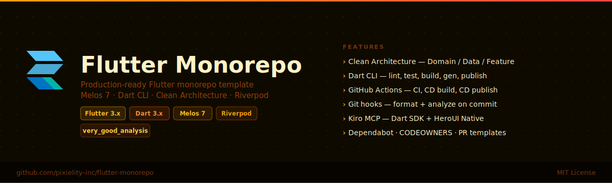

<div align="center">
  
</div>

<div align="center">

[](https://github.com/pixielity-inc/flutter-monorepo/actions/workflows/ci.yml)
[](https://flutter.dev)
[](https://dart.dev)
[](https://melos.invertase.dev)
[](LICENSE)

**A production-ready Flutter monorepo template powered by [Melos](https://melos.invertase.dev).**
Batteries included: Clean Architecture, Riverpod, Dart CLI, CI/CD, git hooks, and MCP.

[Quick Start](#quick-start) · [Structure](#structure) · [CLI](#cli) · [Architecture](#architecture) · [CI/CD](#cicd) · [Contributing](CONTRIBUTING.md)

</div>

---

## Structure

```
flutter-monorepo/
├── apps/
│   └── pixielity_example_app/     # Flutter application — composition root
│       ├── lib/
│       │   ├── app.dart            # App widget + routing
│       │   ├── main.dart           # Entry point
│       │   └── features/           # Feature modules (UI + providers)
│       └── pubspec.yaml            # resolution: workspace
├── packages/
│   └── pixielity_core/            # Domain-layer package (pure Dart)
│       ├── lib/
│       │   └── src/domain/         # Entities · Repositories · Use cases
│       └── pubspec.yaml            # resolution: workspace
├── tool/                           # Dart CLI
│   ├── cli.dart                    # Entry point
│   ├── commands/                   # One file per command
│   ├── core/                       # Process runner + logger
│   └── utils/                      # Path helpers
├── .github/
│   ├── assets/banner.svg
│   ├── workflows/
│   │   ├── ci.yml                  # Format · analyze · test · coverage
│   │   ├── cd_build.yml            # Build APK + iOS on main + tags
│   │   └── cd_publish.yml          # Publish packages to pub.dev on tags
│   ├── CODEOWNERS
│   └── dependabot.yml
├── .githooks/                      # pre-commit · commit-msg · pre-push
├── .kiro/settings/mcp.json         # Dart SDK MCP · HeroUI Native · GitHub
├── pubspec.yaml                    # Workspace root + Melos v7 config
└── analysis_options.yaml           # very_good_analysis base ruleset
```

---

## Quick start

```bash
# 1. Prerequisites
dart --version    # >= 3.11
flutter --version # >= 3.16
dart pub global activate melos

# 2. Clone
git clone https://github.com/pixielity-inc/flutter-monorepo.git
cd flutter-monorepo

# 3. Bootstrap all packages
dart pub get && melos bootstrap

# 4. Install git hooks
./bin/cli hooks:install

# 5. Run the example app
./bin/cli dev
```

---

## CLI

All commands run from the repo root via `./bin/cli <command>` (or `./bin/cli <command>`).

### Development

```bash
./bin/cli dev                    # Run pixielity_example_app
./bin/cli dev --app=my_app       # Run a specific app
```

### Quality

```bash
./bin/cli lint                   # flutter analyze (parallel)
./bin/cli format                 # dart format (parallel)
./bin/cli test                   # flutter test (parallel)
./bin/cli gen                    # build_runner (sequential)
./bin/cli fix                    # dart fix --apply (parallel)
./bin/cli clean                  # flutter clean (parallel)
```

### Build

```bash
./bin/cli build                  # Android APK
./bin/cli build --target=ios     # iOS
./bin/cli build --target=web     # Web
./bin/cli build --app=my_app --target=apk
```

### Scaffolding

```bash
./bin/cli feature auth           # Scaffold a new feature package
```

### Pipelines

```bash
./bin/cli pipeline:ci            # gen → lint + test (parallel)
./bin/cli pipeline:dev           # gen → dev
./bin/cli pipeline:release       # gen → lint → test → build
```

### Versioning & publishing

```bash
./bin/cli version                # Preview version bumps (dry-run)
./bin/cli version --no-dry-run   # Bump + update CHANGELOGs
./bin/cli publish                # Dry-run publish to pub.dev
./bin/cli publish --no-dry-run   # Publish to pub.dev
```

### Melos scripts (alternative)

```bash
melos run lint       # flutter analyze
melos run format     # dart format
melos run test       # flutter test
melos run gen        # build_runner
melos run clean      # flutter clean
melos run upgrade    # flutter pub upgrade
melos run upgrade:major  # flutter pub upgrade --major-versions
melos run outdated   # flutter pub outdated
melos run hooks:install  # register git hooks
```

---

## Architecture

```
┌─────────────────────────────────────────────────────┐
│  App Layer (apps/pixielity_example_app)              │
│  Composition root · Routing · DI · ProviderScope     │
├─────────────────────────────────────────────────────┤
│  Feature Layer (apps/*/lib/features/)                │
│  UI widgets · Riverpod providers · Use case wiring   │
├─────────────────────────────────────────────────────┤
│  Domain Layer (packages/pixielity_core)              │
│  Entities · Repository interfaces · Use cases        │
│  Pure Dart — no Flutter, no HTTP, no state mgmt      │
└─────────────────────────────────────────────────────┘
```

**Dependency rule:** each layer may only depend on layers below it. The Domain Layer depends on nothing outside the Dart SDK.

---

## Adding a new package

```bash
# 1. Create the package
mkdir -p packages/pixielity_my_package/lib/src

# 2. Add pubspec.yaml with:
#    name: pixielity_my_package
#    resolution: workspace

# 3. Bootstrap
dart pub get
```

## Adding a new app

```bash
flutter create apps/pixielity_my_app
# Add `resolution: workspace` to pubspec.yaml
# Add `include: ../../analysis_options.yaml` to analysis_options.yaml
dart pub get
```

## Publishing a package

```bash
./bin/cli version --no-dry-run
./bin/cli publish --no-dry-run
# Or push a tag to trigger CI:
git tag pixielity_core-v1.0.0 && git push --tags
```

---

## CI/CD

| Workflow | Trigger | What it does |
|---|---|---|
| `ci.yml` | PR + push to `main` | Format check · analyze · test · Codecov upload |
| `cd_build.yml` | Push to `main` + version tags | Build Android APK + iOS artifact |
| `cd_publish.yml` | Tag `<package>-v*` | CI gate → publish to pub.dev → GitHub Release |

### Required secrets

| Secret | Workflow | Description |
|---|---|---|
| `CODECOV_TOKEN` | ci.yml | [codecov.io](https://codecov.io) token |
| `PUB_CREDENTIALS` | cd_publish.yml | `cat ~/.pub-cache/credentials.json` after `dart pub login` |

---

## MCP servers (Kiro)

Configured in `.kiro/settings/mcp.json`:

| Server | Command | Purpose |
|---|---|---|
| `dart-flutter` | `dart mcp-server` | Official Dart SDK MCP — analyze, test, pub |
| `heroui-native` | `@heroui/native-mcp` | HeroUI Native component docs |
| `github` | `@modelcontextprotocol/server-github` | Repo operations |
| `playwright` | `@playwright/mcp` | Browser testing |

> The `dart mcp-server` command requires Dart SDK 3.9+ (Flutter 3.35+ beta).

---

## License

MIT © [Pixielity](https://github.com/pixielity-inc)
